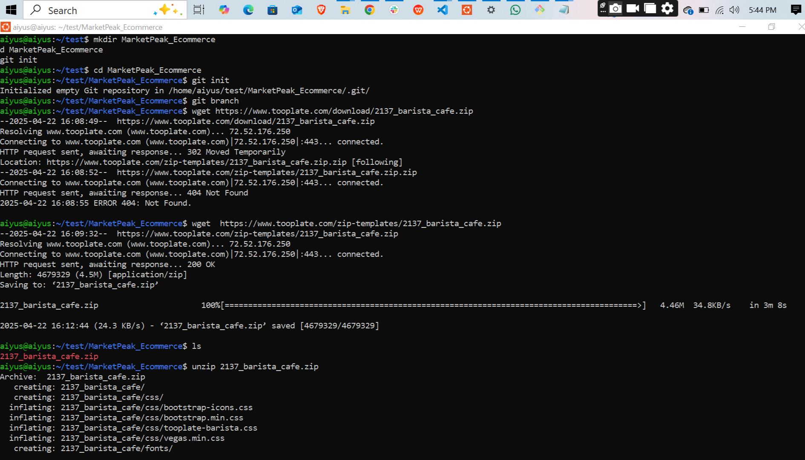
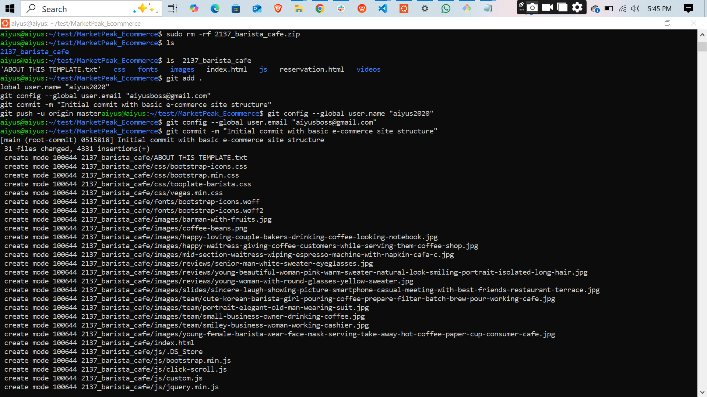
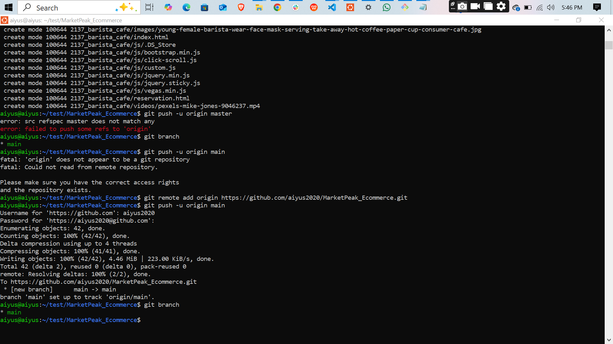
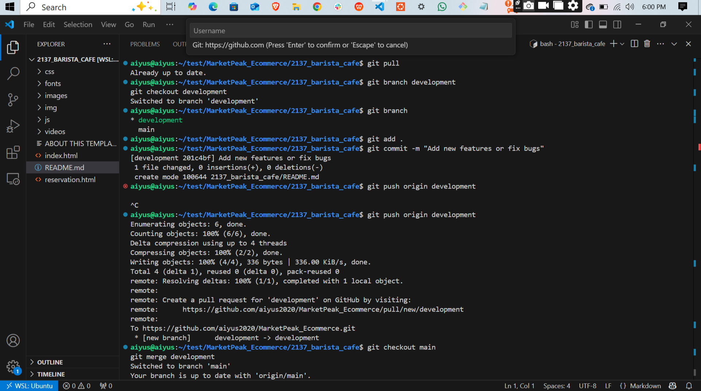
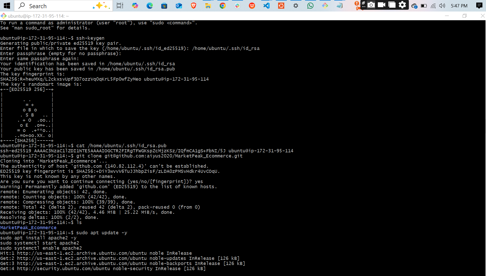
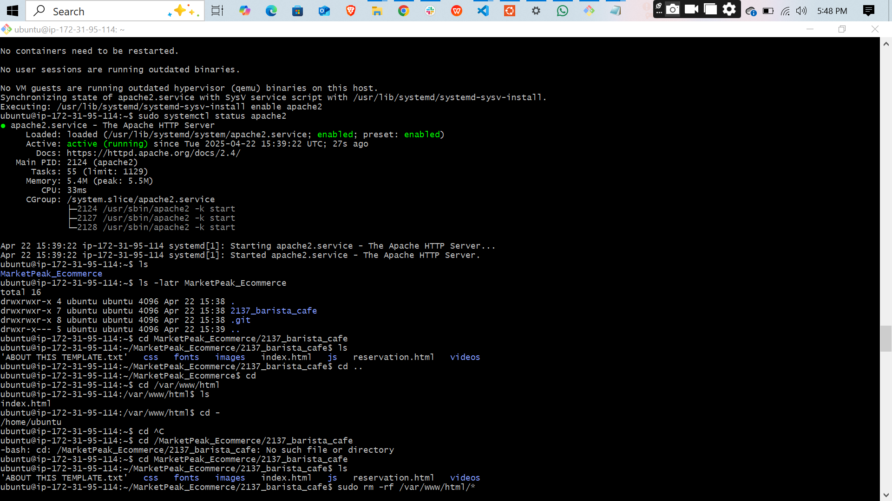
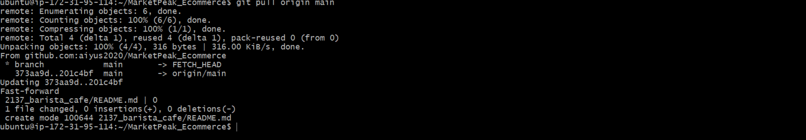
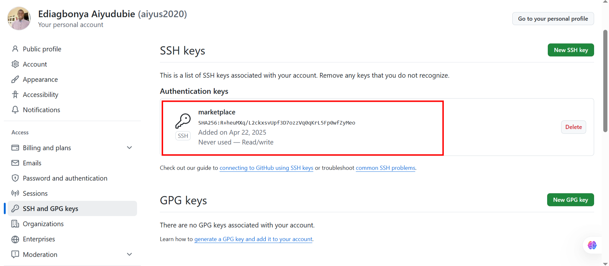

# 🚀 Learning Experience with Git and GitHub and intro to Cloud 

### 📌 Introduction  
This project marked my deep dive into Git for version control and GitHub for managing remote repositories. Through hands-on practice, I explored core concepts and workflows that are essential in modern software development and collaborative coding environments.

---

### 💡 Key Takeaways  

1. **🔧 Repository Initialization**  
   I began by creating a local directory and initializing it with `git init`. This foundational step introduced me to the idea of tracking changes locally before syncing them with a remote repository.

2. **🌿 Branch Management**  
   I learned how to create and switch between branches using `git branch` and `git checkout`. Branching allowed me to work on features and bug fixes independently, maintaining the integrity of the main project.

3. **📥 Staging and Committing Changes**  
   By using `git add` and `git commit -m`, I understood how to prepare and record snapshots of my project. This process emphasized the importance of meaningful commit messages and incremental progress.

4. **🌐 Remote Repositories on GitHub**  
   I connected my local repo to GitHub using `git remote add origin` and synced changes with `git push`. This taught me how to share my work and collaborate effectively on a cloud-hosted codebase.

5. **🔀 Branching Strategies**  
   I explored basic branching strategies like feature branches, hotfix branches, and the main branch. This structure helps teams manage development flows and reduces conflicts during code integration.

6. **🔁 Push & Pull Operations**  
   Regular use of `git pull` and `git push` helped me stay in sync with the remote repository, reinforcing the concept of two-way collaboration in software projects.

7. **🚫 Error Handling**  
   I encountered errors such as `src refspec does not match any` and learned to troubleshoot and resolve them. These moments taught me patience and sharpened my problem-solving skills.

8. **🔐 SSH Key Configuration**  
   Setting up an SSH key for GitHub access made authentication seamless and secure, especially for regular push/pull operations without entering credentials each time.

---

### 🖼️ Project Snapshots  
Here are some screenshots from my terminal and setup process:

---

### ✅ Conclusion  
This learning experience has strengthened my confidence in using Git and GitHub for version control and collaboration. I now understand how to manage code efficiently, collaborate with team members, and resolve conflicts when they arise. These skills are not only valuable but essential for any software developer. I look forward to applying them in real-world projects and team environments.

---
the site is live [live](http://3.82.157.161/)