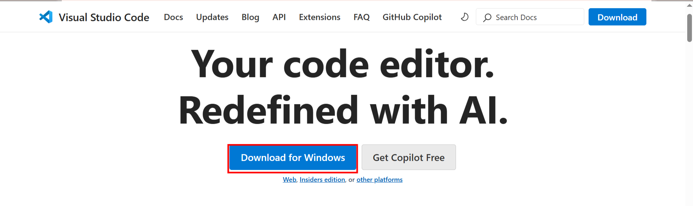
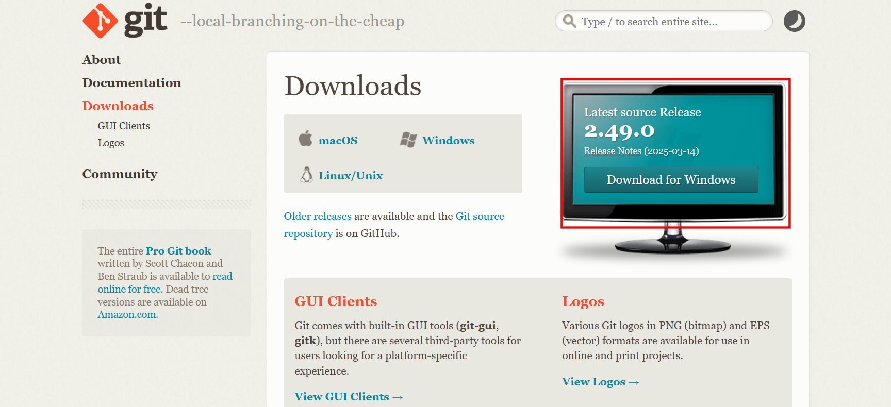
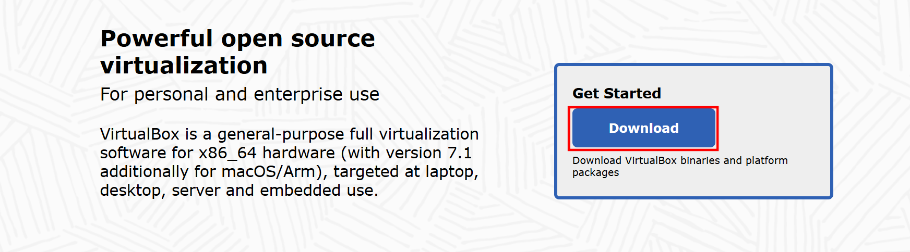
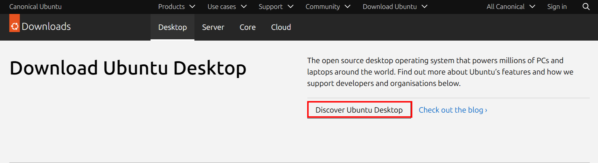

# Darey.io-Tech-Evn-setup
# Setting Up My Development Environment

This document provides a step-by-step guide on how I installed the necessary tools for my development environment.

## Tools I Installed

1. **Visual Studio Code (VS Code)**
2. **Git**
3. **VirtualBox**
4. **Ubuntu on VirtualBox (Windows)**

## Installation Steps

### 1. Installing Visual Studio Code (VS Code)

Visual Studio Code is my go-to source code editor because it's lightweight yet powerful.
 

- I downloaded VS Code from the official website: [VS Code Download](https://code.visualstudio.com/)
- I followed the installation instructions for my operating system (Windows, macOS, or Linux).
- After installation, I opened VS Code and installed necessary extensions like Python, Docker, and GitLens.

### 2. Installing Git

Git helps me track changes in my source code and collaborate with others.
  

- I downloaded Git from the official website: [Git Download](https://git-scm.com/downloads)
- I installed Git by following the provided instructions.
- To verify the installation, I ran:
  ```sh
  git --version
  ```

### 3. Installing VirtualBox


VirtualBox allows me to run multiple operating systems on my machine.

- I downloaded VirtualBox from the official website: [VirtualBox Download](https://www.virtualbox.org/)
- I installed VirtualBox by following the on-screen instructions.
- then i opened it.

### 4. Installing Ubuntu on VirtualBox (Windows)


- I downloaded the Ubuntu ISO from: [Ubuntu Download](https://ubuntu.com/download/desktop)
- I opened VirtualBox and created a new virtual machine:
  - Clicked **New** > Entered a name (e.g., Ubuntu) > Selected **Linux** as the type > Chose **Ubuntu (64-bit)**.
  - Allocated RAM (recommended: 4GB or more).
  - Created a virtual hard disk (recommended: 20GB or more).
- I started the virtual machine and selected the Ubuntu ISO.
- I followed the installation instructions to complete the setup.

### 5. Github Account
- visited github.com and created an account.


## Conclusion

After completing these installations, I now have a fully functional development environment ready for coding and testing. Happy coding!

