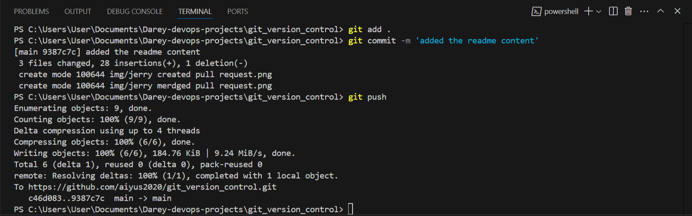

# Project Collaboration

## Team Members
- **Tom**: Updated the navigation bar.
- **Jerry**: Added contact information.

## Branch Workflow
1. **Tom's Update:**
   - Created a branch named `updated-navigation`.
   
   - Updated the navbar.
   - Pushed the changes to the repository.
   - Merged `updated-navigation` into `main`.
   
   

2. **Jerry's Update:**
   - Created a branch named `add-contact-info`.
   
   - Added contact information.
   - Pushed the changes to the repository.
   - Merged `add-contact-info` into `main`.
   
   
## Current Status
All updates have been successfully merged into the `main` branch, ensuring both the navigation bar and contact information are up to date.

