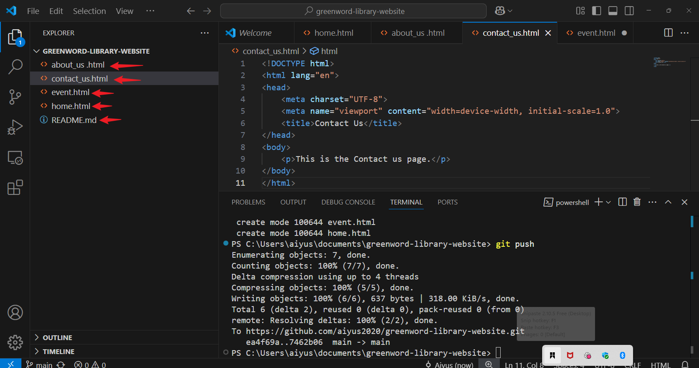
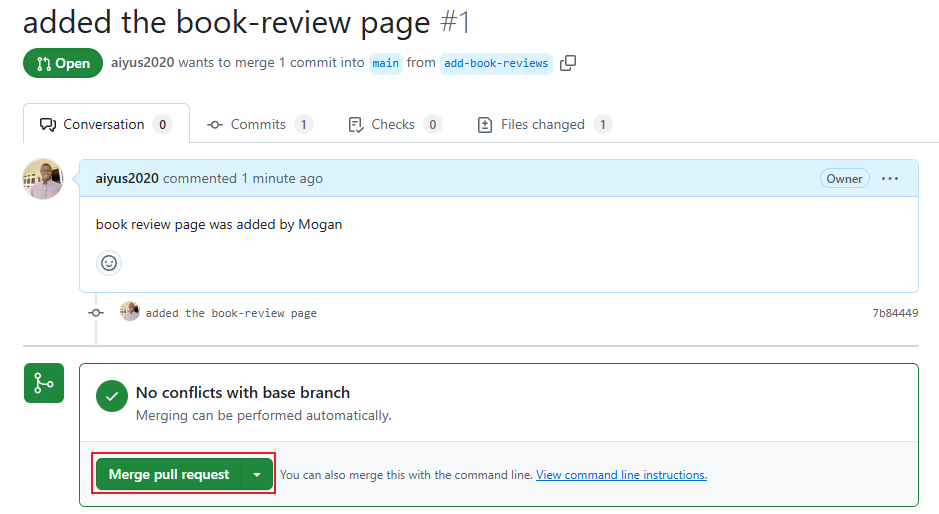
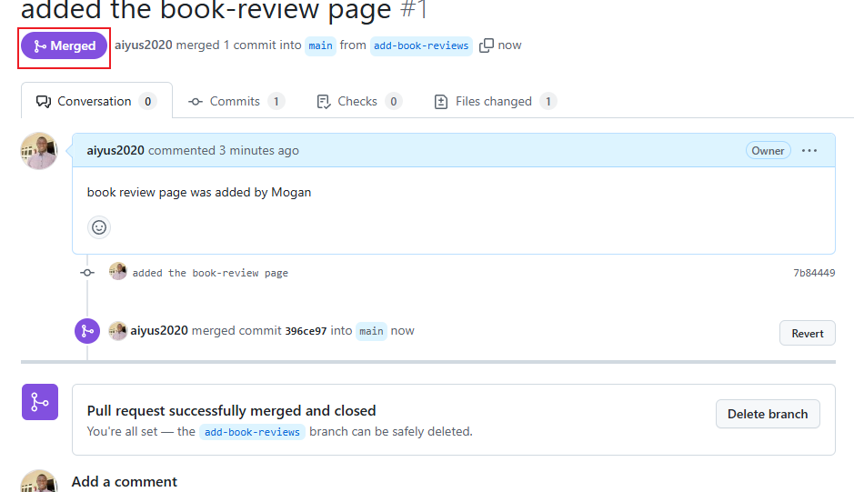

# greenword-library-website
# Greenwood Community Library Website Enhancement

 

## Project Overview

The project aims to improve the website's engagement and informativeness. The existing website has basic sections like Home, About Us, Events, and Contact Us. The team decided to add a "Book Reviews" section and update the "Events" page with details of upcoming community events.

This project involves simulating the roles of two contributors, Morgan and Jamie, to demonstrate a collaborative workflow using Git.

## Project Structure

The project follows a structured approach using Git branching and Pull Requests to manage changes.

**1. Setup:**

   - A GitHub repository named `greenwood-library-website` was created.
   - The repository was initialized with a `README.md` file.
   - The repository was cloned to the local machine.

**2. Initial Web Page Files:**

   - In the `main` branch, the following HTML files were created:
     - `home.html`
     - `about_us.html`
     - `events.html`
     - `contact_us.html`

     
   - Basic HTML structure was added to each file.
   - Changes were committed and pushed to the `main` branch.

**3. Feature Development (Simulating Morgan and Jamie):**

   - **Morgan's Work: Adding Book Reviews**
     - A new branch `add-book-reviews` was created.
     - A file `book_reviews.html` was added to the branch.
     - Placeholder content was added to `book_reviews.html`.
     - Changes were staged, committed, and pushed.
     
     - A Pull Request (PR) was created to merge 
          

     `add-book-reviews` into `main`.
     - The PR was reviewed and merged.

   - **Jamie's Work: Updating Events Page**
     - A new branch `update-events` was created.
     - The `events.html` file was updated with new event details.
     - Changes were staged, committed, and pushed.
          

     - A Pull Request (PR) was created to merge
        

      `update-events` into `main`.
     - The PR was reviewed and merged.

**4. Merging and Conflict Resolution:**

   - Any potential conflicts during the PR process were resolved.
   - Merging was done after successful review and conflict resolution.

## Objectives Achieved

* **Cloning and Branching:** Successfully cloned a repository and worked with branches in Git.
* **Staging, Committing, and Pushing:** Gained experience in staging, committing, and pushing changes from multiple developers.
* **Pull Requests and Merging:** Practiced creating and merging Pull Requests.
* **Collaboration:** Simulated a collaborative development workflow.

## Location

This project was developed from **Ibadan, Oyo, Nigeria**.