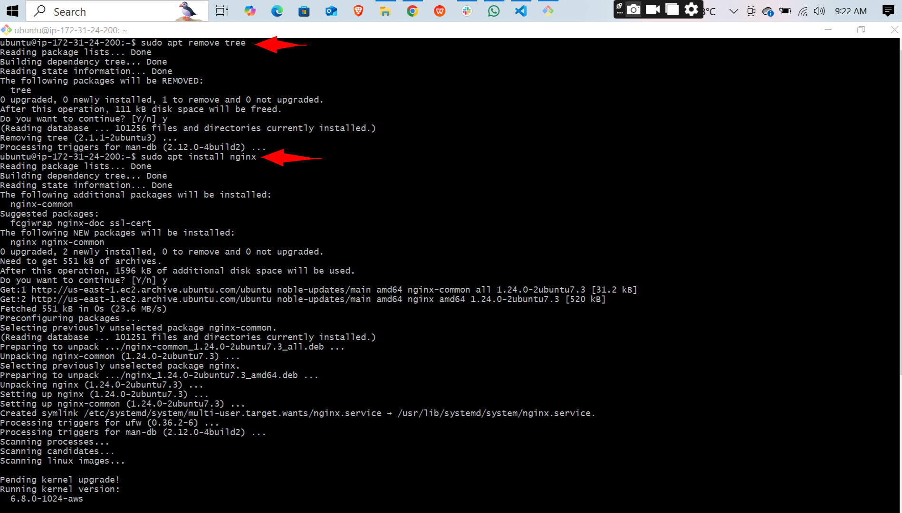

# Linux-foundamentals

## project Review
- This project illustrates how to lunch a Remote server (Aws EC2 instance).
- connecting to the remote server and installing some packages.

### Creating an instance of EC2 
- login to my Aws account and created an ec2 instance

  
  ### Connecting to the remote server.
  - used bash the `cd Downloads` to navigate to the location of my keys
  - updated the server `sudo apt update`

  

  - install the tree package `sudo apt install tree`

  
  - upgraded the server `sudo apt upgrade`

  

- remove the tree package.

- install nginx package ` sudo apt install nginx`

- remove the nginx package `sudo apt remove nginx`

