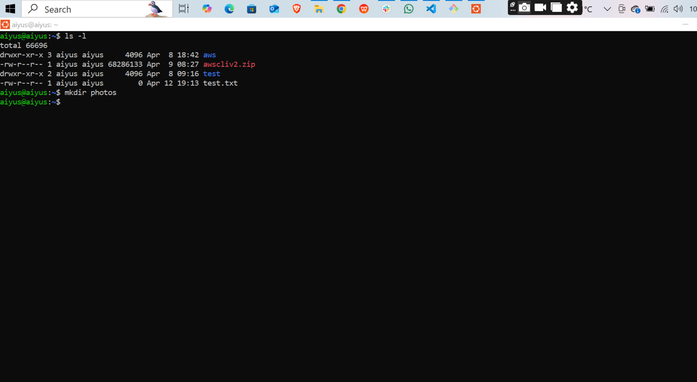
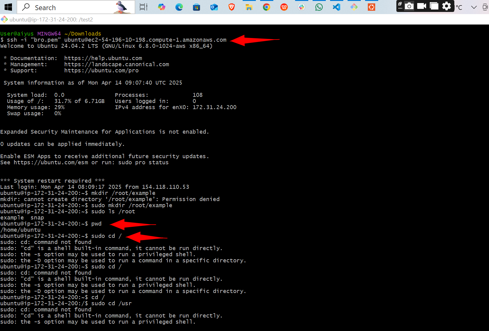
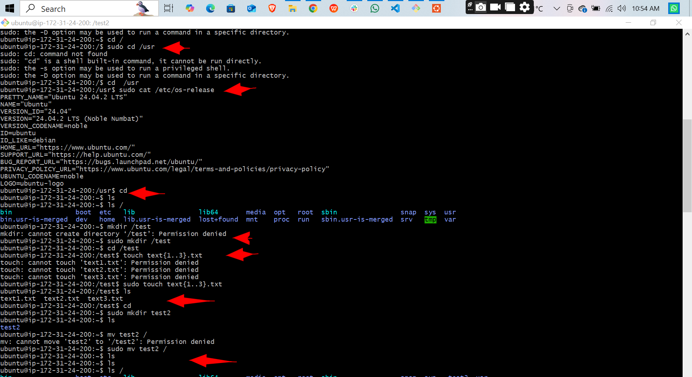

Sure! Here's a cleaner, more polished version of your `README.md` file with improved grammar, formatting, and clarity:

---

# 🐧 Basic Linux Commands

## 📌 Project Overview
This project focuses on learning and practicing essential Linux commands such as:

```bash
cd, cp, ls, mv, mkdir, touch, rm, pwd, cat, find, sudo
```

It also includes logging into an AWS server using SSH and executing commands remotely.

---

## 📁 Creating a Directory

We created a directory named `photo` using the `mkdir` command:



---

## 🔧 Common Linux Commands Practiced

Here are some of the basic yet powerful commands used during the session:

- `sudo` – Execute a command as superuser
- `cd` – Change directory
- `cp` – Copy files and directories
- `mkdir` – Make directories
- `touch` – Create an empty file
- `ls` – List files and directories
- `mv` – Move or rename files
- `rm` – Remove files or directories
- `pwd` – Print current working directory
- `cat` – Display content of a file
- `find` – Search for files and directories

---

## 🔐 Logging into AWS Server

We successfully logged into an AWS EC2 instance using SSH:



---

## 🧪 Practicing the Commands

Here are screenshots showcasing the commands in action:

| Screenshot 1 | Screenshot 2 |
|--------------|--------------|
|  |  |

| Screenshot 3 |
|--------------|
|  |

---

## ✅ Conclusion

This hands-on exercise helped reinforce basic Linux skills essential for navigating and managing servers — a solid foundation for cloud and DevOps development.

