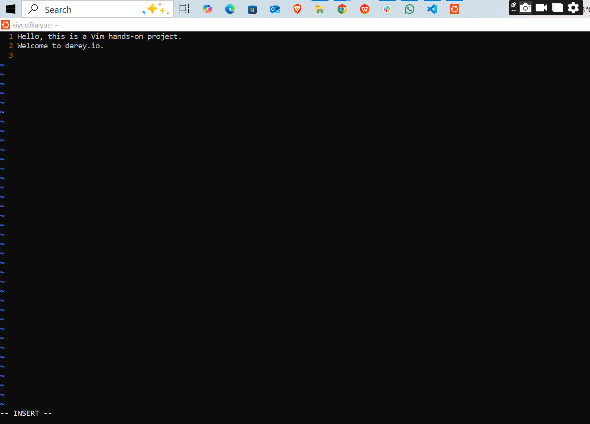
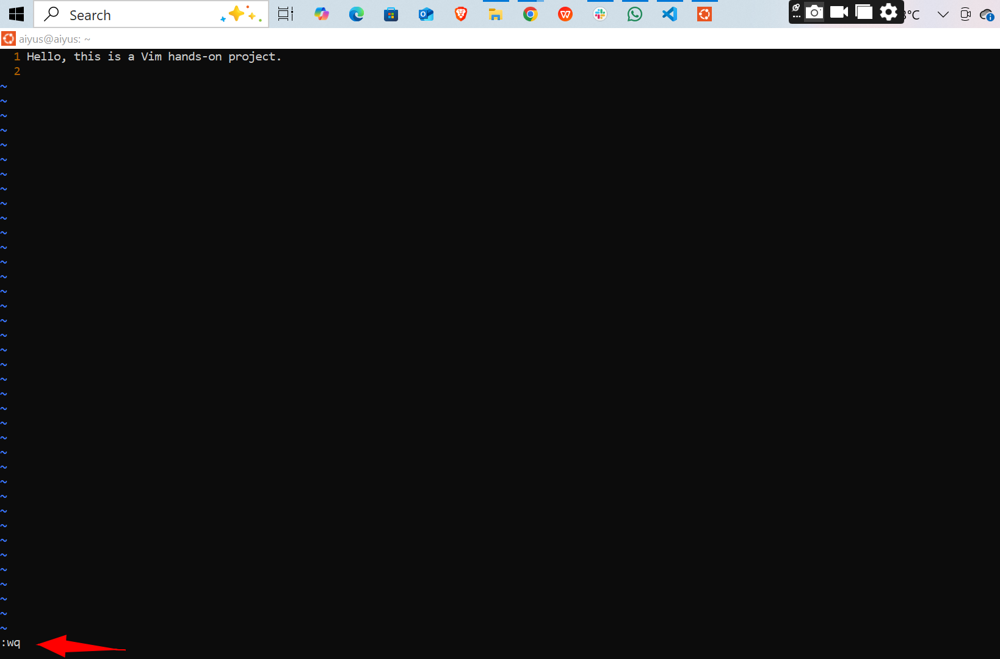
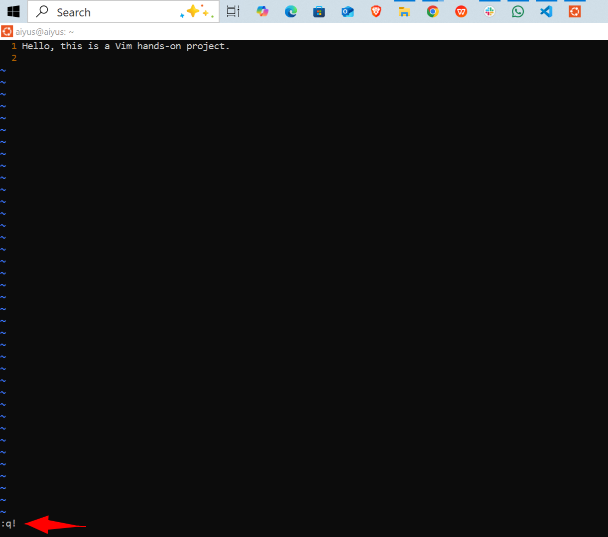
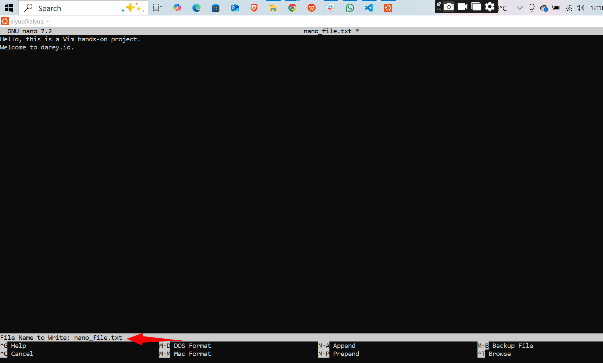
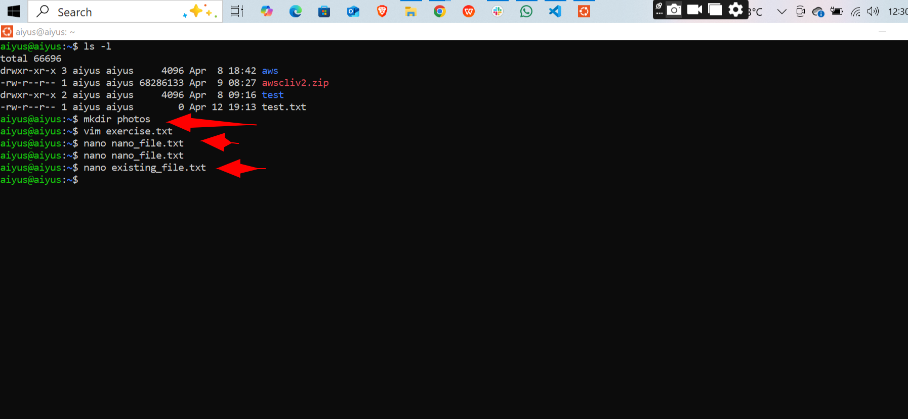

Absolutely! Here's a cleaner, more professional version of your `README.md` file with improved grammar, structure, and formatting:

---

# 📝 Linux Text Editors

## 📌 Project Overview
This project demonstrates how to use **Vim** and **Nano**, two powerful terminal-based text editors in Linux, to create and modify files directly from the command line.

---

## 🧠 Working with Vim

Vim is a modal editor, meaning it operates in different modes (insert, normal, command, etc.).

### 🔧 Common Vim Commands Used:

- `vim exercise.txt` – Open or create a file named `exercise.txt`
- Press `i` – Enter **Insert Mode** to begin typing
- Press `Esc` – Exit **Insert Mode**
- Use arrow keys – Navigate within the file
- Type `:wq` – Save and quit the file
- Type `:q!` – Quit without saving changes

### 📸 Vim Screenshots:

- Inserting text:  
  

- Saving and quitting with `:wq`:  
  

- Exiting without saving using `:q!`:  
  

---

## 🧾 Editing with Nano

Nano is a simpler, beginner-friendly text editor.

### 🔧 Common Nano Commands Used:

- `nano nano_file.txt` – Open or create `nano_file.txt`
- `Ctrl + O` – Save the file
- `Ctrl + X` – Exit the editor

### 📸 Nano Screenshot:

- Saving with `Ctrl + O`:  
  

---

## 💻 Terminal Command Sample

Basic terminal command execution during the editing process:

---

## ✅ Summary

This exercise provided hands-on experience with two widely-used Linux text editors — **Vim** and **Nano** — teaching essential skills for editing configuration files and code directly from the command line.

