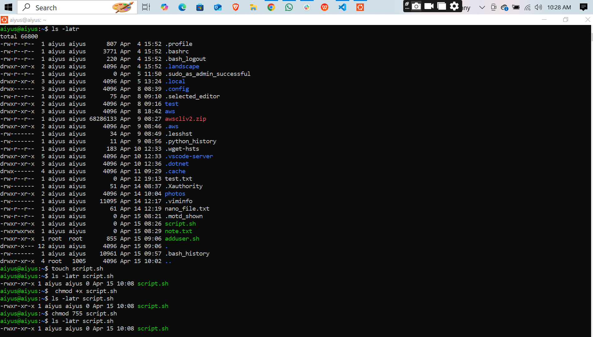
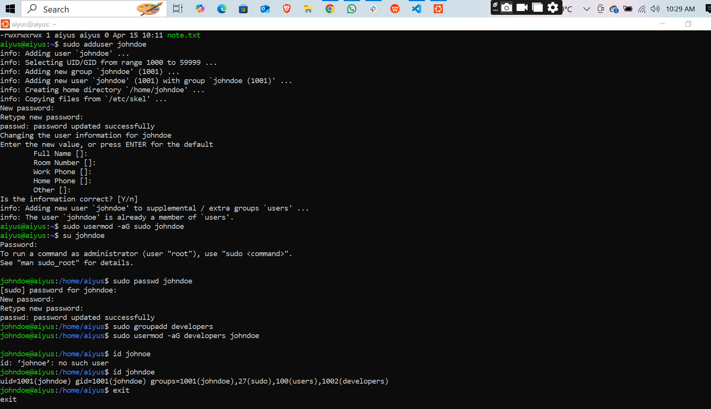
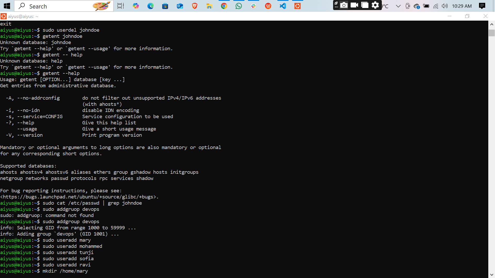
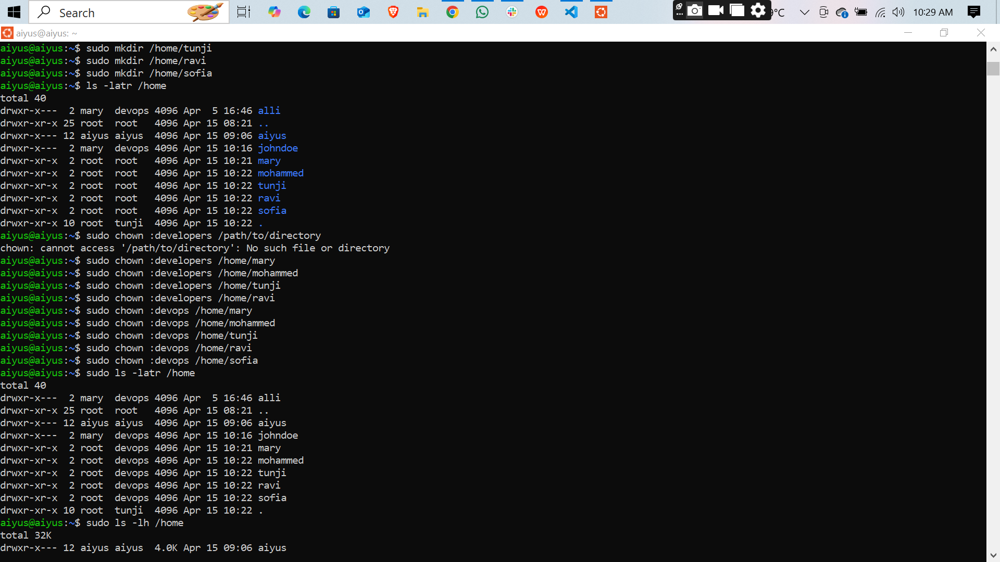
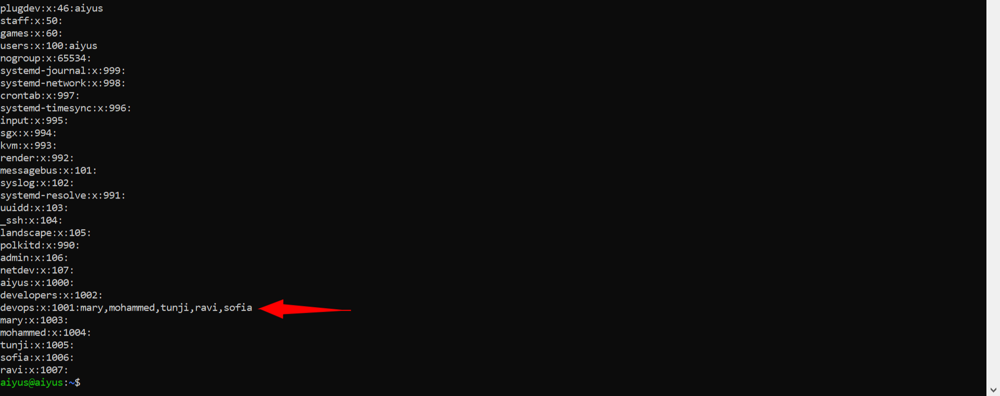

# 🛠️ Linux User and Group Management – DevOps Practice

This project documents basic user and group management operations on a Linux system, along with permission settings for files and folders.


---

## 📁 What’s Included?

This project includes:

- Creating users and groups
- Assigning users to groups
- Changing file permissions
- Managing file ownership
- Setting up executable scripts

---

## 📌 Commands Used

### 🧑‍🤝‍🧑 User & Group Management

```bash
# Add a new user
sudo adduser johndoe

# Add user to sudo group
sudo usermod -aG sudo johndoe

# Switch to the new user
su johndoe

# Change password for a user
sudo passwd johndoe

# Create a new group
sudo groupadd developers

# Add user to a custom group
sudo usermod -aG developers johndoe

# View user group memberships
id johndoe
```
### Creating the users
```bash
sudo useradd  mary
sudo useradd  mohammed
sudo useradd  ravi
sudo useradd  tunji
sudo useradd  sofia```

### folders for each user
```bash
sudo mkdir /home/mary
sudo mkdir /home/mohammed
sudo mkdir /home/ravi
sudo mkdir /home/tunji
sudo mkdir /home/sofia
```
### change the ownership of each dir to devops
```bash
 sudo chown :devops /home/mary
 sudo chown :devops /home/mohammed
 sudo chown :devops /home/ravi
 sudo chown :devops /home/tunji
 sudo chown :devops /home/sofia

```

### 👥 Add DevOps Group & Members

```bash
# Add a new group
sudo addgroup devops

# Add users individually to the group
sudo usermod -aG devops mary
sudo usermod -aG devops mohammed
sudo usermod -aG devops ravi
sudo usermod -aG devops tunji
sudo usermod -aG devops sofia
```

---

## 📂 Folder Group Ownership

```bash
# Change group ownership of a folder
sudo chown :devops /path/to/folder
```

✅ To verify ownership:
```bash
ls -l /home
```

Check if the folder's group is listed as `devops`.

---

## 📜 File Management

```bash
# Create files
touch script.sh note.txt

# Make files executable
chmod +x script.sh

# Set full permissions (for practice only; not recommended in production)
chmod 777 note.txt

# View file permissions
ls -l script.sh
ls -l note.txt
```

---


---

### script images











