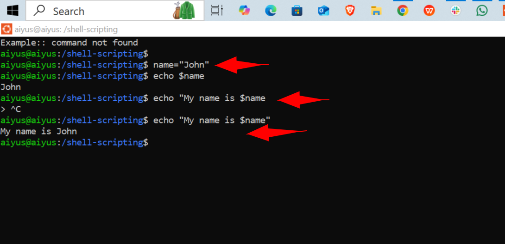

# linux-shell-scripting-mini-

This project documents my first experience creating and running a shell script on a Linux system. Along the way, I encountered permission-related issues and learned how to handle them using `chmod`, `sudo`, and understanding user/group ownership.

---

## 📝 Steps Covered

### 1. **Creating the Shell Script Directory**
```bash
mkdir /shell-scripting     # Permission denied (needs sudo)
sudo mkdir /shell-scripting
```

### 2. **Navigating to the New Directory**
```bash
cd /shell-scripting
```

### 3. **Creating the Shell Script**
```bash
sudo vim my-first-shell-script.sh
```


> The file was created with root ownership.

### 4. **Listing Files and Checking Permissions**
```bash
ls -latr
```
> Output showed the script was owned by `root` and not executable by the current user.

### 5. **Trying to Run the Script**
```bash
./my-first-shell-script.sh
# Error: Permission denied
```

### 6. **Modifying Permissions**
```bash
chmod u+x my-first-shell-script.sh
# Operation not permitted due to lack of ownership
```

### 7. **Changing Ownership with sudo**
```bash
sudo chown aiyus my-first-shell-script.sh
```

### 8. **Making Script Executable**
```bash
chmod u+x my-first-shell-script.sh
```

### 9. **Running the Script Successfully**
```bash
./my-first-shell-script.sh
```


### 10 **using variables**

```bash
name=joun
```
```bash
echo $name
```
```bash
echo "My name is $john"
```
