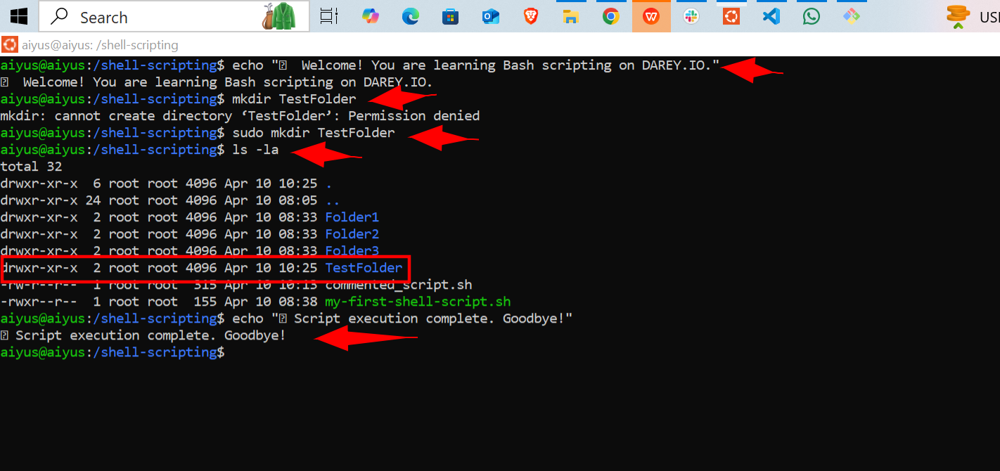
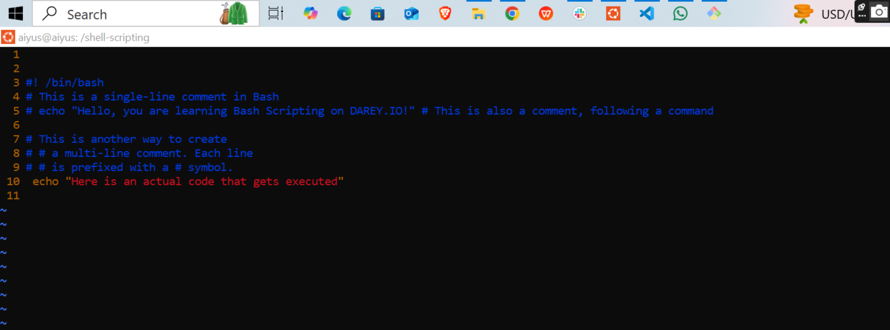

# 📝 Bash Script: Commenting Basics

This script demonstrates how to use **comments** in Bash scripting. Comments are an essential part of writing clean and understandable scripts. They are ignored during execution but help explain what the code is doing.

## 📜 Script Overview (`commented_script.sh`)

```bash
#!/bin/bash

# This is a simple Bash script to demonstrate comments and basic commands

# Print a welcome message
echo "👋 Welcome! You are learning Bash scripting on DAREY.IO."

# Create a directory named TestFolder
mkdir TestFolder

# List all files and folders in the current directory
ls -la

# Display a goodbye message
echo "✅ Script execution complete. Goodbye!"
```


## 📄 Script Content
 - created the script 

 

```bash
#! /bin/bash
# This is a single-line comment in Bash
# echo "Hello, you are learning Bash Scripting on DAREY.IO!" # This is also a comment, following a command

# This is another way to create
# # a multi-line comment. Each line
# # is prefixed with a # symbol.
echo "Here is an actual code that gets executed

```
