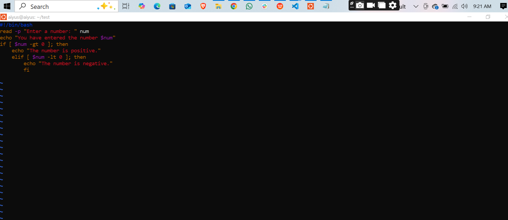
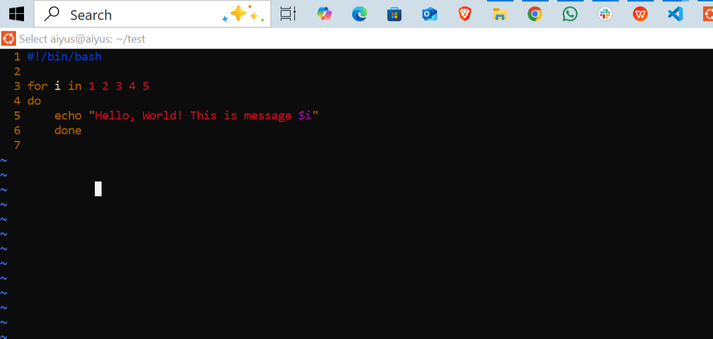
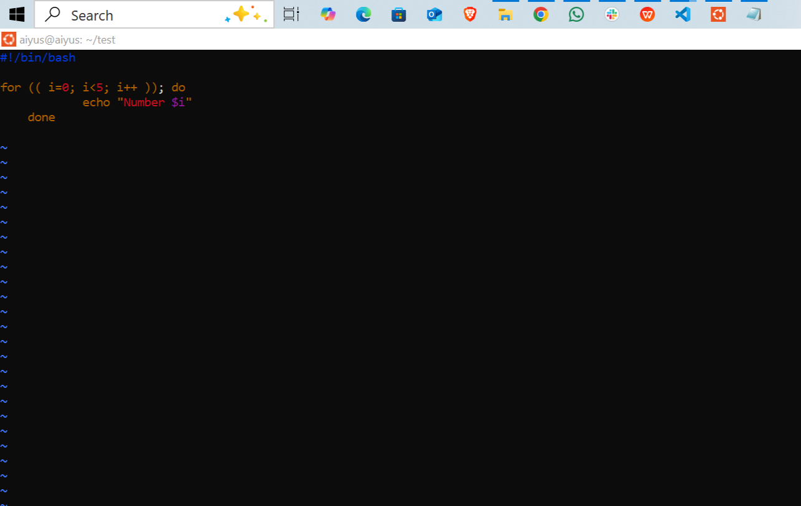
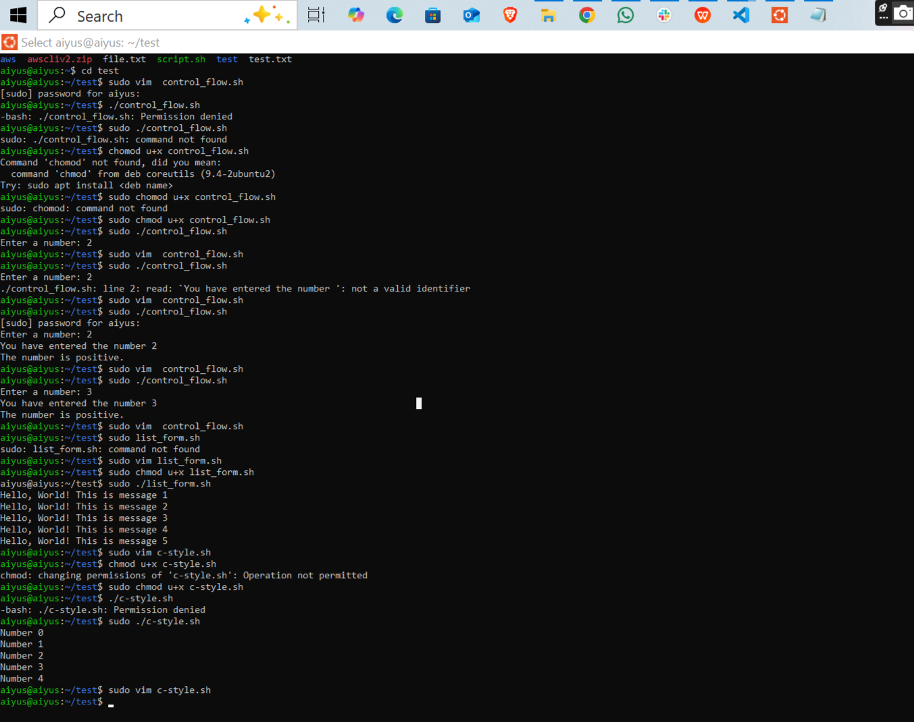

Sure thing, Aiyus! Here's a polished and more professional version of your README with improved grammar, clarity, formatting, and a bit of flair for GitHub:

---

# ⚙️ Control Flow in Shell Scripting

## 📘 Project Overview
This project demonstrates how to use **control flow statements** in Bash scripting, including:

- **Conditional statements**: `if`, `elif`, and `else`
- **Loops**: specifically the `for` loop in different formats

These fundamental scripting concepts are essential for automating tasks and building more dynamic shell scripts.

---

## 🔍 Conditionals
Conditional statements execute a block of code based on whether a specific condition is met.

```bash
if [ condition ]; then
   # do something
elif [ another_condition ]; then
   # do something else
else
   # default action
fi
```

📸 Example Output:  


---

## 🔁 Loops
Loops allow for repetitive execution of a block of code. This project showcases two `for` loop formats:

### 1. **List-style `for` loop**
Iterates over a list of items.

📸 Example Output:  


---

### 2. **C-style `for` loop**
Uses a structure similar to C/C++ style looping.

📸 Example Output:  


---

## 💻 Terminal Commands in Action
Example run-through of the shell scripts and permissions using the terminal:

📸 Screenshot:  


---

## 🚀 How to Run

1. **Give execute permission:**
   ```bash
   chmod +x filename.sh
   ```

2. **Run the script:**
   ```bash
   ./filename.sh
   ```
   Use `sudo` if necessary:
   ```bash
   sudo ./filename.sh
   ```

---

## 📂 Scripts Included

| Script Name        | Description                                   |
|--------------------|-----------------------------------------------|
| `control_flow.sh`  | Takes a number input and evaluates its sign   |
| `list_form.sh`     | Displays 5 messages using list-style `for` loop |
| `c-style.sh`       | Prints numbers using C-style `for` loop       |

---

