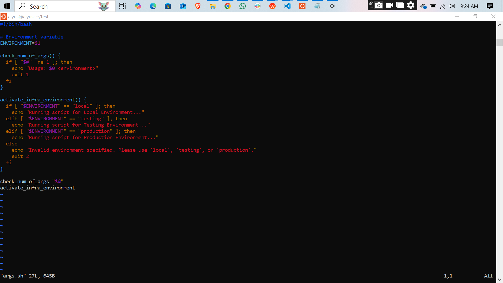
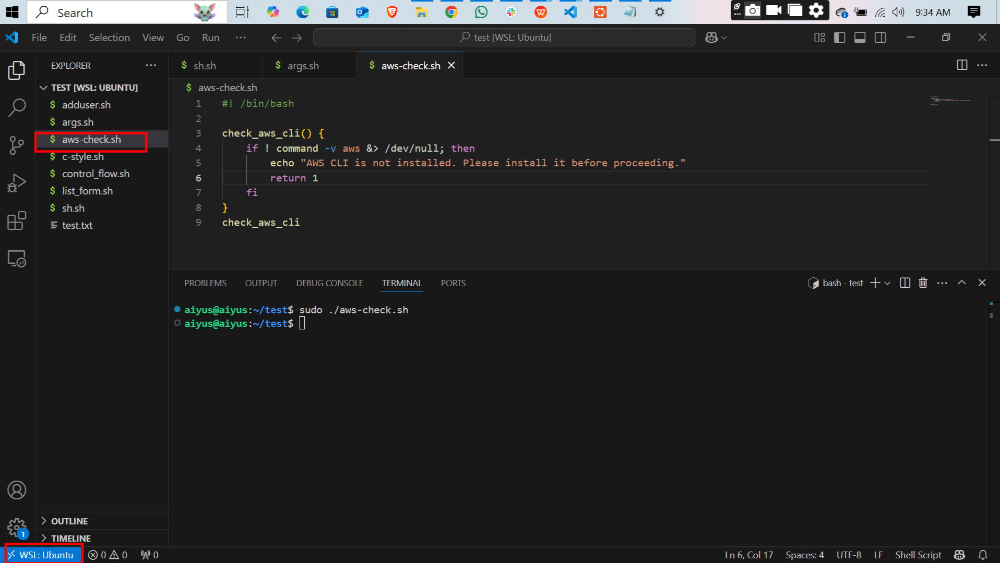
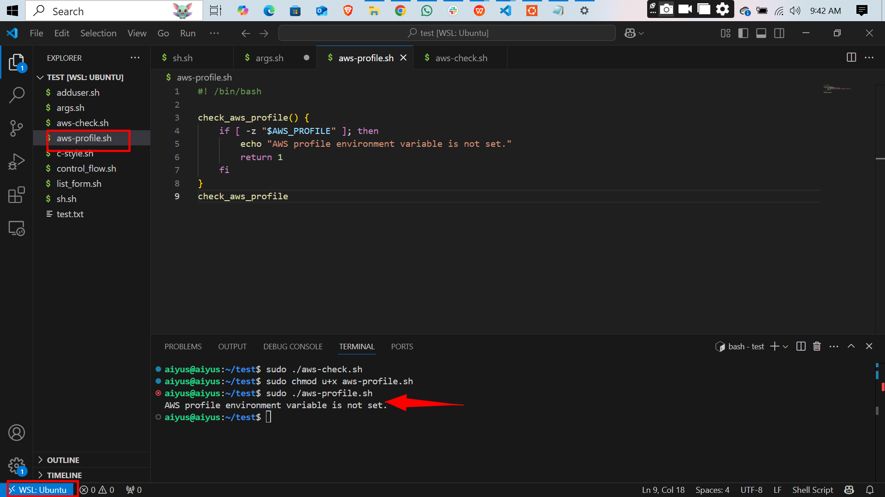
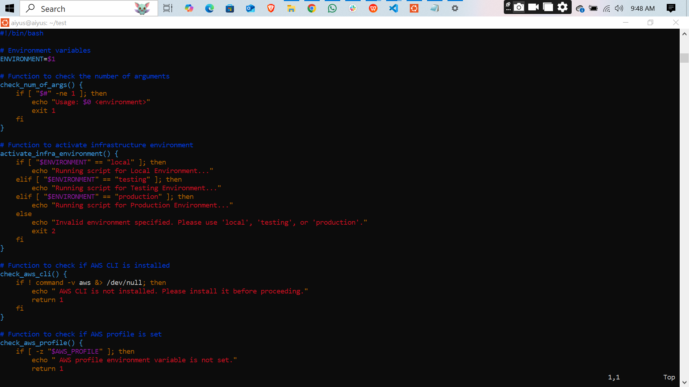
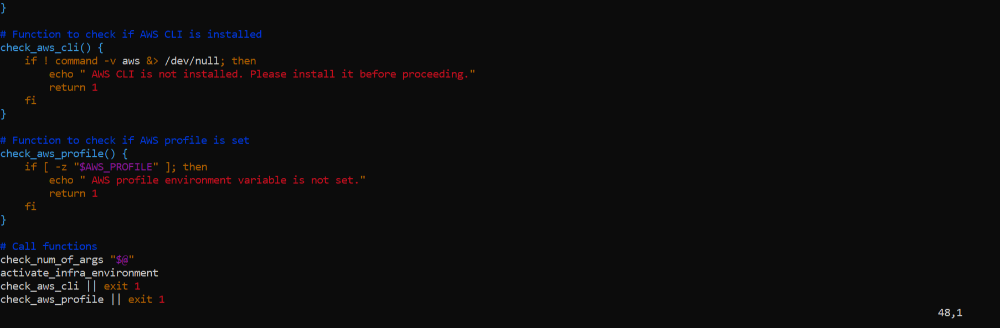
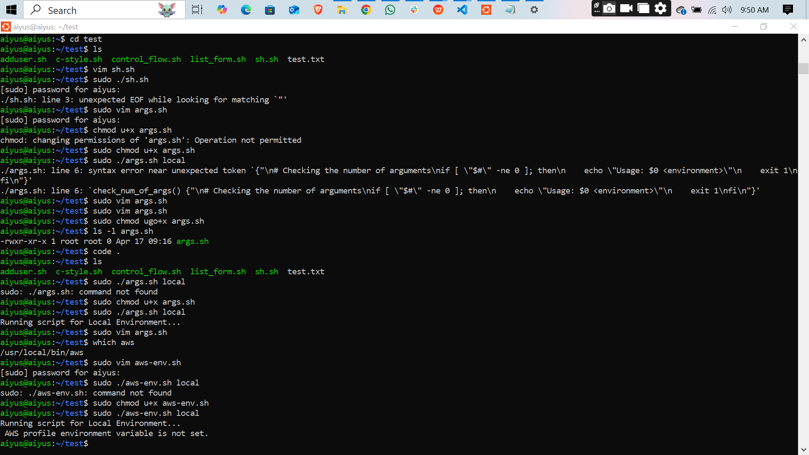

# Working-with-functions
From this script, I learned how to write a Bash script that accepts an environment as an argument and performs checks before running any AWS-related tasks. I understood how to validate the number of arguments, activate different environment modes (like local, testing, and production), and ensure necessary AWS configurations are in place by checking if the AWS CLI is installed and if the AWS profile environment variable is set. This approach has taught me the importance of input validation, structured control flow, and pre-checks to avoid runtime errors, especially when working with cloud resources.

## images of command and script
- check is script has argument

- check if aws cli is installed

- others

