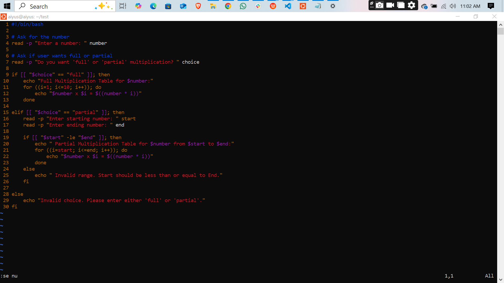
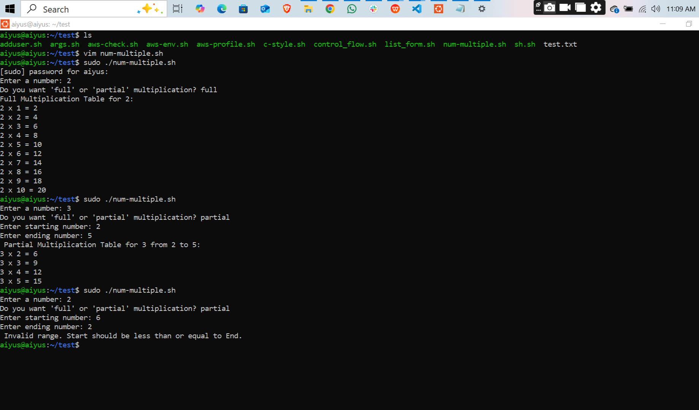

# 🧮 Shell Script Multiplication

## 📘 What I Learned

### ✅ User Input in Bash  
I learned how to use the `read -p` command to collect inputs from users. This made the script interactive, allowing users to enter a number and specify whether they want a full or partial multiplication table.

### 🔁 Using C-Style `for` Loops  
I practiced using the C-style `for (( i=1; i<=10; i++ ))` loop syntax in Bash. This structure feels intuitive and efficient, especially coming from other programming languages like C or JavaScript.

### 🧮 Performing Arithmetic Operations  
I explored Bash arithmetic by using the `$((...))` syntax. This made it easy to compute and display multiplication results like: `echo "$i x $num = $((i * num))"`.

### 🧠 Implementing Conditional Logic  
I applied `if`, `elif`, and `else` conditions to handle different user choices (`full` or `partial`). This helped me understand how control flow in Bash can be used to make scripts more dynamic and responsive.

### 📊 Validating Ranges  
For partial multiplication tables, I added logic to ask for a starting and ending value. This taught me how to validate and use ranges in loops to customize script output based on user input.

### 💡 Real-World Scripting Practice  
This project gave me hands-on experience with writing practical Bash scripts. It combined loops, conditionals, and user input to create a functional tool—one that mimics real-world scripting tasks.

- link to the script

[View the script](./multiplication.sh)

---

## 📸 Screenshots

### 🖥️ Script

### 💬 Terminal Command

---
