# 🧾 How I Created My AWS Account – Step by Step

Hey there! 👋  
This README is my personal walkthrough of how I created an AWS (Amazon Web Services) account from scratch. I decided to document the process so I can always refer back to it, and maybe it’ll help someone else who’s just getting started too.

---

## ✍️ Step-by-Step Guide

### 1. **Visited the AWS Website**
I started by heading over to [aws.amazon.com](https://aws.amazon.com) and clicked on **“Create an AWS Account”** at the top right.

---

### 2. **Entered My Email and Set Up a Password**
I filled in the following:
- ✅ A valid email address  
- 🔐 A strong password  
- 🧾 An account name (I picked something relevant to me)

Then I clicked **Continue**.

---

### 3. **Chose Account Type**
I selected **Personal** use since this account is mainly for testing and personal projects.

---

### 4. **Provided Contact Information**
Here’s what I filled out:
- Full name  
- Phone number  
- Country (🇳🇬 Nigeria)  
- Address and postal code  

I also agreed to the terms and conditions.

---

### 5. **Verified My Phone Number**
AWS sent a 6-digit verification code via SMS, which I entered to confirm my phone number.

---

### 6. **Added My Payment Method**
Even though AWS offers a free tier, they still require payment details. So I added my **debit card**.

💡 *Important:* I made sure the card supports **international transactions**.

---

### 7. **Selected a Support Plan**
I went with the **Basic (Free)** plan – it’s perfect for beginners and casual use.

---

### 8. **Account Successfully Created**
Once everything was submitted, I got a confirmation message, and a couple of welcome emails from AWS showed up in my inbox.

---

### 9. **Signed In to the AWS Console**
I logged in through [console.aws.amazon.com](https://console.aws.amazon.com) as the **Root user**, using the same email I registered with.

---

## 🔐 Final Touches After Signup

After logging in, I took a few extra steps to secure and set up my account:

- ✅ Enabled **MFA (Multi-Factor Authentication)** for my root account  
- 👤 Created a dedicated **IAM user** for day-to-day activities (much safer than using the root account directly)  
- 🧪 Started exploring core services like **EC2**, **S3**, and **Lambda**

---

## ✅ Quick Summary

Here’s what you’ll need before signing up:
- 📱 A working phone number  
- 📧 A valid email address  
- 💳 A card that supports online/international transactions  

And that’s it! Now I’m all set up to explore and build cool stuff on AWS ☁️💻

---

## 📸 Image Walkthrough

Below are screenshots I took while going through the signup process:

| Step | Screenshot |
|------|------------|
| 1 | 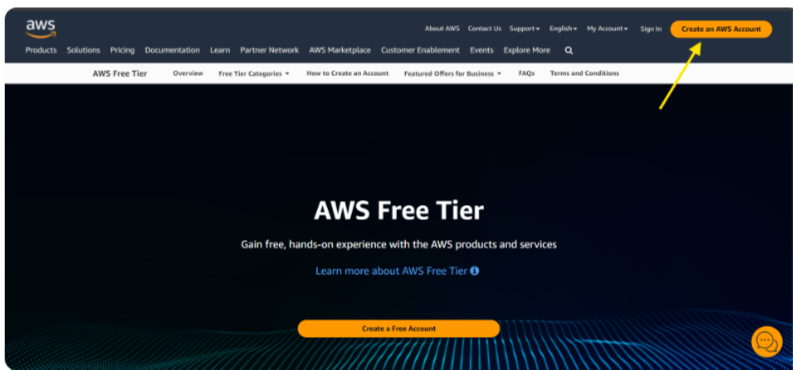 |
| 2 | 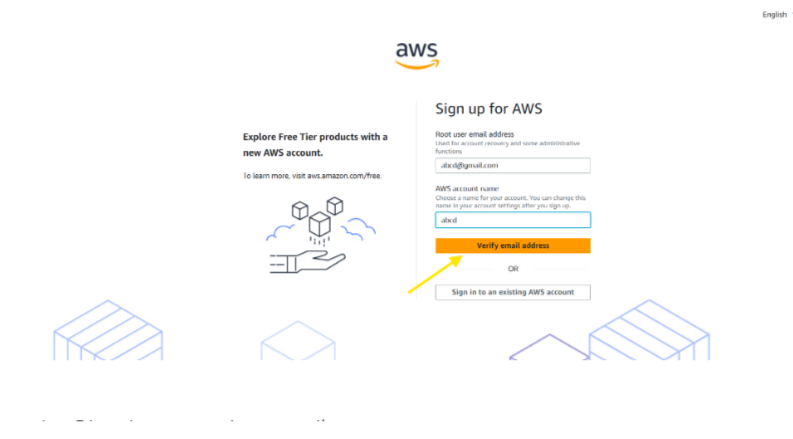 |
| 3 | 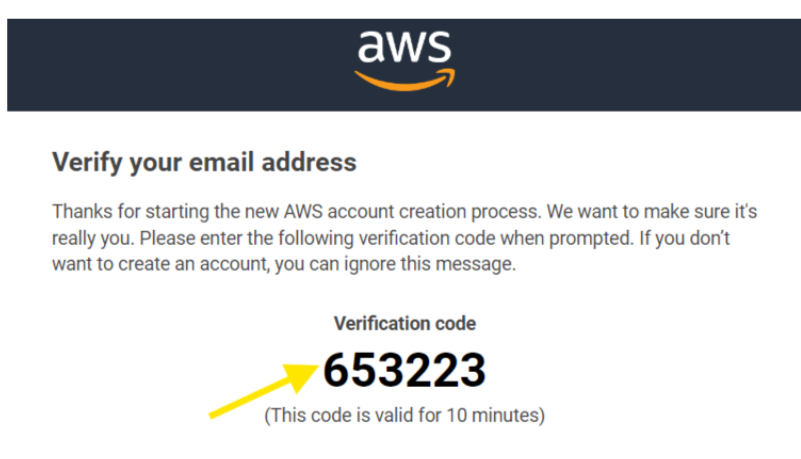 |
| 4 | 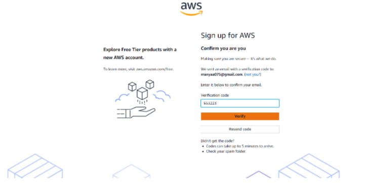 |
| 5 | 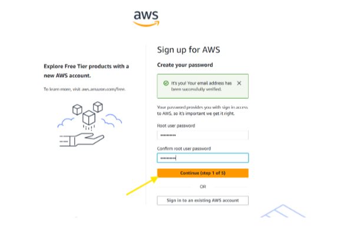 |
| 6 | 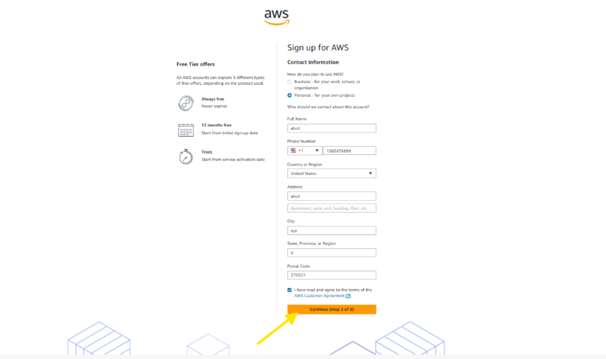 |
| 7 | 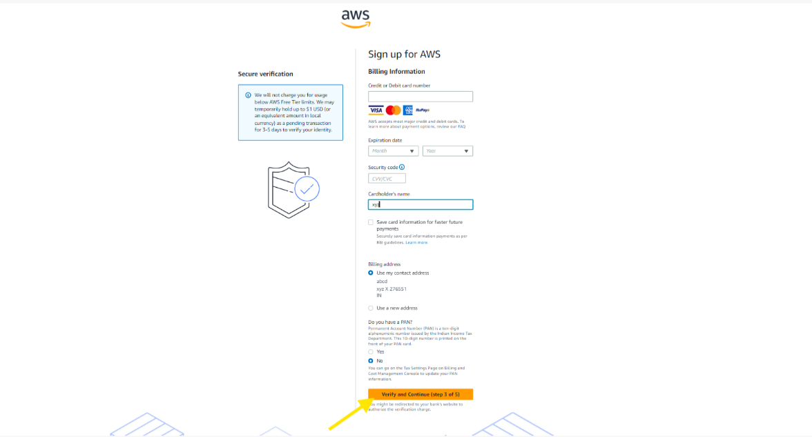 |
| 8 | 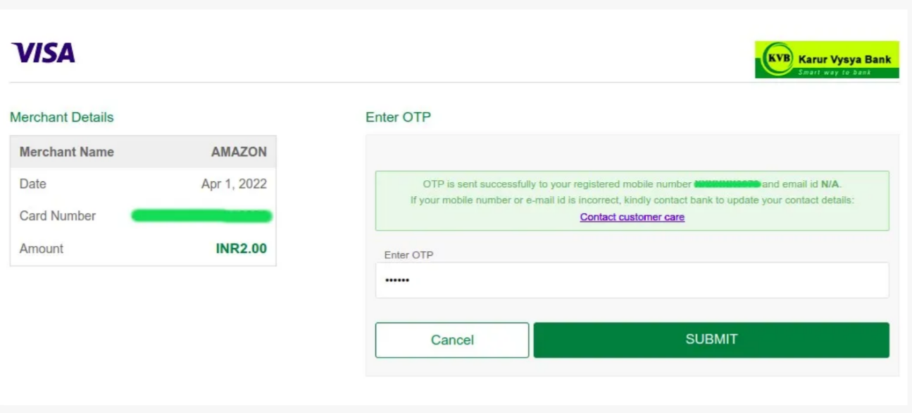 |
| 9 | 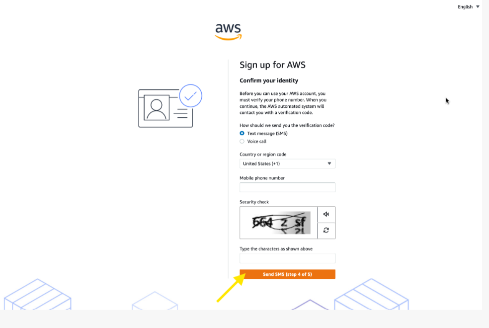 |
| 10 | 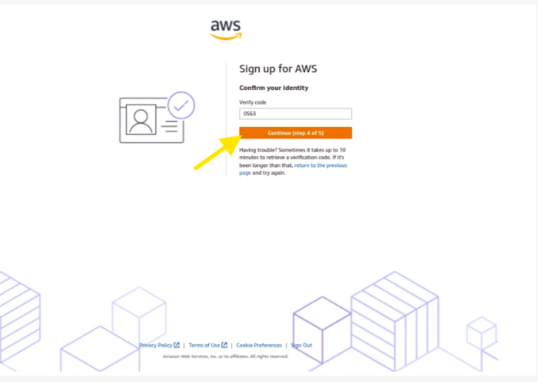 |
| 11 | 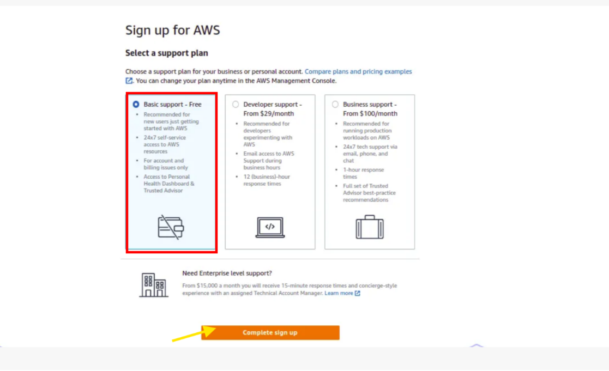 |
| 12 | 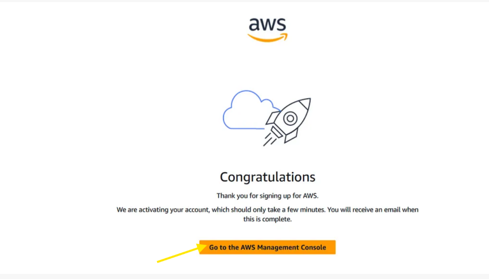 |
| 13 | 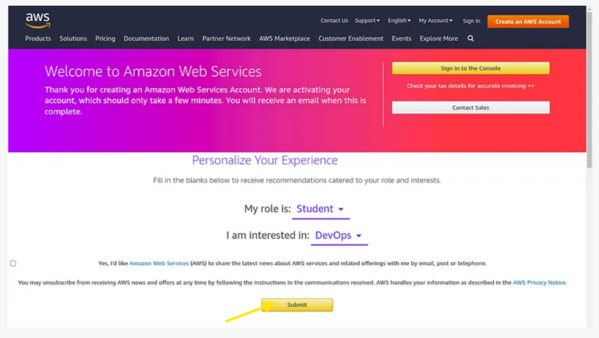 |
| 14 | 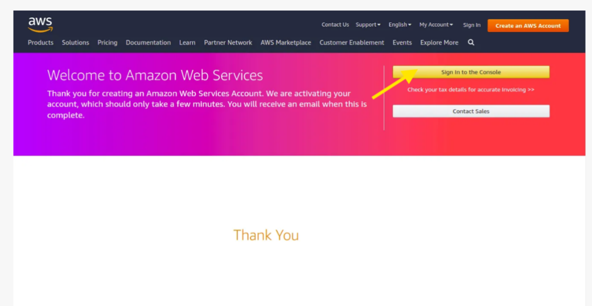 |
| 15 | 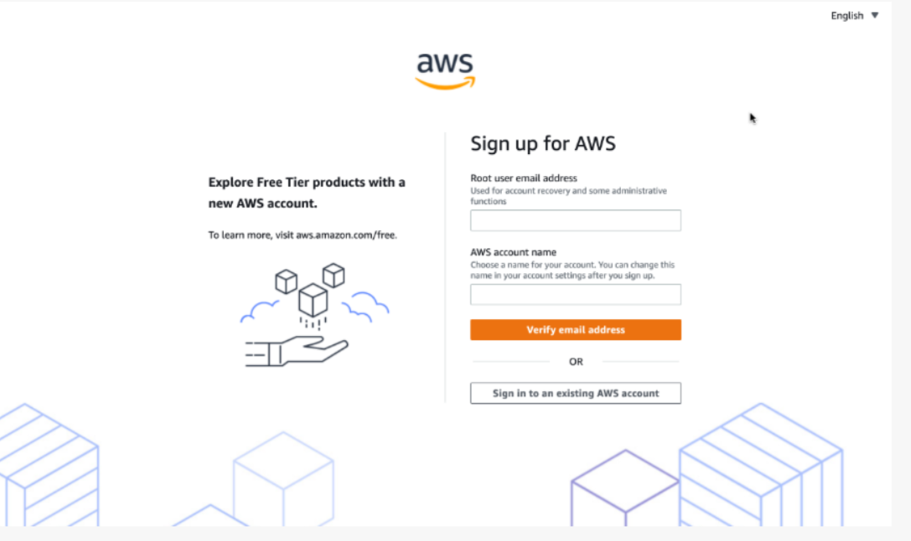 |
| 16 | 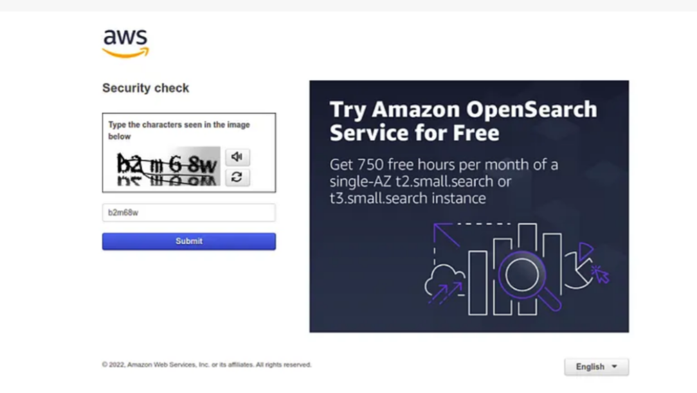 |
| 17 | 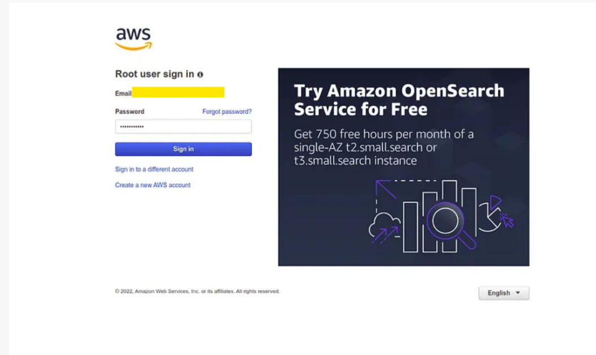 |
| 18 | 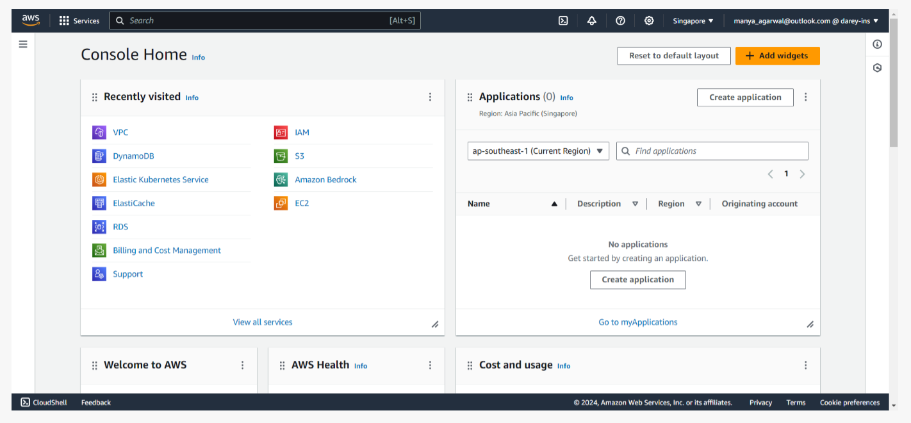 |

---

