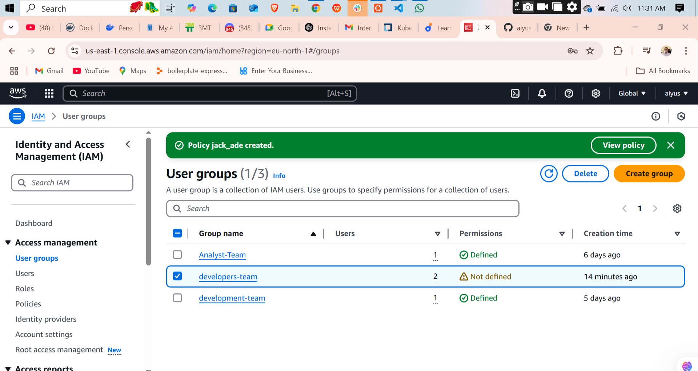

# 🔐 AWS IAM Practice – My Journey in Managing Access the Right Way

## 🧾 Overview

In this exercise, I explored AWS IAM (Identity and Access Management) by setting up users, groups, and policies. My goal was to understand how to properly assign permissions for services like EC2 and S3 without giving unnecessary access. This was part of my cloud learning journey, and it gave me hands-on experience with managing AWS identities securely and effectively.

---

## 🧑‍💻 What I Did

### 👤 Created a User – `eric`

I started by creating an IAM user named `eric`. My intention was to give Eric permission to manage EC2 instances only.

- I created a **custom IAM policy** with the necessary permissions for EC2 operations (like starting, stopping, and terminating instances).
- Then I **attached that policy directly to Eric**, giving him access to EC2 without granting unnecessary permissions.

### 📜 Wrote a Custom Policy for EC2 and S3

Next, I created a more flexible IAM policy that allows access to **both EC2 and S3**.

- This policy grants full EC2 management rights.
- It also gives access to S3 buckets, allowing users to create, upload, list, and delete objects.
- I saved this policy to use with a developer group.

### 👥 Created a Group – `developer-team`

To simulate a team setup, I created a group called `developer-team`.

- This group is meant for users who need both EC2 and S3 access.
- I attached the custom EC2 & S3 policy to this group.

### 👨‍💻👨‍💻 Added Users – `jack` and `ade`

I then created two users: `jack` and `ade`.

- Instead of assigning permissions to them individually, I added them to the `developer-team` group.
- This way, they inherited the group’s permissions and could work with both EC2 and S3 services right away.

---

## 🧠 What I Learned

This hands-on setup helped me understand the value of proper permission management in AWS:

- **Use groups for scalability**: It’s easier to manage access through groups instead of attaching policies to each user.
- **Custom policies are powerful**: I can tailor access based on what a user or group actually needs.
- **The principle of least privilege matters**: Don’t give more access than necessary. It’s safer that way.
- **Every user should have unique credentials** for accountability.

I also realized how easy it is to misconfigure access if you're not careful. Using visual policy editors and IAM policy simulator tools helped me double-check everything.

---

## ✍️ Final Thoughts

Doing this IAM setup by myself helped me see just how important identity and access management is in cloud computing. It’s not just about clicking buttons—it’s about thinking through who needs what and why.

Security in the cloud starts with IAM, and I’m glad I’m getting the foundations right.

---

## 📸 Screenshots

Here’s a visual walkthrough of the process:

  
  
  
  
  
  
  
  
  
  
  

  
  
  
  
  
  

  
  
  
  
  
  
  
  
  
  
  

