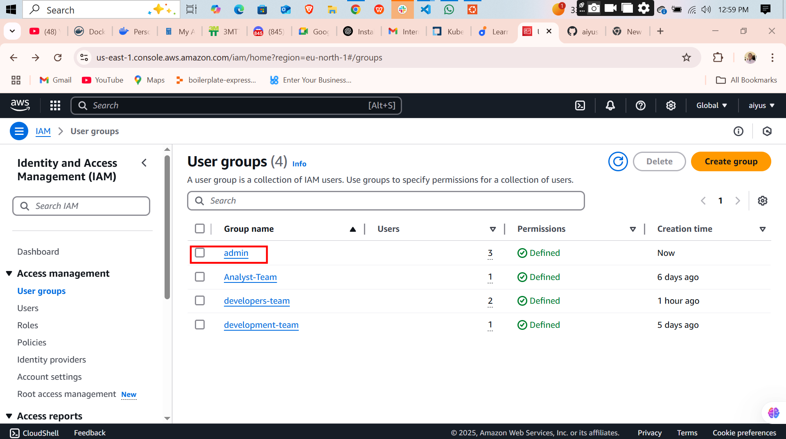
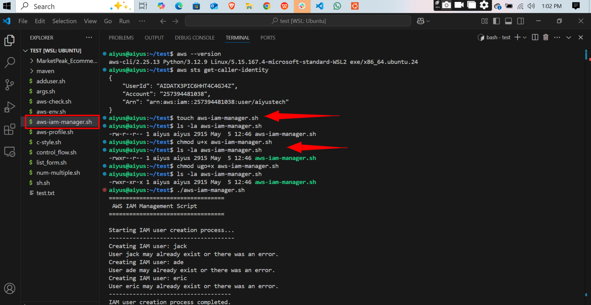
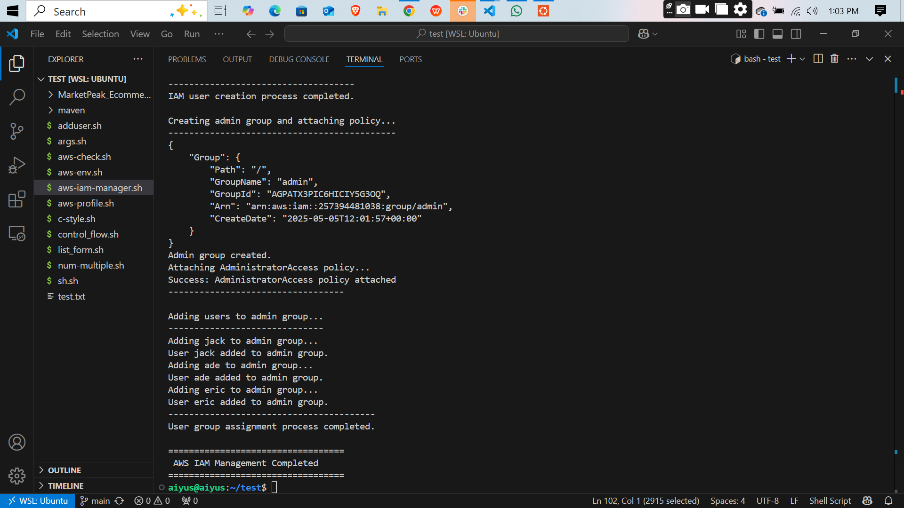

# 🔐 AWS IAM Automation Script – My Thought Process & Build

## 🧾 Overview

As part of my CloudOps and DevOps learning journey, I wanted to move beyond manual IAM operations in the AWS console. I challenged myself to **automate user and group management using Bash and AWS CLI**. This script reflects that journey — my goal was to build a tool that:

- Creates multiple IAM users in one go.
- Creates an admin group if it doesn't already exist.
- Attaches the `AdministratorAccess` policy to that group.
- Adds specified users to the admin group automatically.

This helped me understand how DevOps professionals use infrastructure as code (IaC) principles for managing cloud resources efficiently.

---

## ⚙️ Features of the Script

### ✅ Creates IAM Users
I defined an array of users (e.g., `jack`, `ade`, `eric`) and used a loop to create them programmatically. This eliminates repetitive clicks in the AWS console.

### ✅ Sets Up Admin Group with Full Access
The script checks if the `admin` group already exists. If not, it creates it. Then, it attaches the AWS-managed policy `AdministratorAccess` to the group, giving full control over AWS services.

### ✅ Adds Users to Admin Group
The script adds all defined users to the `admin` group, ensuring that permissions are managed at the group level — a best practice in IAM.

---

## 💡 My Thought Process

I broke the automation into three major functions:

1. **User Creation:** A loop handles creating IAM users based on an array of names. I added error handling in case users already exist.
2. **Group Setup & Policy Attachment:** I made the script smart enough to detect existing groups and re-use them rather than recreate. This avoids unnecessary errors.
3. **User Group Assignment:** I added users to the group dynamically, which is scalable and clean.

Before writing the script, I sketched the logic using pseudocode and made sure I understood how each AWS CLI command works using the official documentation and `aws help`.

This exercise helped me understand:
- The importance of scripting in cloud environments.
- How to use `aws iam` commands effectively.
- How automation improves consistency and reduces human error.

---

## 🔗 Link to the Script

👉 [View Script on GitHub](./aws-iam-manager.sh)

> Replace the link above with the actual path to your GitHub repository.

---

## 🧠 Lessons Learned

- Using arrays and loops in Bash can greatly simplify repetitive tasks.
- AWS CLI is a powerful tool when combined with scripting.
- Managing IAM properly is critical for security and efficiency in AWS environments.
- It's better to assign permissions through groups, not directly to users.

## 🗂️ Usage

Make sure you’ve configured AWS CLI with `aws configure`, then run:

bash iam_manager.sh

## Screen Shots
 
 
 
