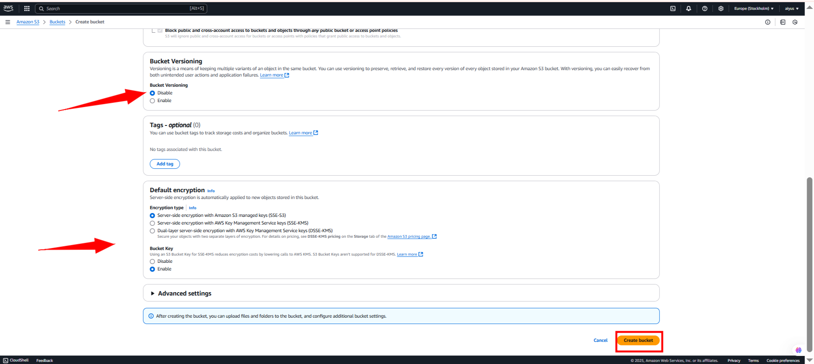

# Amazon S3 Bucket Lifecycle Project

## Overview

In this project, I explored how to manage files effectively using Amazon S3. The process involved creating a new bucket, uploading files, enabling versioning, configuring public access permissions, and setting up lifecycle policies to automate file management.

---

## What I Did

1. **Created a New S3 Bucket**  
   I began by creating a new S3 bucket to store files securely in the cloud.

2. **Uploaded a File**  
   I uploaded a sample file to the bucket to test the setup and ensure everything was functioning correctly.

3. **Enabled Versioning**  
   To maintain a history of changes, I enabled versioning on the bucket. This allowed me to retain and track multiple versions of uploaded files.

4. **Configured Permissions**  
   I configured the bucket’s permissions to allow public access so that anyone with the correct link could retrieve the files.

5. **Implemented Lifecycle Policies**  
   Finally, I created lifecycle rules to automate storage management. For example, older file versions can be transitioned to cheaper storage or deleted after a set period.

---

## Reflections

This hands-on experience deepened my understanding of Amazon S3’s core features. Enabling versioning was particularly valuable, as it added a layer of safety against accidental overwrites or deletions. Managing permissions taught me to balance accessibility with security, and setting up lifecycle rules highlighted how automation can improve efficiency and reduce costs over time.

Overall, this exercise helped me appreciate the power and flexibility of cloud storage and reinforced best practices for scalable file management.

---

## Tools & Technologies

- **Amazon Web Services (AWS)**
  - S3 (Simple Storage Service)
- **AWS Management Console**  
  (I could also have used the AWS CLI for a more automated setup.)

---
## Screen Shots
  
  
  
  
  
  
  
  
  
  
  
  
  
  
  
  
  
  
  
  
  
  
  
  
  
  
  
  
  
  
  
  
  
  
  
  

