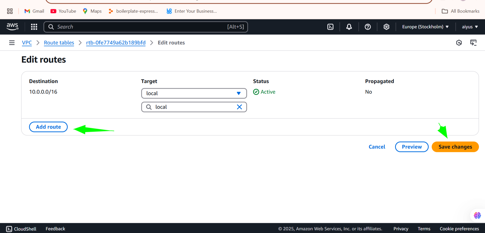
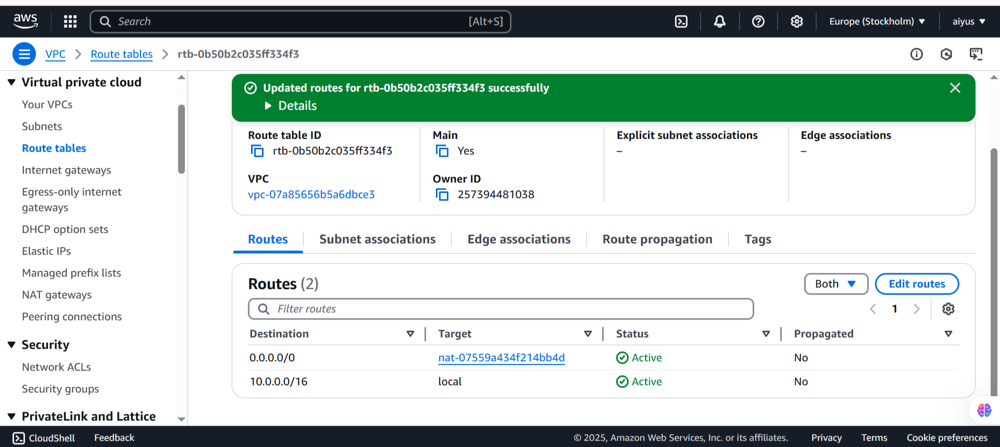
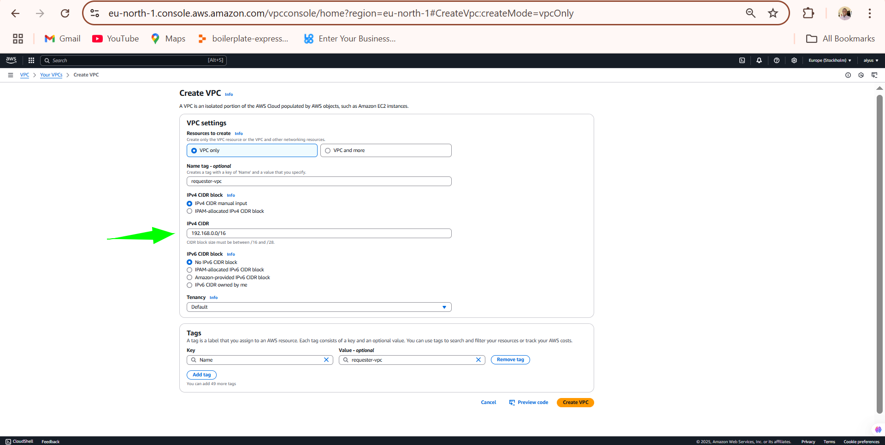

# 🌐 Network Mastery with AWS VPC – Mini Project

## 📌 Project Overview

In this session, I explored the core concepts of **Amazon Web Services (AWS)**, focusing specifically on **Virtual Private Clouds (VPCs)**. The objective was to understand the fundamental components of VPC infrastructure, including **subnets, gateways, and routing tables**. Through practical demonstrations and interactive exercises, I navigated the AWS Management Console to deploy and manage these critical components.

---

## 🎯 Objectives

* Create and configure a custom VPC
* Set up public and private subnets
* Configure Internet Gateway and NAT Gateway
* Set up and modify route tables
* Deploy EC2 instances in both subnets
* (Bonus Task) Create two additional VPCs and connect them using **VPC Peering**

---

## 🛠️ What I Did

### 1. **Created a Custom VPC**

* CIDR: `10.0.0.0/16`
* One **public subnet** and one **private subnet**

### 2. **Set Up Gateways**

* **Internet Gateway**: Attached to the VPC for public subnet access
* **NAT Gateway**: Deployed in the public subnet using an Elastic IP to allow private subnet internet access

### 3. **Configured Route Tables**

* Public subnet: Route to Internet Gateway
* Private subnet: Route to NAT Gateway

### 4. **Launched EC2 Instances**

* One instance in the public subnet (for SSH and internet access)
* One instance in the private subnet (tested internet connectivity through the NAT gateway)

---

## 🔄 Bonus: VPC Peering Between Two Additional VPCs

### Additional VPCs Created:

* **VPC A:** `172.16.0.0/16`
* **VPC B:** `192.186.0.0/16`

### Peering Setup:

* Created a **VPC Peering Connection** between VPC A and VPC B
* Accepted the peering request
* Updated route tables in both VPCs for mutual routing
* Modified security groups to allow traffic from the other VPC’s CIDR
* Verified connectivity between EC2 instances in VPC A and B

---

## 🔐 Security Considerations

* Restricted SSH access to specific IPs
* Security groups opened only for necessary ports
* Private subnet fully isolated from inbound external traffic

---

## 🧠 Skills Gained

* Custom VPC and subnet creation
* Gateway configuration and routing logic
* NAT and internet access control
* VPC peering and route table updates
* Security group management and testing inter-VPC communication

## 📸 Screenshots (Optional)

  
  
  
  
  
  
  
  
  
  
  
  
  
  
  
  
  
  
  
  
  
  
  
  
  
  
  
  
  
  
  
  
  
  
  
  
  
  
  
  
  
  
  
  
  
  
  
  