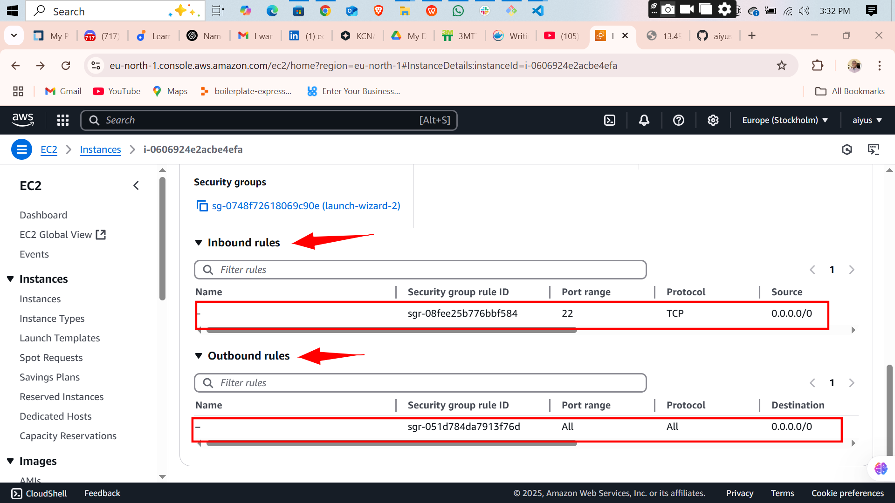
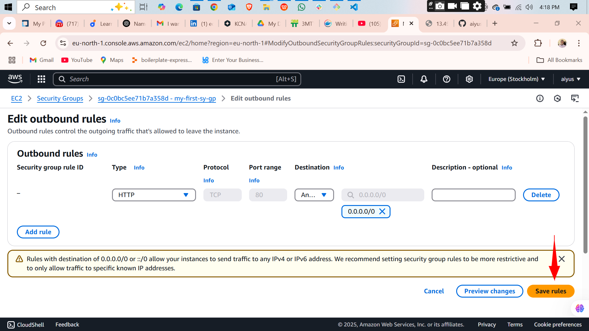
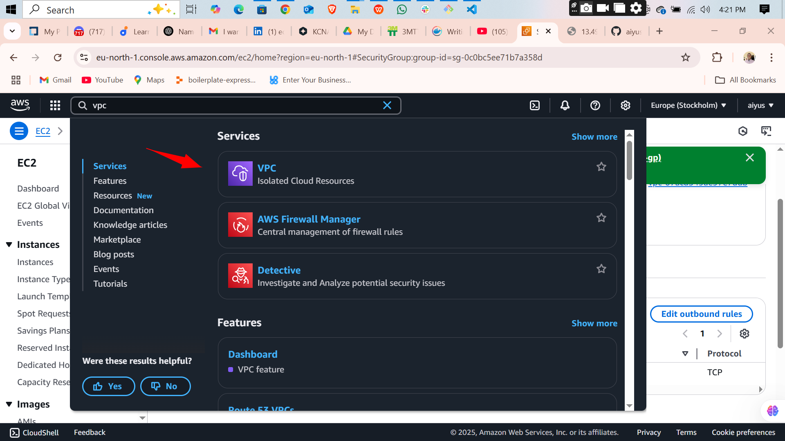
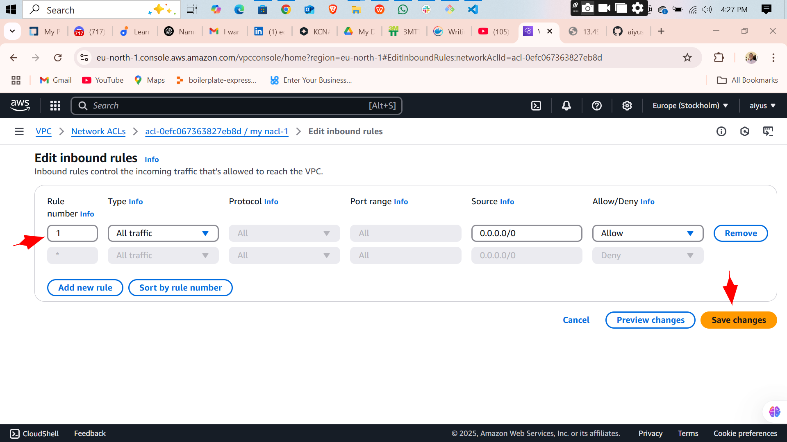

# NACL - AWS Network Security Project

This project focused on configuring and understanding key AWS networking components—**Security Groups** and **Network Access Control Lists (NACLs)**—to secure and control traffic flow in AWS environments.

---

## 🔍 Project Overview

- Configured Security Groups and NACLs to manage **inbound** and **outbound** traffic.
- Distinguished the roles and behaviors of **Security Groups vs. NACLs** in network security.
- Conducted hands-on tests to observe how these two layers interact and impact traffic.
- Troubleshooted and resolved **network connectivity issues** in various simulated AWS scenarios.

---

## 🧠 Key Takeaways

- Gained clarity on **stateless (NACL)** vs. **stateful (Security Group)** behavior.
- Practiced **diagnosing** traffic blocks and resolving issues with rule configurations.
- Enhanced confidence in managing and securing network layers in AWS VPC environments.

---

## 🚀 Outcome

Successfully built a solid foundation in **AWS network security** with practical, real-world applications of Security Groups and NACLs.

---

> This was an enriching hands-on project that built both technical and troubleshooting skills in cloud networking.

---

## 📸 Screen Shots

  
  
  
  
  
  
  
  
  
  
  
  
  
  
  
  
  
  
  
  
  
  
  
  
  
  
  
  
  
  
  
  
  
  
  
  
  
  
  
  
  
  
  
  
  
  
  
  
  
  
  

---

[⬅ Back to Top](./README.md)
