# AWS Infrastructure Automation Script 🖥️☁️

This project is a Bash automation script designed to provision AWS infrastructure components efficiently. Based on the specified environment (`local`, `testing`, or `production`), the script performs a series of checks to ensure the AWS CLI is installed and configured correctly. It then automates the creation of **two EC2 instances** using a defined AMI and instance type, and **S3 buckets** for various departments (Marketing, Sales, HR, Operations, Media) using a consistent naming convention. This script simplifies repetitive infrastructure setup tasks and promotes standardized cloud resource deployment across different environments.

## 🚀 Features

* Environment-specific automation
* EC2 instance provisioning
* S3 bucket creation per department
* AWS CLI and profile validation
* Simple and reusable Bash functions

## 📋 Usage

```bash
chmod +x ec2-s3.sh
./ec2-s3.sh <environment>
```

Replace `<environment>` with `local`, `testing`, or `production`.

## ✅ Requirements

* AWS CLI installed and configured
* Valid AWS credentials (`AWS_PROFILE` set)
* Proper IAM permissions to create EC2 and S3 resource

-- view the script here [script](./ec2-s3.sh)

## Screen Shots and Video
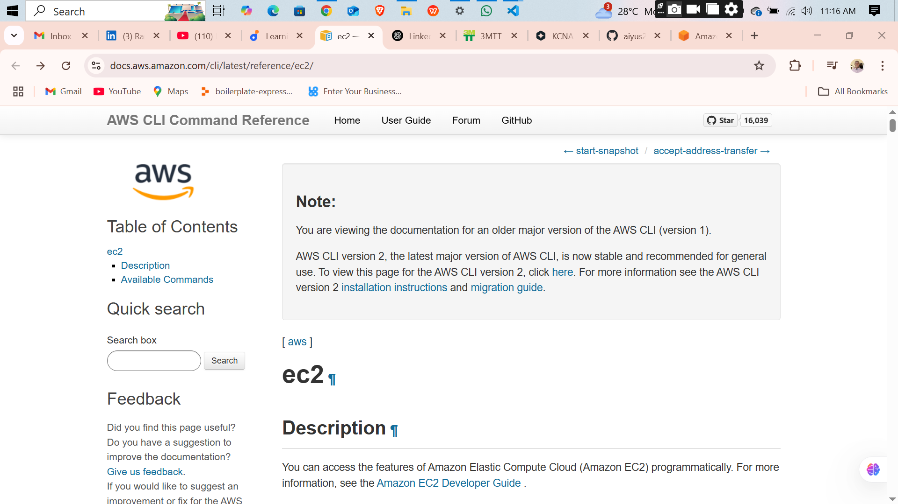 
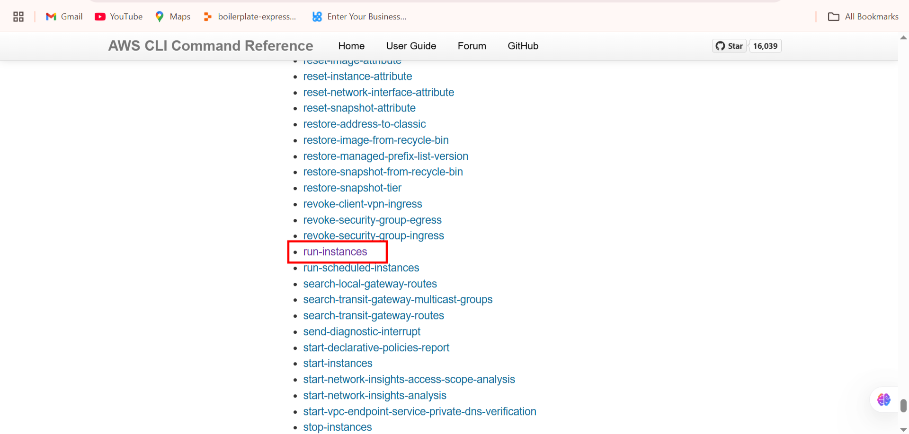  
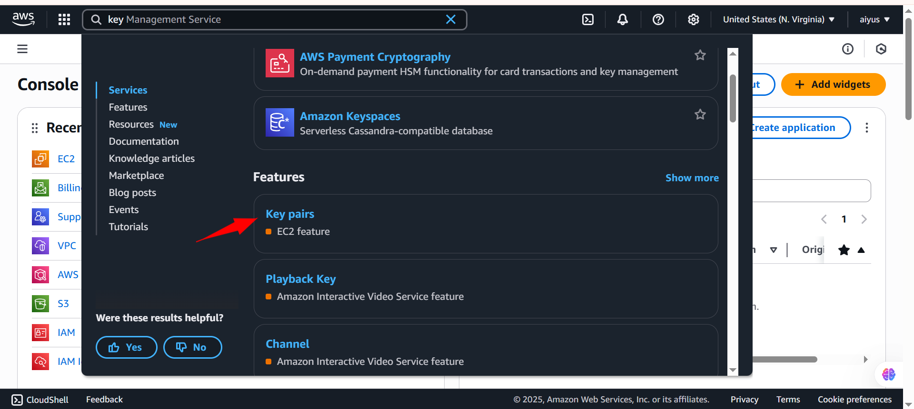
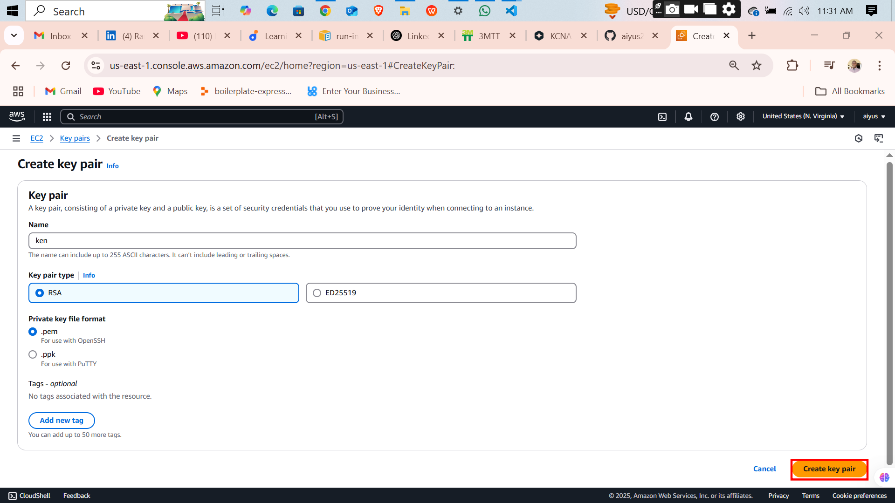  
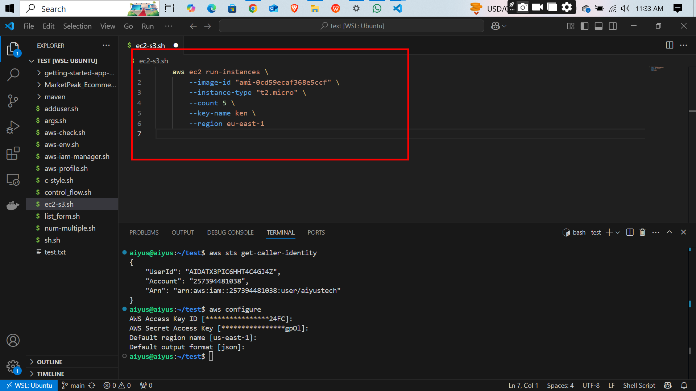  
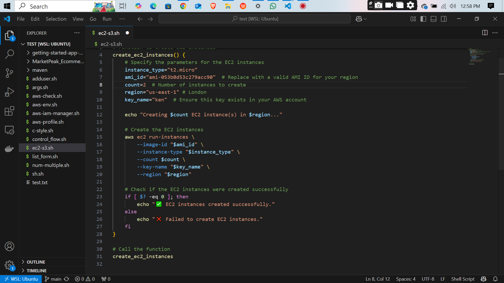  
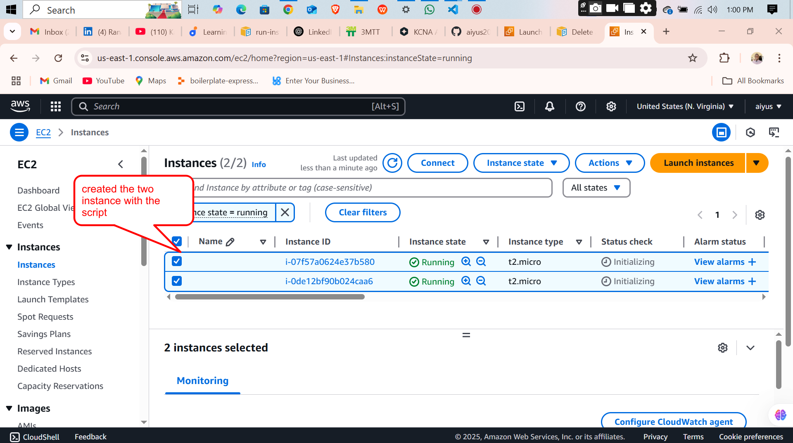  
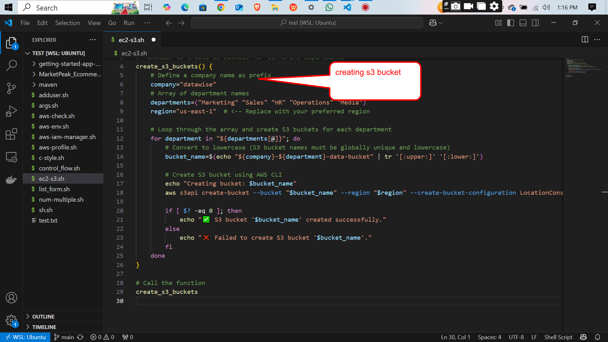  
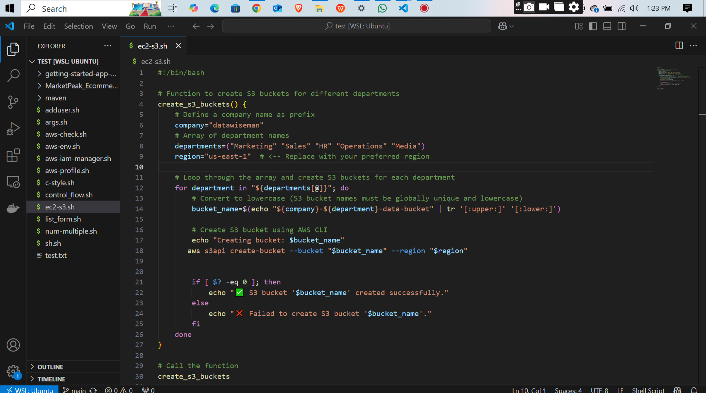  
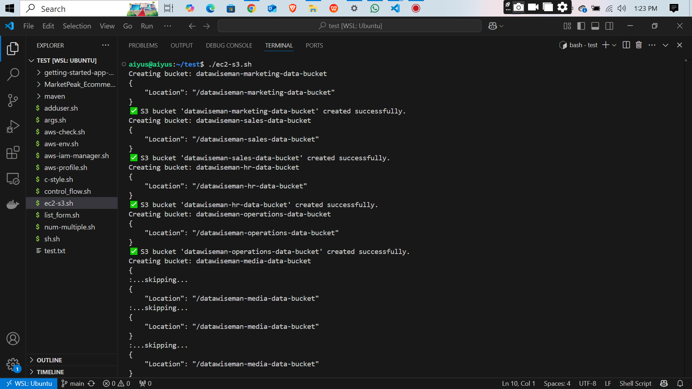  
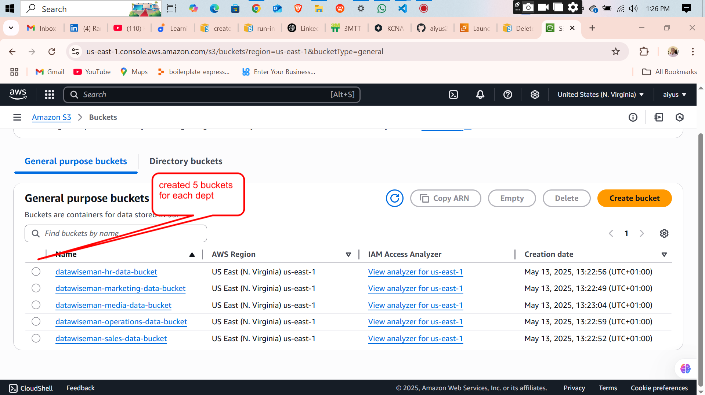  
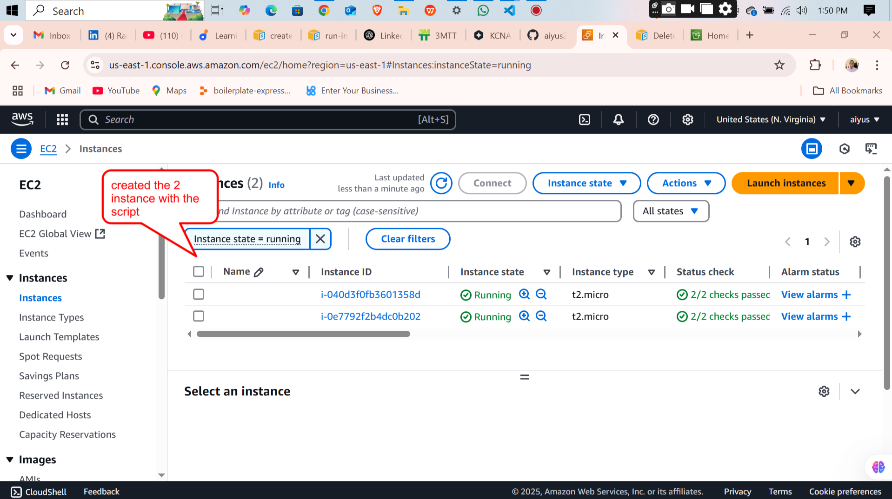  
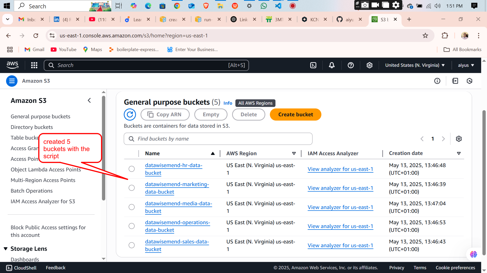  
 

<video controls src="./imgs/awe-vd.mp4" title="alt text"></video>
