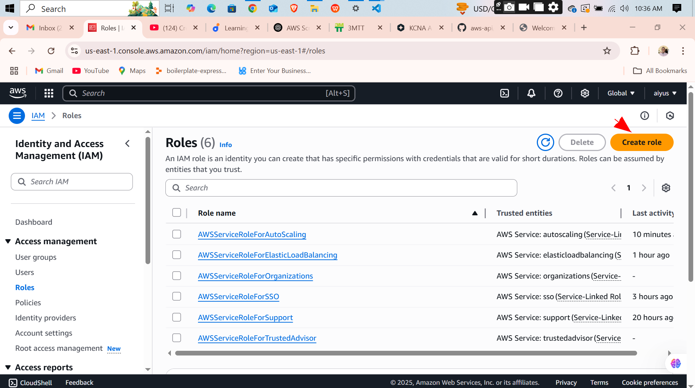

Certainly! Here's your updated `README.md` with `./imgs/` as the path and each image on its own line:

---

# üöÄ Mini Project: Setting Up Secure Authentication to AWS API

## üìå Objective

To securely access AWS services from the terminal using the AWS CLI, we configure IAM roles, policies, and users to enable programmatic access via AWS APIs. This project demonstrates a foundational understanding of secure authentication to AWS APIs.

---

## 🛠️ Steps Followed

### 1. **Create an IAM Role**

Created a role named `automationRole` with a trust policy allowing a specific user (`automation_user`) to assume the role.

**Trust Policy:**

```json
{
  "Version": "2012-10-17",
  "Statement": [
    {
      "Effect": "Allow",
      "Principal": {
        "AWS": "arn:aws:iam::257394481038:user/automation_user"
      },
      "Action": "sts:AssumeRole"
    }
  ]
}
```

---

### 2. **Create an IAM Policy**

Policy granting full access to EC2 and S3 resources.

**IAM Policy JSON:**

```json
{
  "Version": "2012-10-17",
  "Statement": [
    {
      "Effect": "Allow",
      "Action": [
        "ec2:*",
        "s3:*"
      ],
      "Resource": "*"
    }
  ]
}
```

---

### 3. **Create an IAM User**

Created an IAM user named `automation_user`.

---

### 4. **Assign the User to the Role**

Using the trust relationship in the role to allow `automation_user` to assume it.

---

### 5. **Attach Policy to User**

Attached the above policy to `automation_user` for full access to EC2 and S3.

**Additionally:**
Attached an inline policy to allow the user to assume the role:

```json
{
  "Version": "2012-10-17",
  "Statement": [
    {
      "Effect": "Allow",
      "Action": "sts:AssumeRole",
      "Resource": "arn:aws:iam::257394481038:user/automation_user"
    }
  ]
}
```

---

### 6. **Create Programmatic Access Credentials**

Generated an **Access Key ID** and **Secret Access Key** for `automation_user`.

Stored securely in:

```bash
~/.aws/credentials
```

---

### 7. **Configure AWS CLI**

```bash
aws configure
```

* Access Key ID
* Secret Access Key
* Region (e.g., `us-east-1`)
* Output Format (e.g., `json`)

---

### 8. **Test Authentication via Terminal**

```bash
aws sts get-caller-identity
```

Expected Output:

```json
{
  "UserId": "AIDxxxxxxxxxxxxx",
  "Account": "123456789012",
  "Arn": "arn:aws:iam::123456789012:user/automation_user"
}
```


---

## üì∑ Screenshots

```markdown
  
  
  
  
  
  
  
  
  
  
  
  
  
  
  
  
  
  
  
  
```

---

## ✍️ Reflection

Setting up secure AWS API access through the CLI ensures safer and more manageable cloud operations, especially when automating infrastructure provisioning. Understanding IAM policies, roles, trust relationships, and programmatic credentials is foundational for DevOps and cloud professionals.

