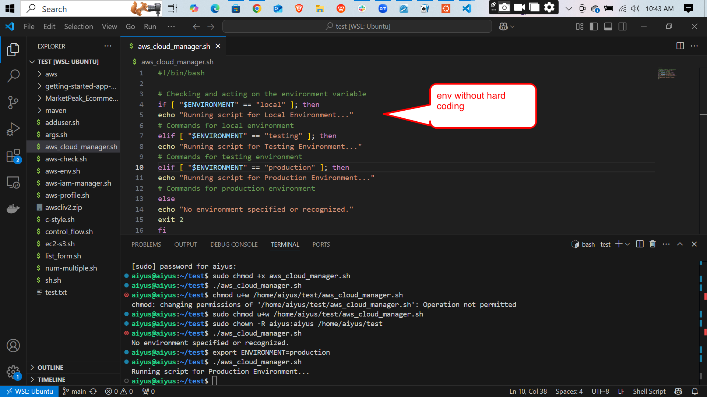
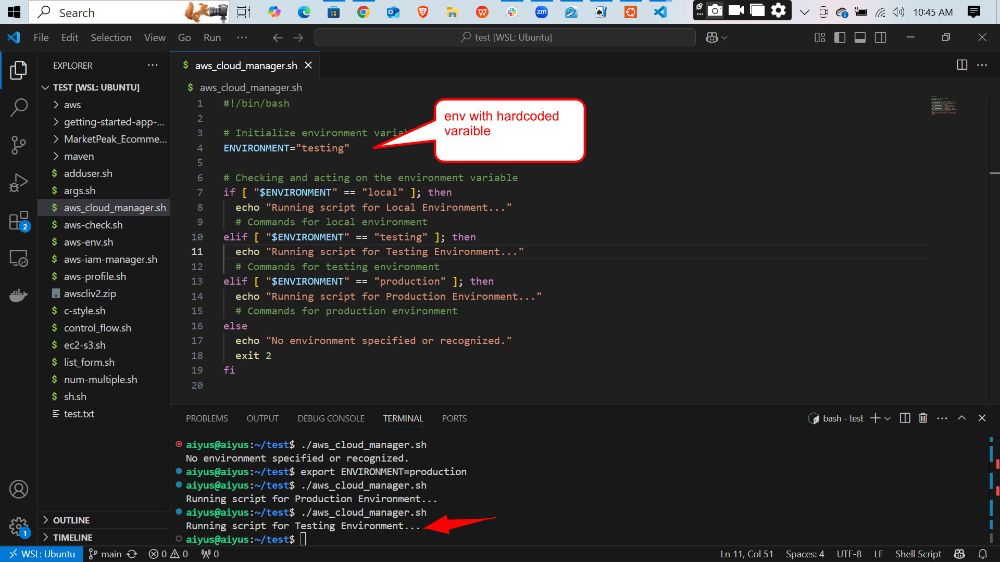
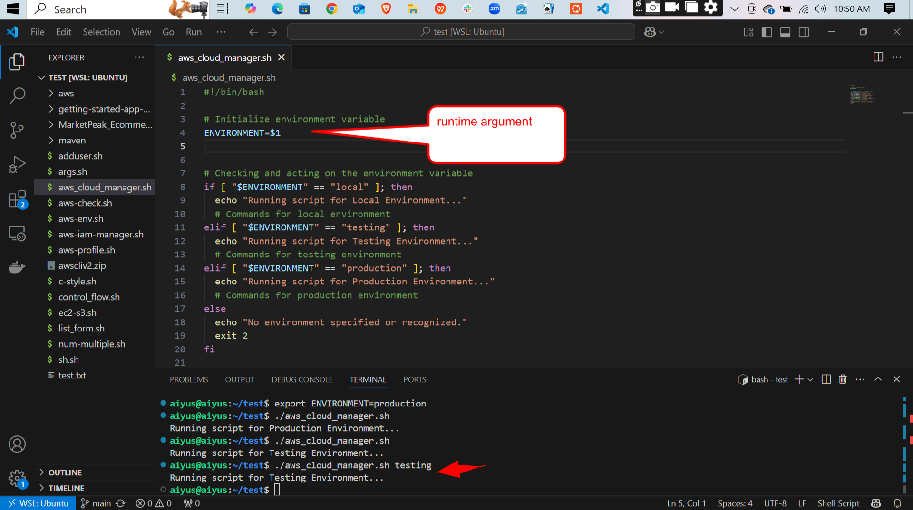
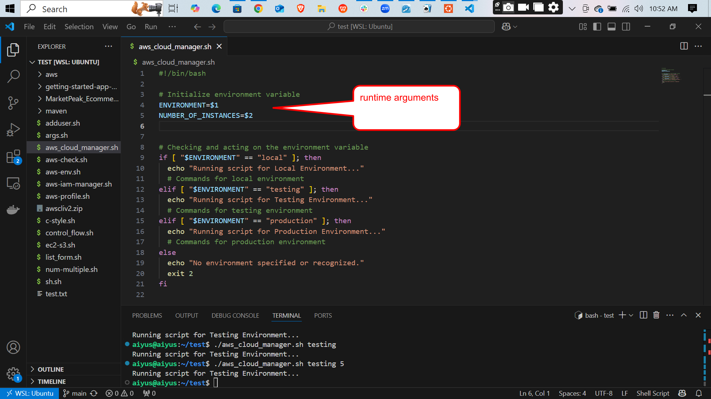
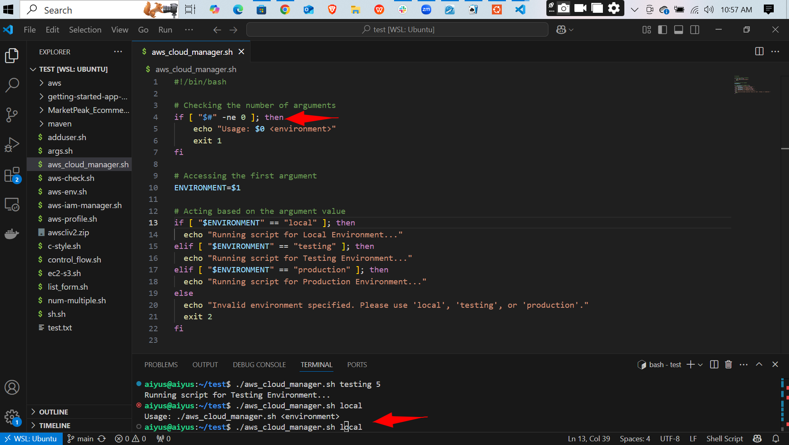
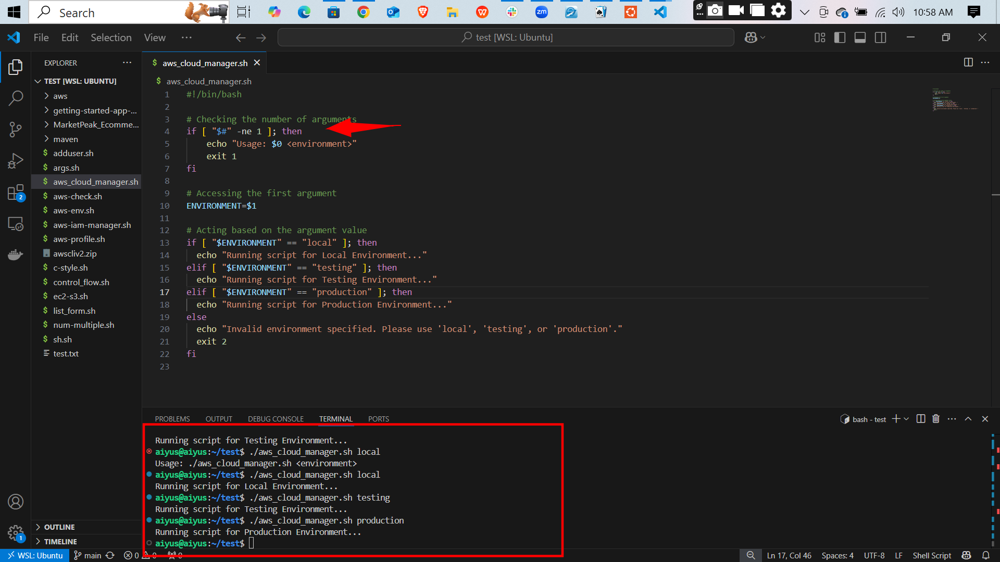
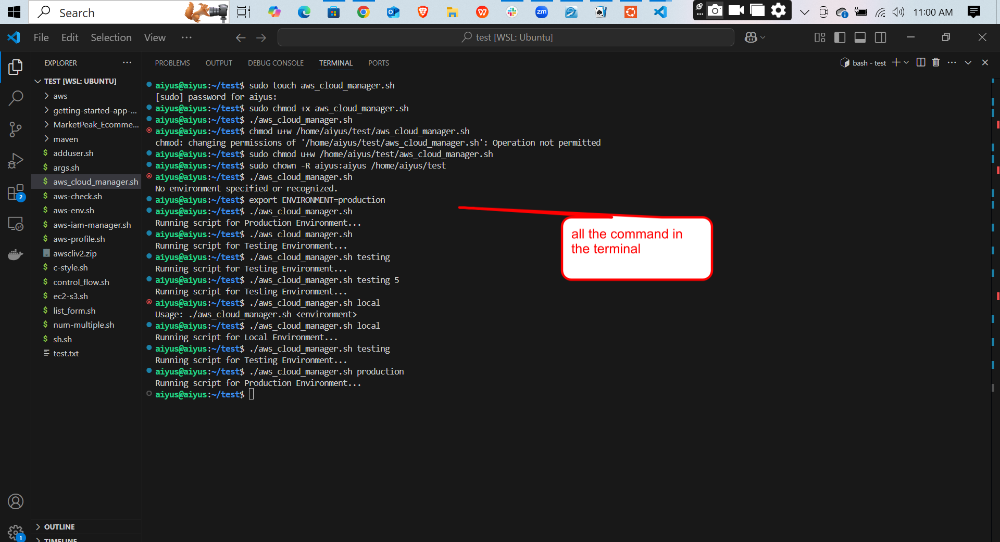

# Environmental Variables
This repository provides a versatile Bash script template that adapts to different deployment environments—either by setting a hard‑coded ENVIRONMENT variable or by passing the desired environment (local, testing, or production) as a command‑line argument. It demonstrates clear conditional branching with if…elif…else, enforces input validation (exiting with distinct codes for incorrect usage vs. unrecognized values), and prints concise, informative messages for both normal operations and error conditions. The template’s modular structure makes it easy to extend with additional environments, integrate into CI/CD pipelines, and maintain over time, while included screenshots illustrate its behavior in each environment.This repository provides a versatile Bash script template that adapts to different deployment environments—either by setting a hard‑coded ENVIRONMENT variable or by passing the desired environment (local, testing, or production) as a command‑line argument. It demonstrates clear conditional branching with if…elif…else, enforces input validation (exiting with distinct codes for incorrect usage vs. unrecognized values), and prints concise, informative messages for both normal operations and error conditions. The template’s modular structure makes it easy to extend with additional environments, integrate into CI/CD pipelines, and maintain over time, while included screenshots illustrate its behavior in each environment.

## screen shots

