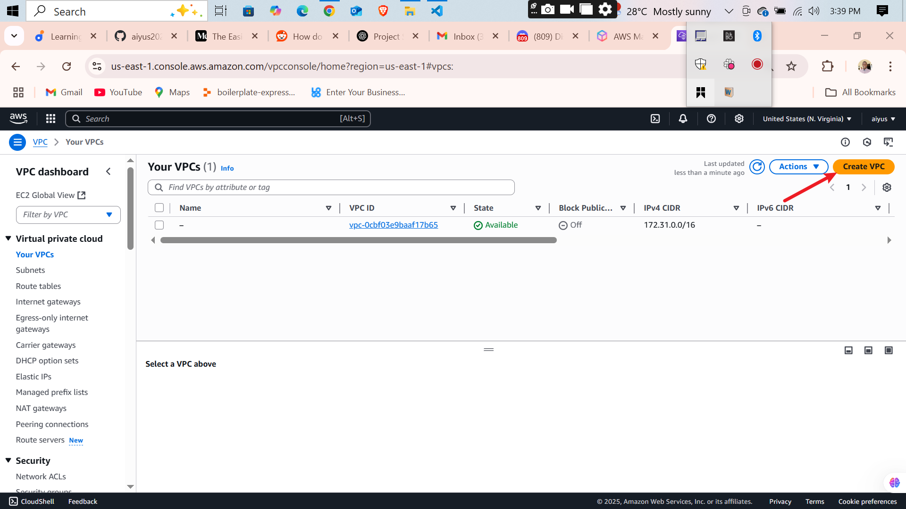
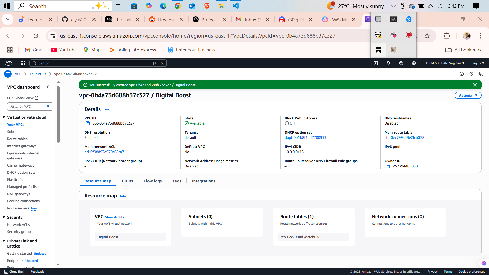
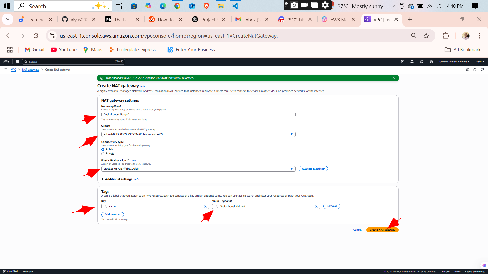
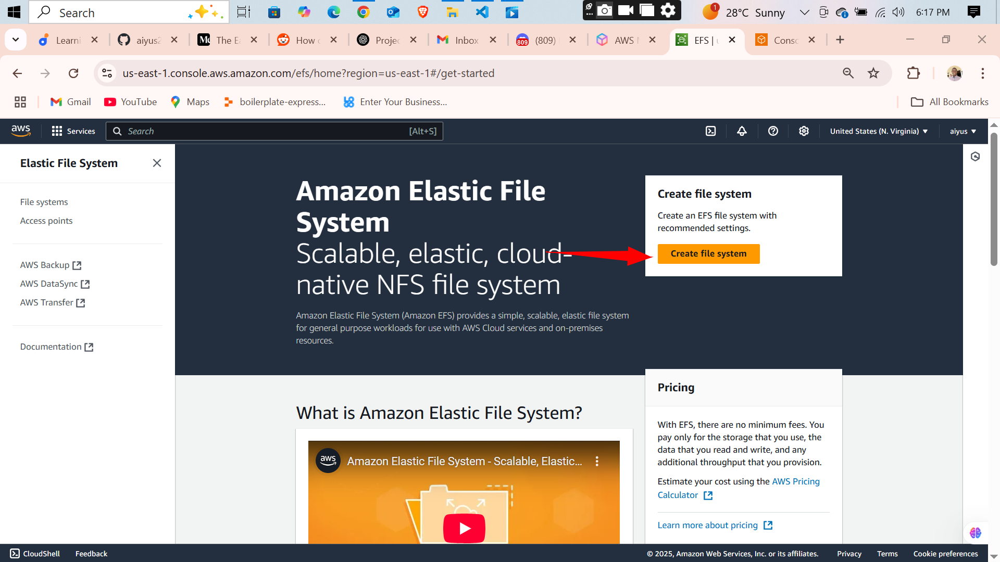
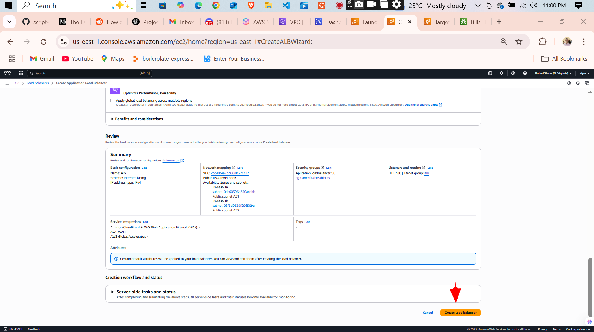
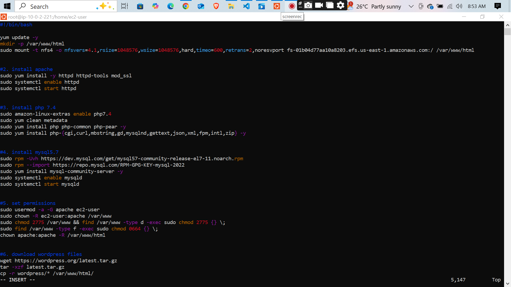
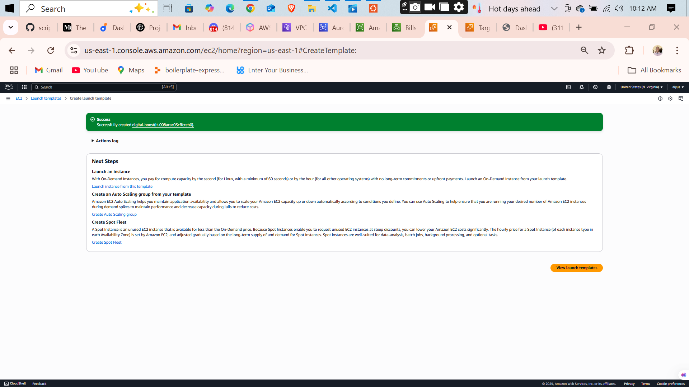

# AWS-Based Web Application Deployment with EFS, RDS, and Load Balancer

This project demonstrates how I deployed a high-availability WordPress application on AWS using the following key services:

- **EC2 (Amazon Linux 2023)**
- **Amazon RDS (MySQL)**
- **Amazon EFS**
- **Elastic Load Balancer (ALB)**
- **Auto Scaling Group**
- **Security Groups**
- **IAM Roles**
- **User Data for bootstrapping**
- **(Optional) Route 53**

---

## 🔧 Technologies Used

- Amazon Linux 2023 (on EC2)
- Apache Web Server
- PHP (with MySQL support)
- MySQL (RDS)
- AWS CLI / Cloud Console

---

## 🌐 Architecture Overview

```text
              Route 53 (optional)
                     |
            ┌────────▼────────┐
            │ Application Load│
            │    Balancer     │
            └────────┬────────┘
                     |
           ┌─────────▼─────────┐
           │  Auto Scaling     │
           │   Group (EC2)     │
           └────┬────┬────┬────┘
                │    │    │
        ┌───────▼┐ ┌─▼────┐┌────▼─────┐
        │ EC2 #1 │ │ EC2#2││ EC2 #n  │
        └────┬───┘ └──────┘└─────────┘
             │
   ┌─────────▼────────┐
   │   Amazon EFS     │ (shared web content)
   └──────────────────┘

   ┌──────────────────┐
   │   Amazon RDS     │ (MySQL DB)
   └──────────────────┘
```

---

## 🚀 Deployment Steps

### 1. Launch EC2 Instances

- Used Amazon Linux 2023
- Installed Apache, PHP, MySQL client using `user-data`
- Mounted EFS into `/var/www/html`
- Attached IAM Role with necessary permissions

### 2. Setup Amazon EFS

- Created a file system with mount targets in relevant AZs
- Allowed NFS traffic in security groups
- Mounted with:

  ```bash
  sudo mount -t nfs4 -o nfsvers=4.1 fs-XXXX:/ /var/www/html
  ```

### 3. Configure Apache & PHP

```bash
sudo dnf install -y httpd php php-mysqlnd
sudo systemctl start httpd
```

### 4. Connect to Amazon RDS

- Created RDS with MySQL engine
- Connected from EC2 using:

  ```bash
  mysql -h <rds-endpoint> -u <user> -p
  ```

### 5. Create Load Balancer and Auto Scaling Group

- Target group health check: `/index.php`
- Launch Template included EFS mount and Apache startup
- Load balancer DNS used to access app

---

## 📂 File Structure

```text
/var/www/html/
├── index.php
├── config.php
├── db.php
└── assets/
```

---

## 📎 Scripts

- **WordPress setup script**: [`./wordpress.sh`](./wordpress.sh)
- **Auto scaling script**: [`./autoscale.sh`](./autoscale.sh)

---

## 📸 Screenshots

### 📌 General Setup

  


### 📌 WordPress Interface

  
  
  
  
  
  
  
  
  
  
  
  
  
  
  
  
  
  
  
  
  
  
  
  
  
  
  
  
  
  
  
  
  
  
  
  
  
  
  
  
  
  
  
  
  
  
  
  
  
  
  
  
  
  
  
  
  
  
  
  
  
  
  
  
  
  
  
  
  
  
  
  
  
  
  
  
  
  
  


---

## 🔐 Security Measures

- Used IAM roles, no hardcoded AWS keys
- NFS, HTTP, and MySQL ports carefully controlled by SG
- SSH only allowed from known IPs

---

## 📚 What I Learned

- Deploying multi-AZ EC2 + EFS applications
- Using Auto Scaling + Load Balancers effectively
- Creating robust IAM roles and security groups
- Troubleshooting EFS, Apache, and RDS connectivity

---

## 📁 Project Files

- [`./README.md`](./README.md)
- [`./wordpress.sh`](./wordpress.sh)
- [`./autoscale.sh`](./autoscale.sh)

