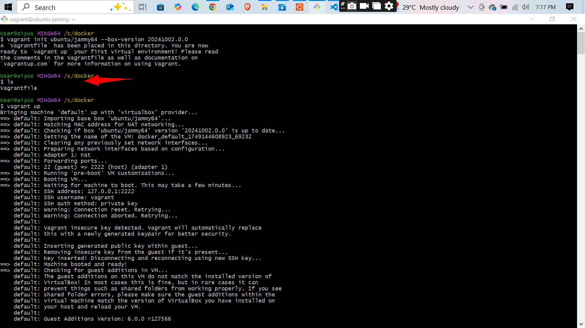
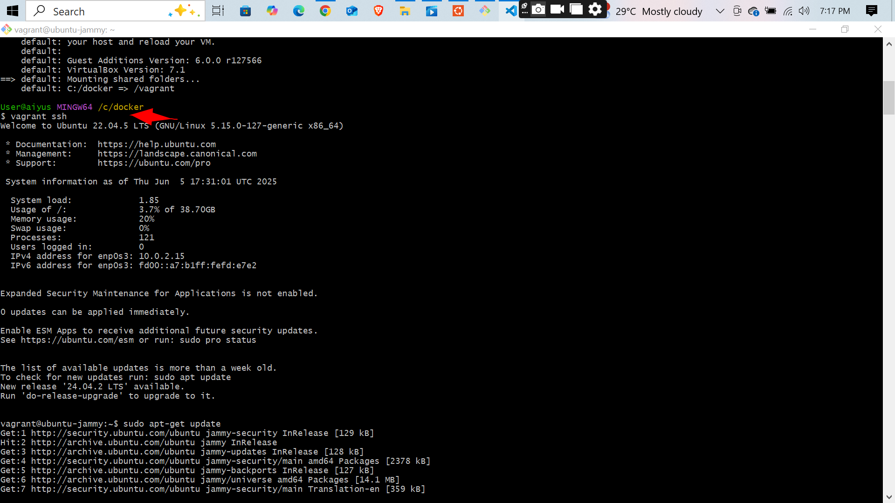
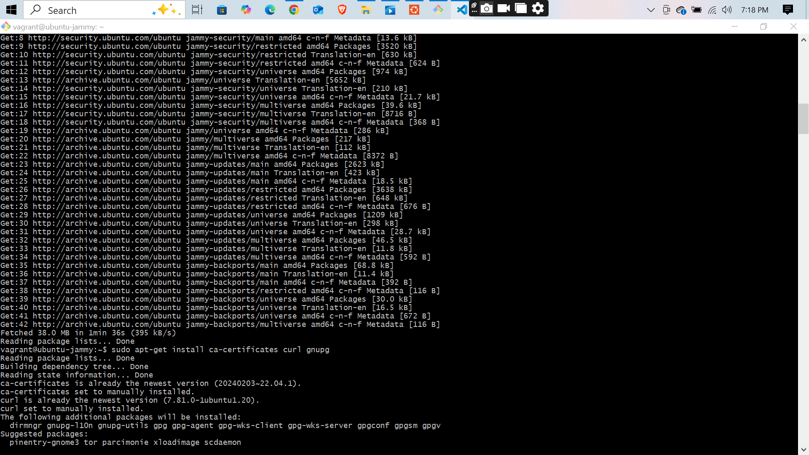
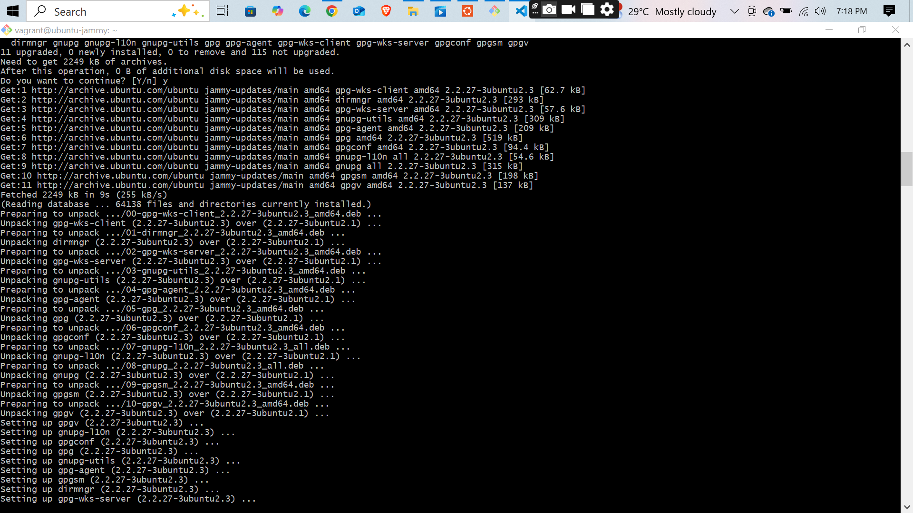
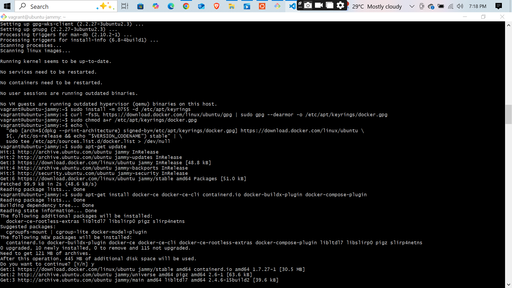
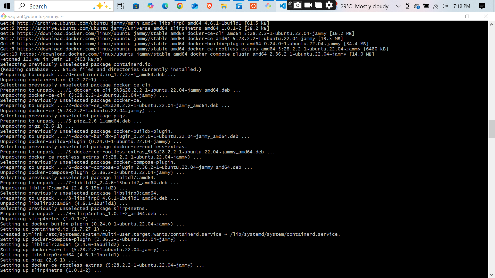
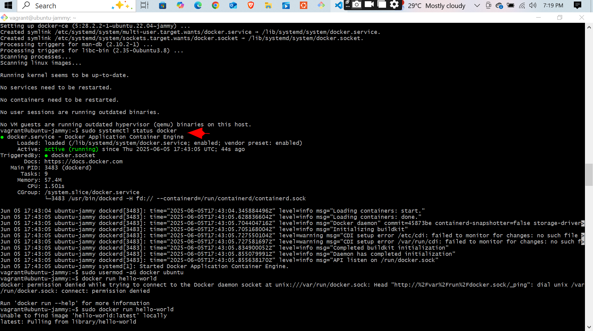
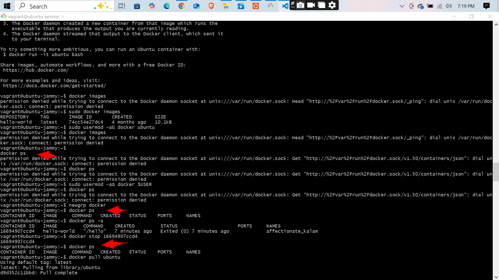
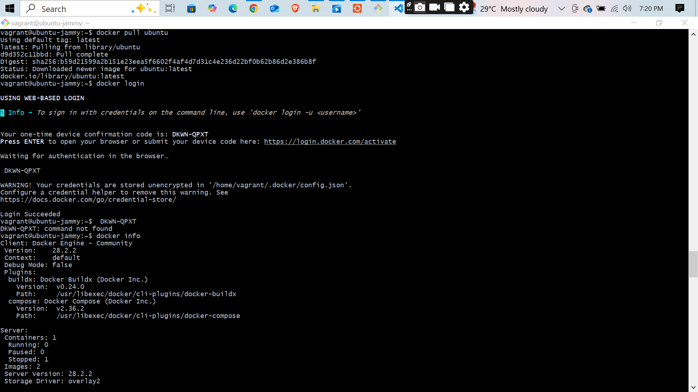
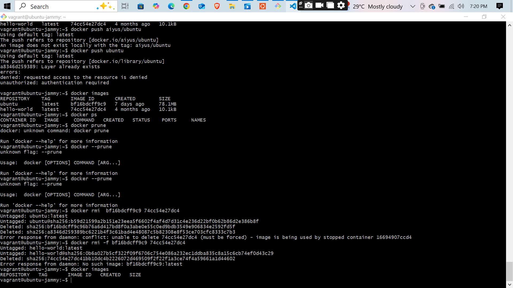

Here’s a revised and improved `README.md` based on your instructor’s detailed feedback and expectations:

---

````markdown
# 🐳 Introduction to Docker and Containers

This project is a foundational exploration of **Docker** and **containerization**, fulfilling core objectives such as installation, understanding container lifecycle, executing basic Docker commands, and clear documentation. Below is a structured breakdown of the concepts, practical execution, and evidence of learning.

---

## 📘 What is Docker?

Docker is a platform designed to help developers build, share, and run applications in lightweight, portable containers. Containers package everything needed to run an application—including the code, runtime, libraries, and system tools—making deployments consistent across environments.

---

## 🆚 Docker Containers vs Virtual Machines

| Feature                | Docker Containers                    | Virtual Machines                        |
|------------------------|--------------------------------------|-----------------------------------------|
| Boot Time              | Seconds                              | Minutes                                 |
| Resource Usage         | Lightweight                          | Heavy (includes full OS)                |
| Isolation              | Process-level                         | Full OS-level                           |
| Portability            | High (same behavior everywhere)      | Moderate                                |
| Storage Footprint      | Small                                 | Large                                   |
| Use Case               | Microservices, CI/CD, DevOps         | Full application with GUI, legacy apps  |

---

## 🛠️ Docker Installation

Docker was installed successfully by following these steps:

1. Added Docker GPG key.
2. Configured Docker’s official repository.
3. Installed Docker Engine.
4. Verified Docker daemon status using:

```bash
sudo systemctl status docker
````

📸 Screenshots:





---

## 👤 Non-Root Docker Usage

To avoid repeated permission errors, the current user was added to the Docker group:

```bash
sudo usermod -aG docker $USER
```

👉 *Note: A logout/login or `newgrp docker` is needed to apply this without reboot.*

📸 Screenshot:



---

## 🧪 Running a Docker Container

The following command was used to run the `hello-world` container:

```bash
docker run hello-world
```

This verifies that Docker is working correctly. The output message confirms successful container execution.

📸 Screenshot:



---

## 🔁 Docker Lifecycle & Core Commands

Here are key Docker commands used to demonstrate container and image lifecycle:

| Command                   | Description                              |
| ------------------------- | ---------------------------------------- |
| `docker run`              | Runs a container from an image           |
| `docker ps`               | Lists running containers                 |
| `docker ps -a`            | Lists all containers (running + stopped) |
| `docker images`           | Lists locally stored images              |
| `docker stop <container>` | Stops a running container                |
| `docker rm <container>`   | Removes a container                      |
| `docker rmi <image>`      | Removes a Docker image                   |

📸 Screenshots:






---

## 📤 Docker Push & Authentication Challenges

An attempt was made to push a local image to Docker Hub using:

```bash
docker tag local-image-name username/repo-name
docker push username/repo-name
```

However, this failed due to missing authentication credentials. This highlights the importance of:

* Creating a Docker Hub account
* Running `docker login` before pushing

📸 Screenshot:



---

## 🔄 Docker Image & Container Lifecycle Explanation

Docker containers go through a lifecycle: **created → running → stopped → removed**. Images can be reused across containers and must be managed to keep disk usage optimal.

| Stage      | Command Example                | Purpose                      |
| ---------- | ------------------------------ | ---------------------------- |
| Create     | `docker create` / `docker run` | Initialize a new container   |
| Start/Stop | `docker start`, `docker stop`  | Manage running state         |
| Inspect    | `docker inspect`               | View internal config/details |
| Remove     | `docker rm`, `docker rmi`      | Clean up unused resources    |

---

## 🧹 Improvements and Lessons Learned

✅ What was done well:

* Docker installed correctly.
* Screenshots captured essential steps.
* Key basic commands executed.

⚠️ What was corrected/improved:

* Non-root access configuration.
* Structured documentation with context per screenshot.
* Lifecycle concepts now included and explained.
* Docker push issue identified and documented.

---
## Screen Shots

  
  
  
  
  
  
  
  
  
 

## ✅ Conclusion

This project helped build foundational skills in:

* Installing and configuring Docker
* Understanding the purpose and workflow of containers
* Executing basic Docker commands
* Identifying and resolving common permission/authentication issues

Going forward, I plan to explore:

* Docker Compose for multi-container apps
* Volume and network configuration
* Pushing and managing Docker images on Docker Hub

---

📎 [Back to Top](./README.md)


