# Working with Docker Images

## 📦 Project Overview

This project demonstrates the use of basic Docker commands to manage and interact with Docker images and containers. Key commands used include:

- `docker images`
- `docker ps`
- `docker run`
- `docker build`
- `docker pull`
- `docker push`

It also showcases how to create a `Dockerfile` for an **NGINX** server setup.

---

## 🖼️ Screenshots

### 🔧 Docker Image and Container Commands

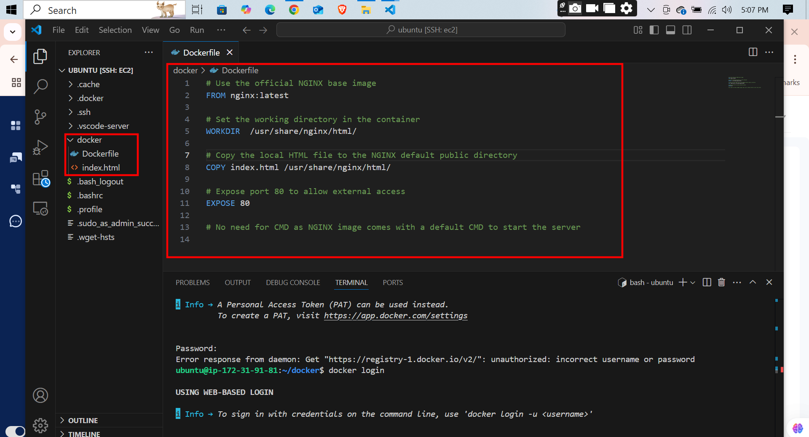  
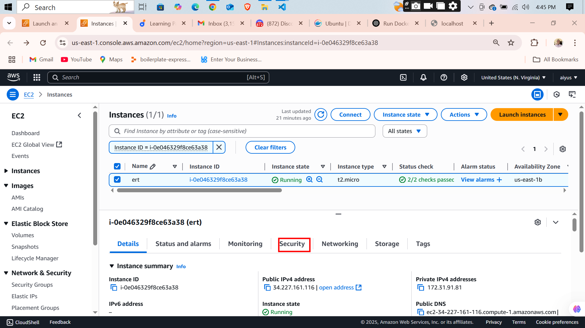  
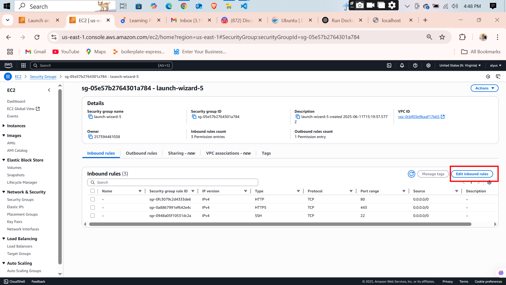  
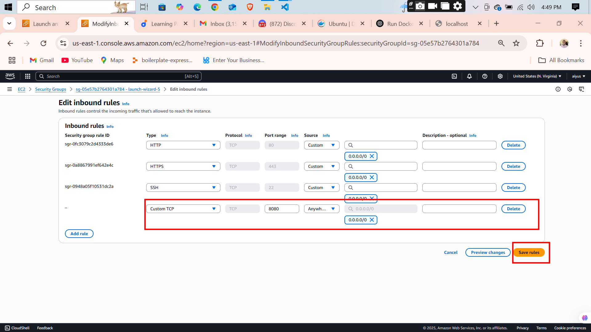  
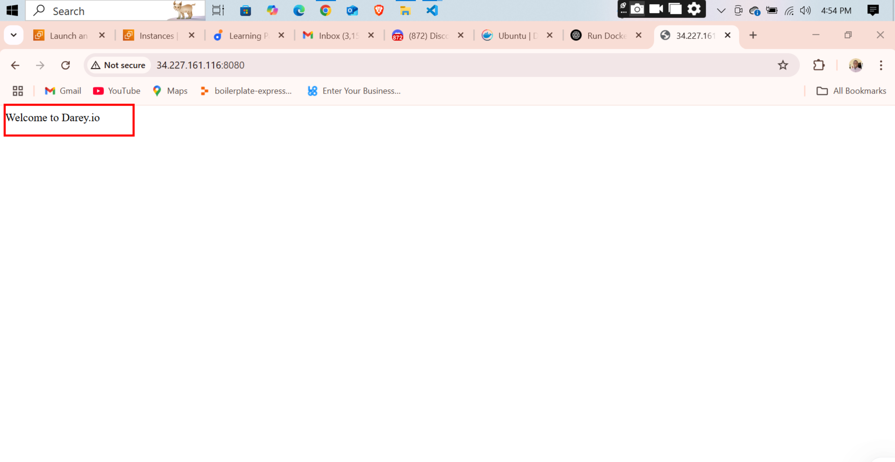  
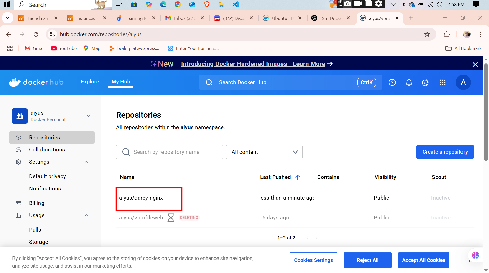  
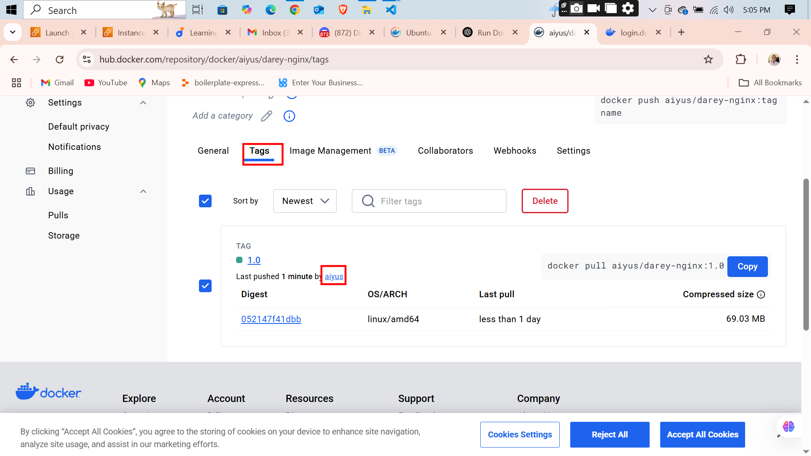  

### 💻 Terminal Views

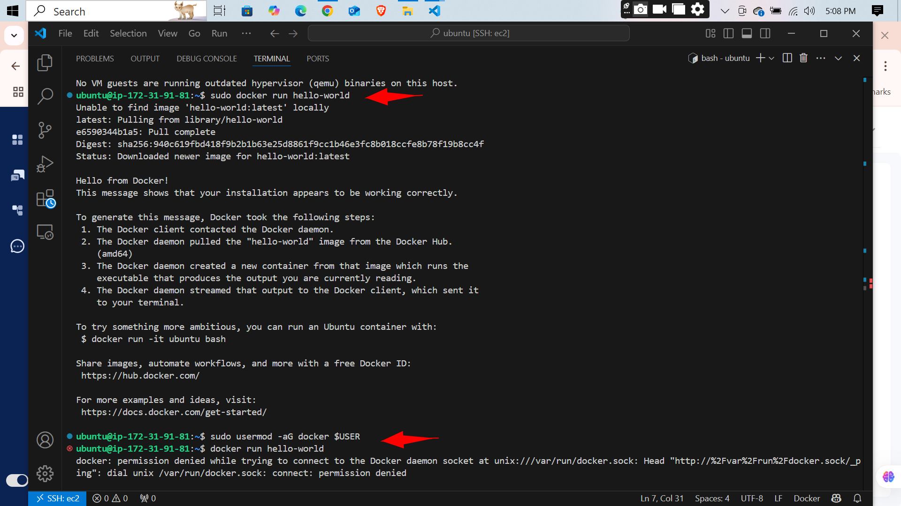  
  
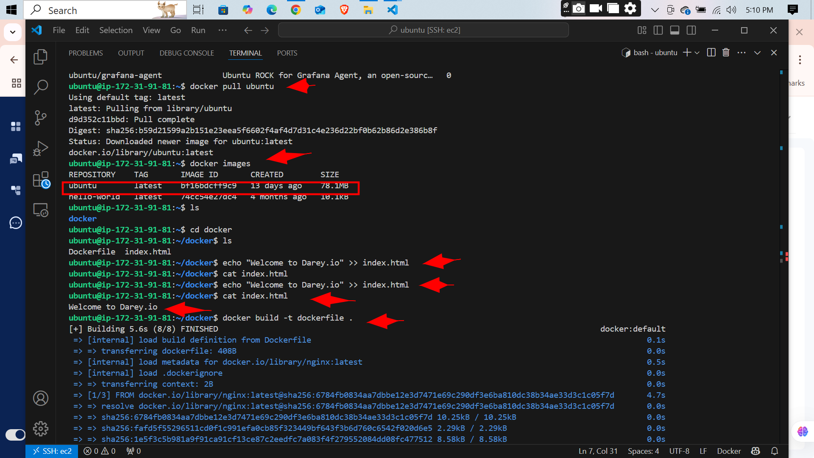  
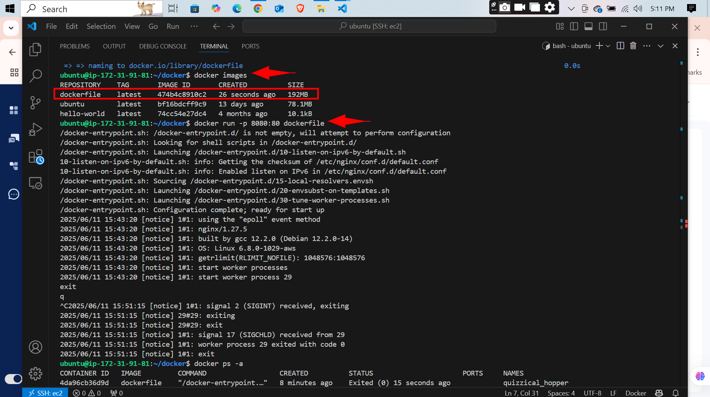  
  
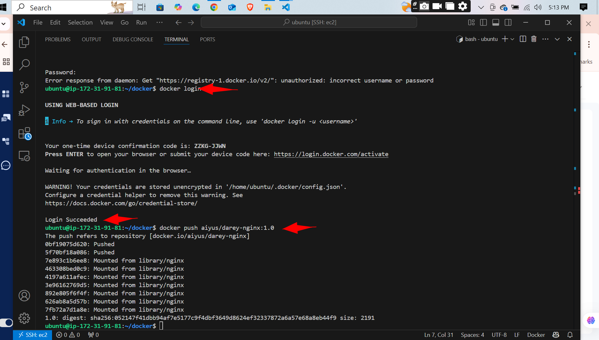  

---

- link to dockerfile [dockerfile](./Dockerfile)
- link to index.html [html](./index.html)