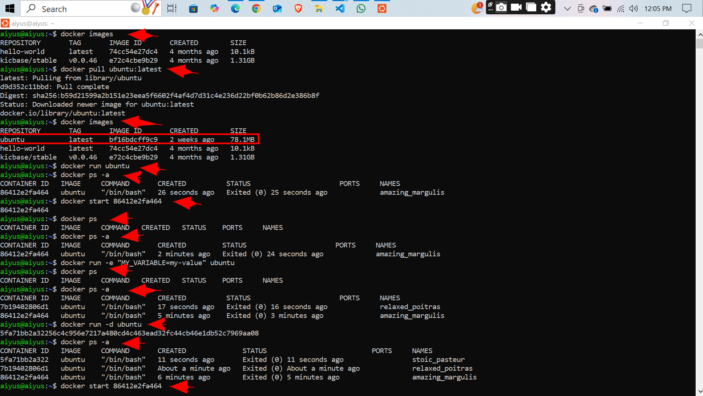
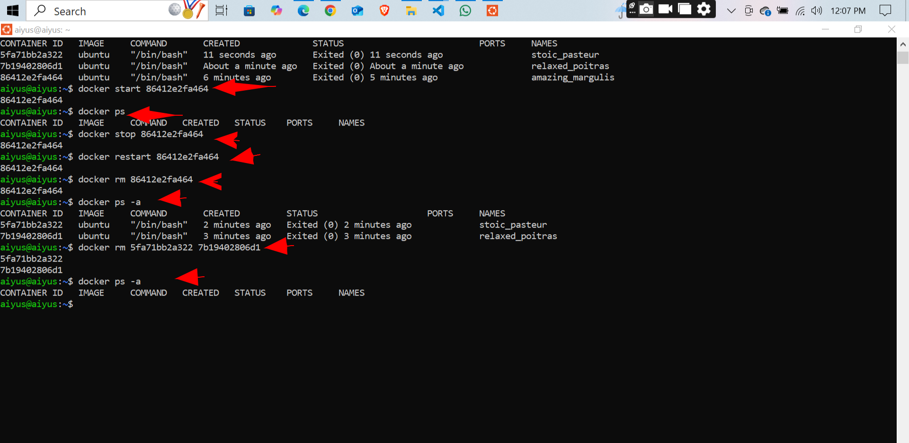

# Working with Containers

## Project overview
- this project focues on the building, runing, and destroying of containers
  *Some commands* 
  `docker run` - to run a container
  `docker pull` - to pull a docker image from a remote repo
  `docker start` - to start the container
  `docker stop` - to stop the container
  `docker restart` - to restart a stopped container 
`docker rm` - to remove a container
`docker ps` - to display a running container
`docker ps -a` - to display a stopped container

## Screen Shots
 

