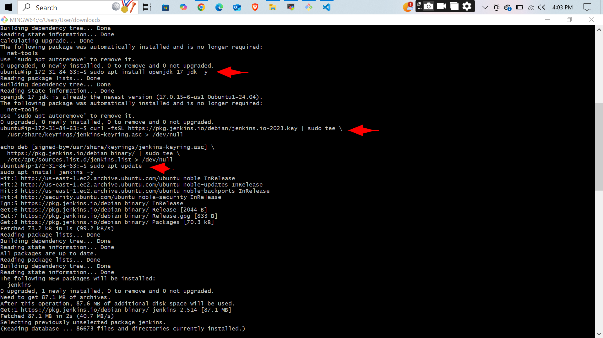

Got it! Here's a fully updated and **working `README.md`** section you can paste into your file. It assumes your image files are located inside a folder named `imgs/` in the **same directory as `README.md`**, and that you've already added and committed them.

---

````markdown
# 🚀 Intro to Jenkins

## 📘 Project Overview
This project demonstrates the **installation, configuration, and setup of Jenkins** on an Ubuntu server. It serves as a hands-on guide for DevOps beginners to understand Jenkins basics.

---

## 🛠️ Key Objectives
- Install Jenkins on an Ubuntu EC2 instance
- Configure firewall and access permissions
- Start and enable Jenkins as a service
- Access Jenkins through a web browser
- Unlock Jenkins with the initial admin password

---

## 📦 Commands Used

```bash
# Update & upgrade system
sudo apt update && sudo apt upgrade -y

# Install Java
sudo apt install openjdk-17-jdk -y

# Add Jenkins key and repository
curl -fsSL https://pkg.jenkins.io/debian/jenkins.io-2023.key | sudo tee /usr/share/keyrings/jenkins-keyring.asc > /dev/null
echo deb [signed-by=/usr/share/keyrings/jenkins-keyring.asc] https://pkg.jenkins.io/debian binary/ | sudo tee /etc/apt/sources.list.d/jenkins.list > /dev/null

# Install Jenkins
sudo apt update
sudo apt install jenkins -y

# Start Jenkins
sudo systemctl start jenkins
sudo systemctl enable jenkins

# Check Jenkins status
sudo systemctl status jenkins

# View initial admin password
sudo cat /var/lib/jenkins/secrets/initialAdminPassword

# Allow Jenkins port
sudo ufw allow 8080
````

---

## 📸 Screenshots

### 🔧 Terminal Commands





---

### 🌐 Jenkins Web Interface


---

## ✅ Conclusion

This walkthrough covers setting up Jenkins from scratch and accessing the dashboard. It's a great first step into **DevOps pipelines** and **CI/CD automation**.
