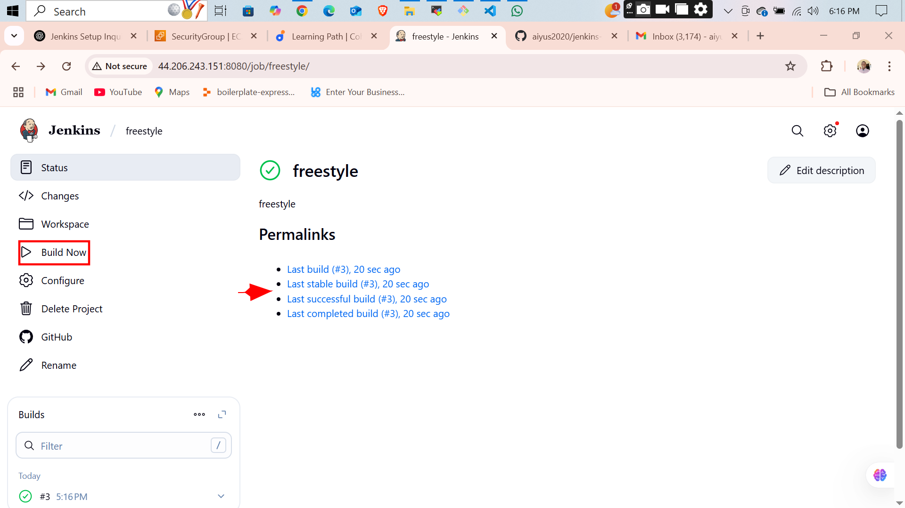

# 🛠️ Jenkins Freestyle Project

## 📌 Project Overview

This project demonstrates how to set up and configure a **Jenkins Freestyle Project** integrated with **GitHub**. It covers:

- 🔧 Configuring Jenkins with GitHub credentials
- 🛠️ Creating a Freestyle project in Jenkins
- 🌐 Connecting Jenkins to a GitHub repository
- 🔁 Creating a webhook on GitHub to trigger builds
- ▶️ Using the "Build Now" feature
- 🚀 Automatically triggering builds via GitHub webhook pushes

---

## 📸 Screenshots

> Below are images showing the setup and execution process step-by-step.

  
  
  
  
  
  
  
  
  
  
  

---

## 📂 Project Files

- [`README.md`](./README.md)

---

## ✅ Outcome

By completing this project, Jenkins is now able to:
- Clone a GitHub repository
- Automatically build on code push events
- Integrate continuous integration practices using a Freestyle job

---

>