Here’s a cleaned-up and improved version of your `README.md` section, with proper formatting, grammar, and a more professional tone. Each image is placed on its own line, and useful sections like setup and technologies used are added:

---

# Jenkins Pipeline Jobs Project

## 📌 Project Overview

This project focuses on configuring and running Jenkins pipeline jobs on a Jenkins server hosted on an AWS EC2 instance. The pipeline automates the process of:

* Cloning a GitHub repository
* Building a Docker image from a `Dockerfile`
* Running a Docker container with the built image

This setup helps automate DevOps workflows and deploy applications more efficiently.

---

## 🖼️ Screenshots

Here are the screenshots showcasing different stages of the project:

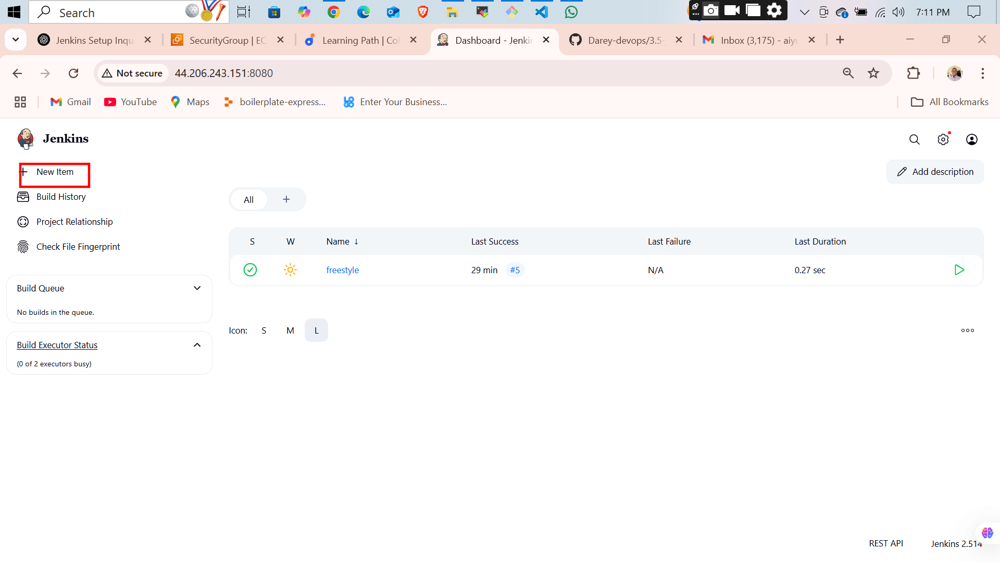
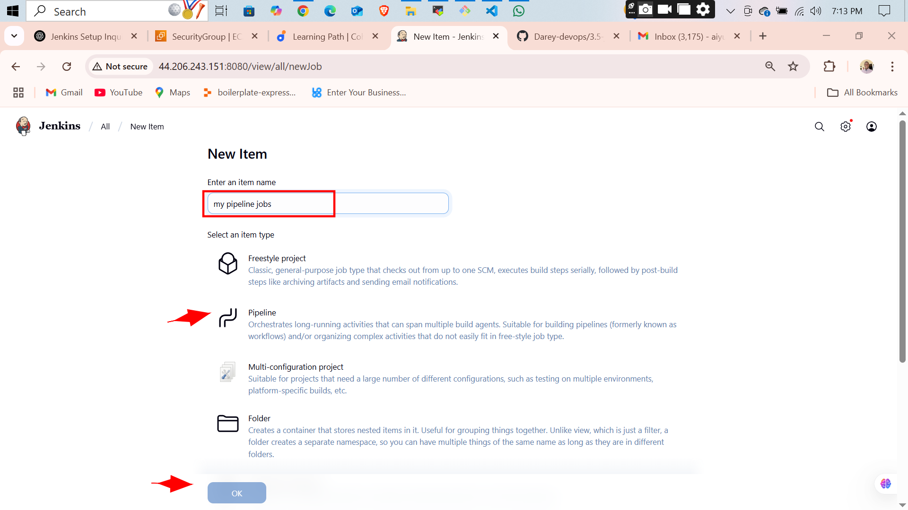
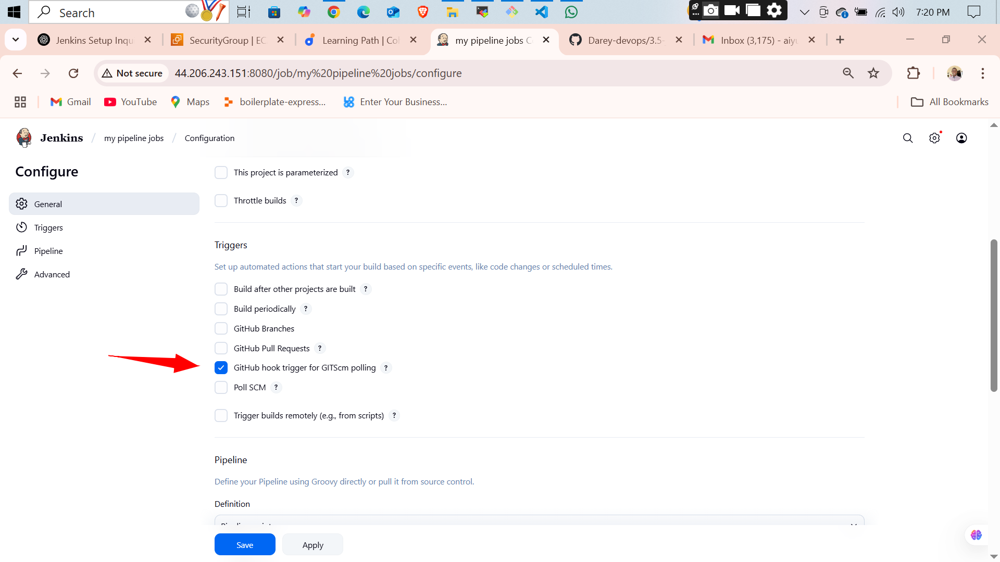
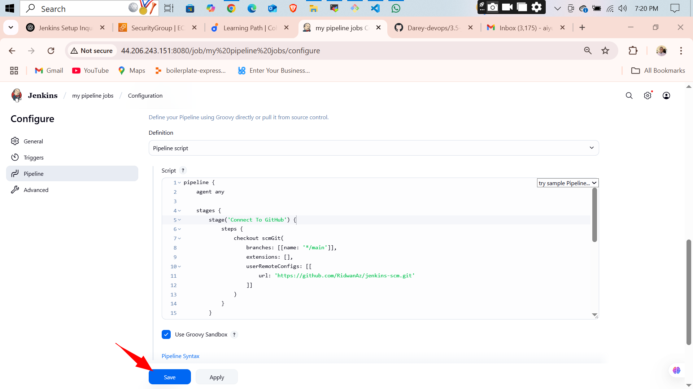
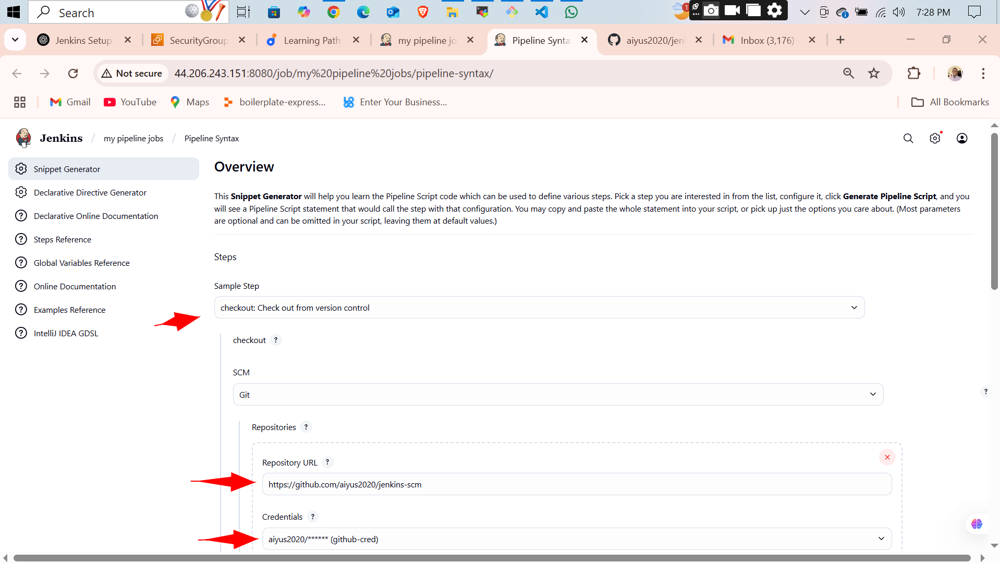
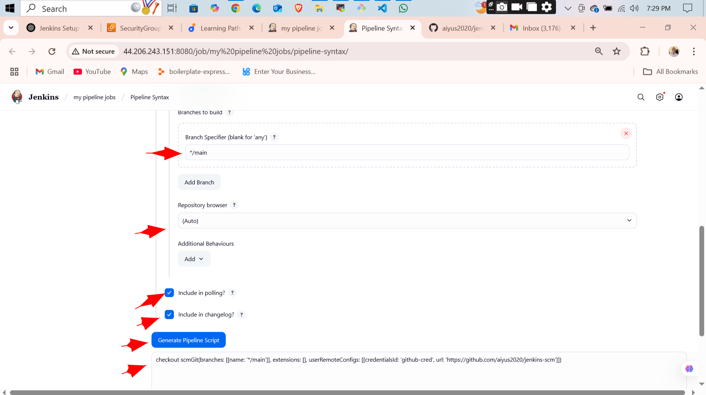
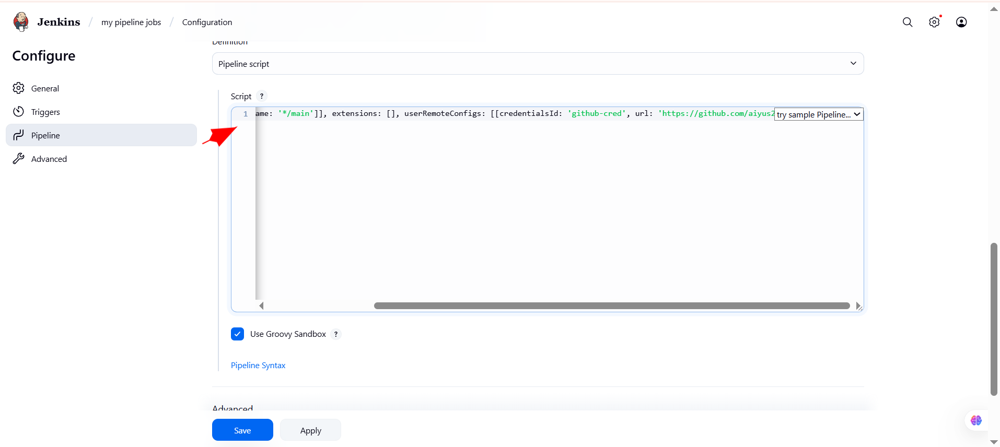
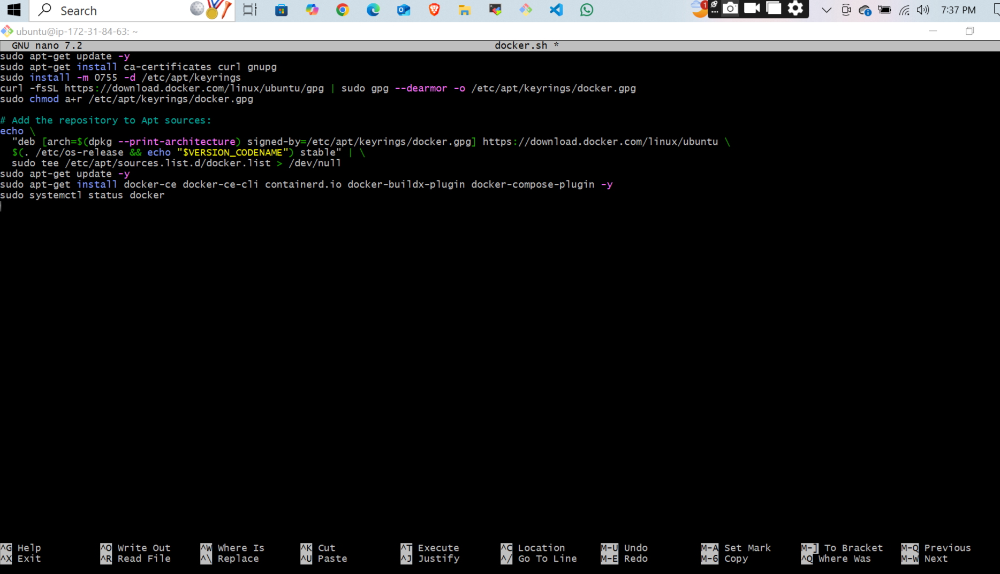
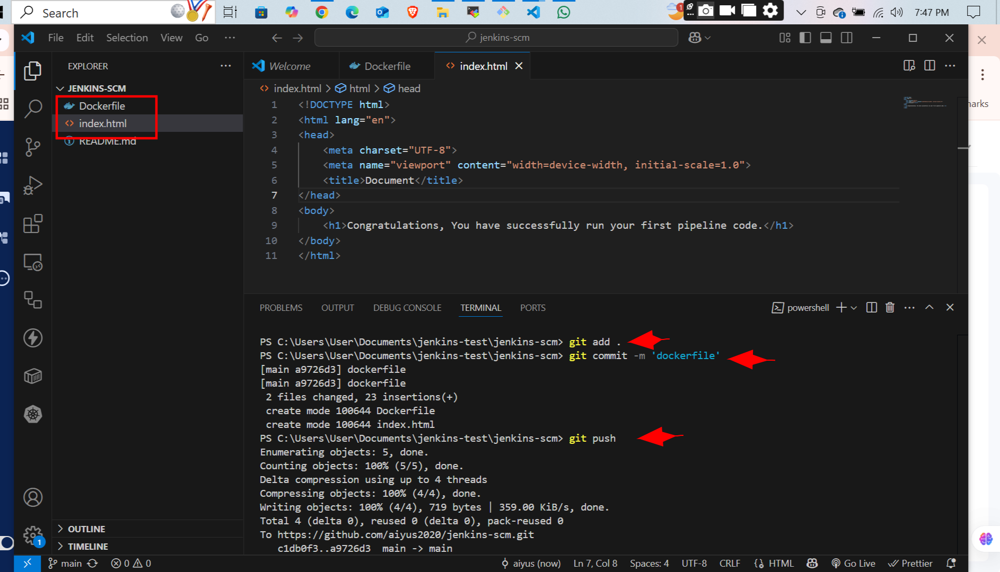
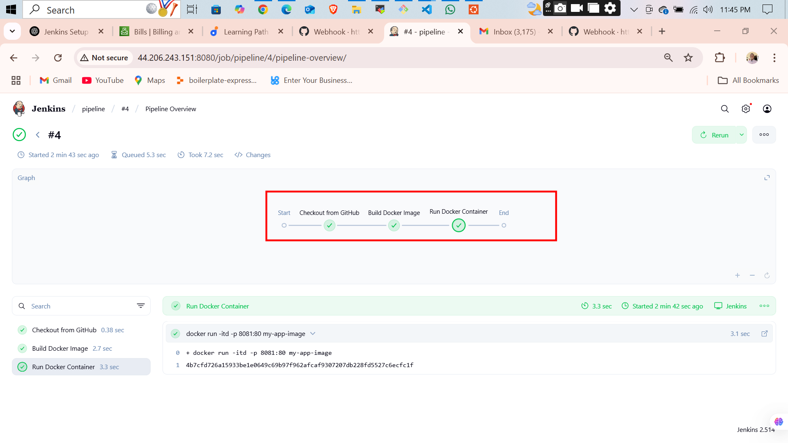
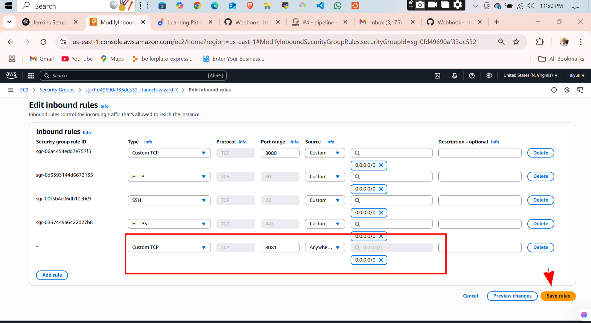
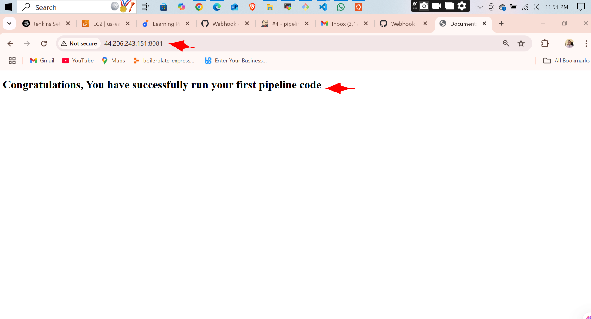

---

## 🧱 Project Structure

* [`Dockerfile`](Dockerfile): Used to build the Docker image.
* [`index.html`](index.html): A simple HTML page served by Nginx inside the container.
* [`README.md`](README.md): Project documentation.

---

## 🛠️ Technologies Used

* **Jenkins** (installed on AWS EC2)
* **GitHub** for source control
* **Docker** for containerization
* **Nginx** as the base image
* **Shell scripting** in Jenkins pipeline

---

## ✅ How It Works

1. Jenkins pulls the latest code from the GitHub repository.
2. Builds a Docker image using the provided `Dockerfile`.
3. Runs a Docker container exposing the application on a specific port (e.g., 8081).
4. The application becomes accessible through the EC2 public IP and exposed port.

---

## ⚠️ Common Issues & Fixes

**Error: Port is already allocated**
To avoid this error, make sure no other container is using the same port. You can add a cleanup step in your Jenkins pipeline to stop and remove any container using the required port before starting a new one.

---

