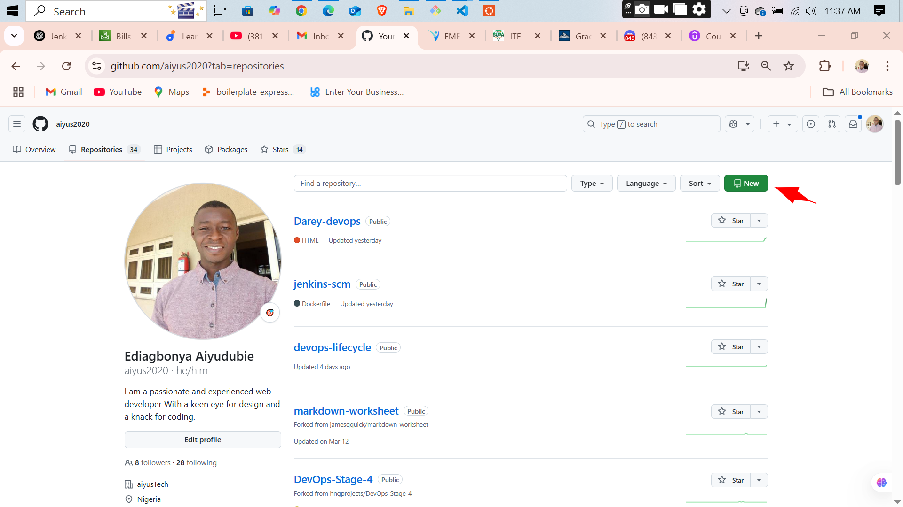
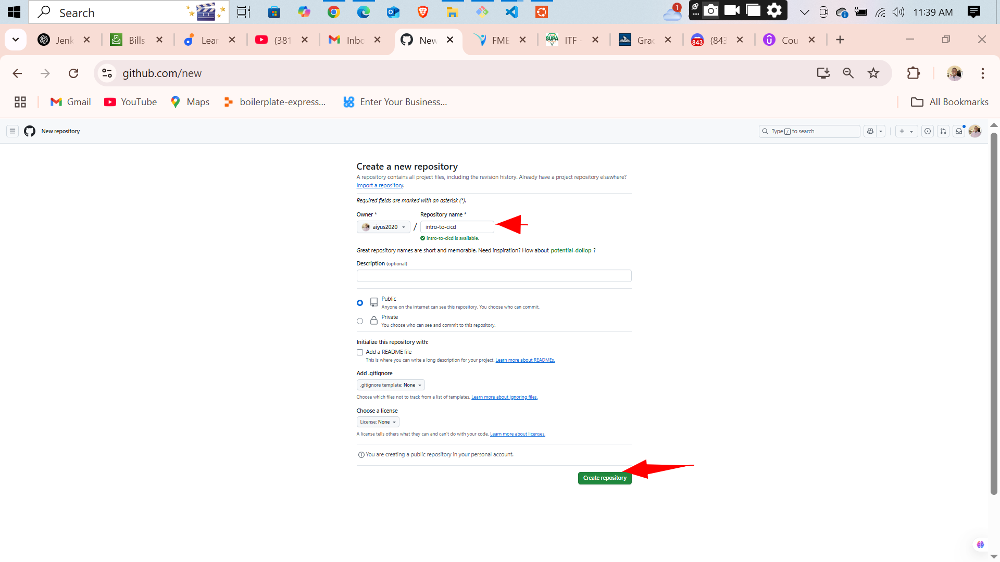
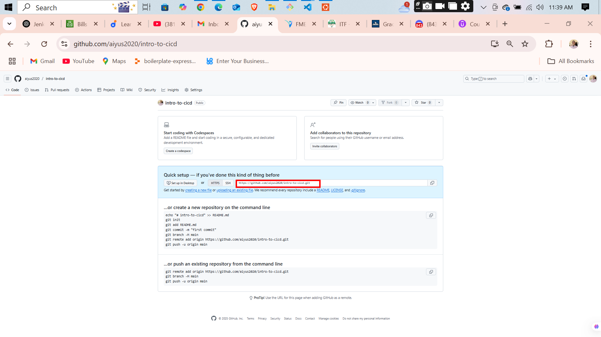
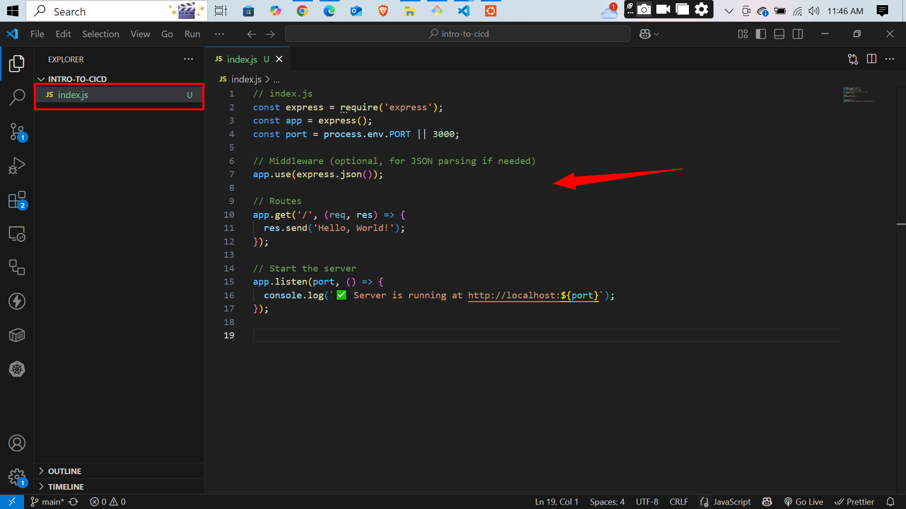
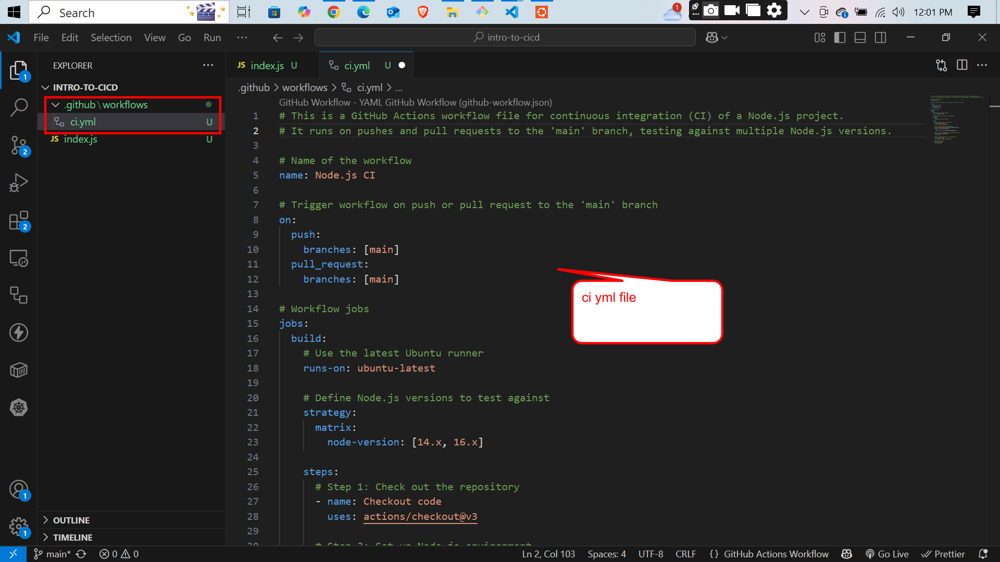
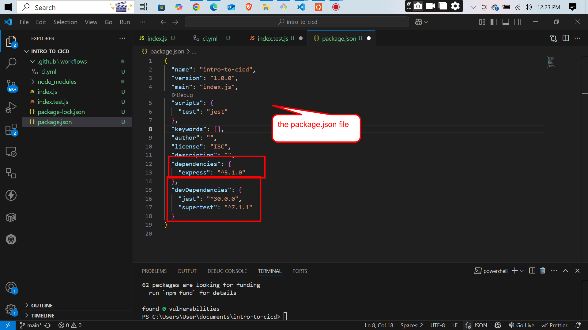
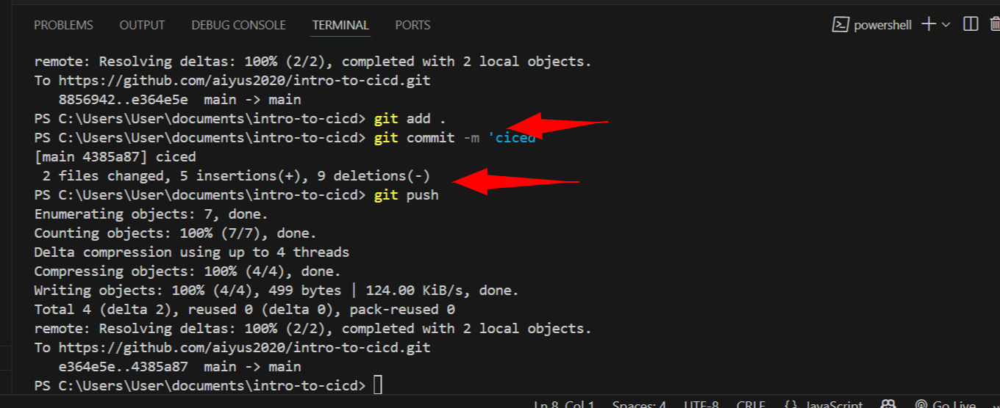
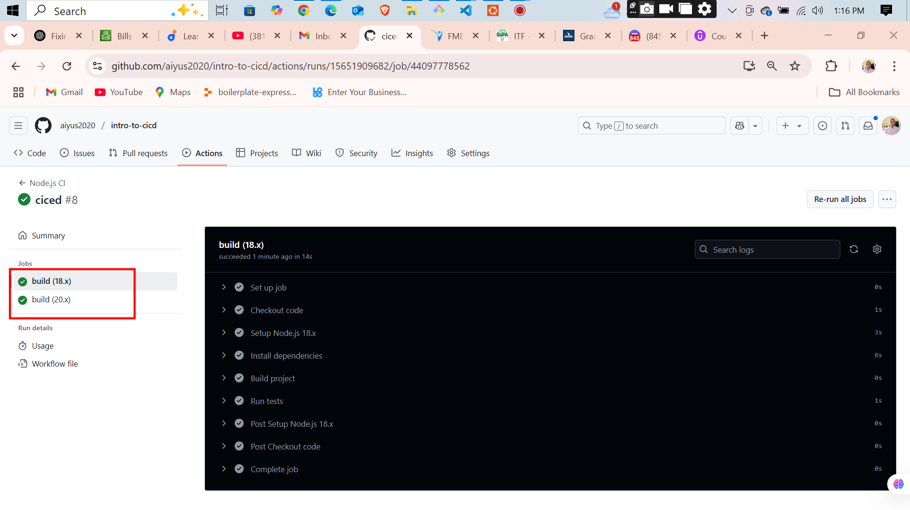

# Introduction to CI/CD with GitHub Actions

## Project Overview

This project demonstrates how to use GitHub Actions to automate the build and test process of a Node.js application. The key steps include:

1. Creating the GitHub repository
2. Cloning the repository to your local machine
3. Initializing the project with `git init`
4. Creating essential files such as `server.js`, `index.js`, `.github/workflows/ci.yml`, `index.test.js`, and others

---

## Screenshots

---

the project file is located here [file](https://github.com/aiyus2020/intro-to-cicd)