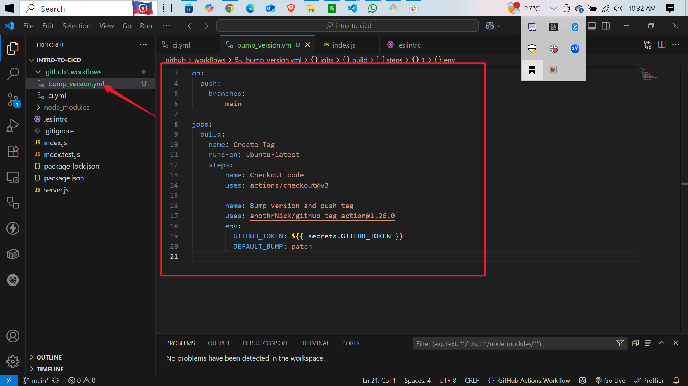
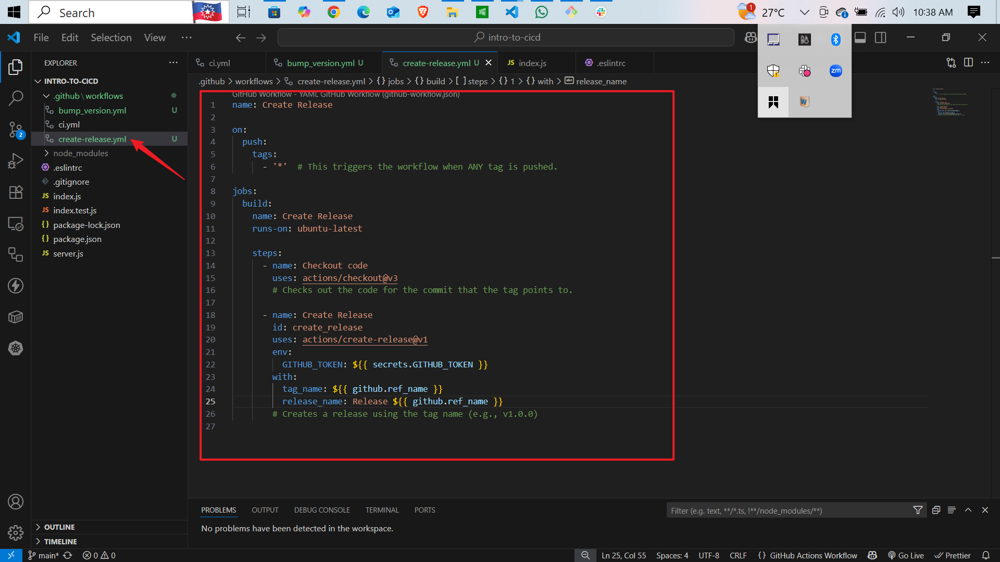
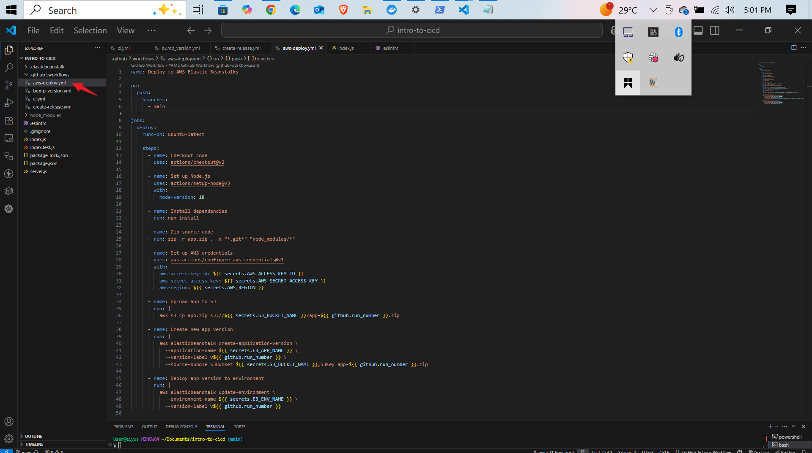
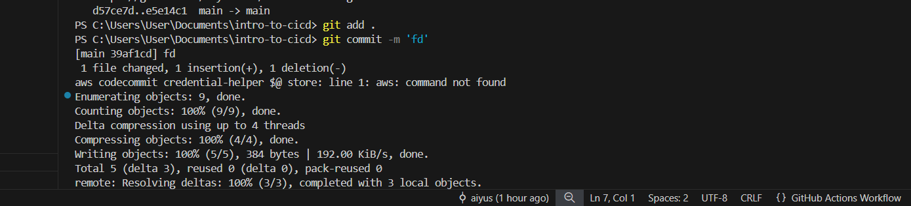
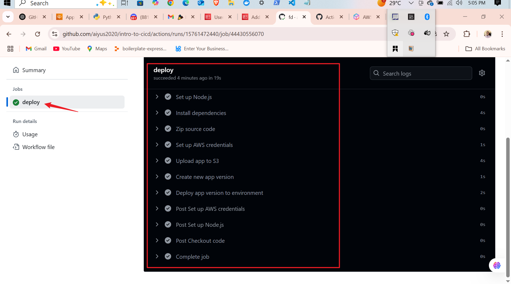

Here's the refined README.md with each screenshot on its own line:

```markdown
# CI/CD Pipeline

This project implements a CI/CD pipeline using GitHub Actions for version management and AWS deployment.

## Workflows

1. **Version Bump**  
   - Auto-increments version on push to `main`  
   - Creates Git tag using `github-tag-action`

2. **Release Creation**  
   - Generates GitHub releases from tags  
   - Uses `create-release` action

3. **AWS Deployment**  
   - Deploys Node.js app to AWS  
   - Steps:  
     - Install dependencies  
     - Zip code  
     - Upload to S3  
     - Deploy new version

## Usage

1. Commit changes:
```bash
git add .
git commit -m "message"
git push
```

## Screenshots






```

