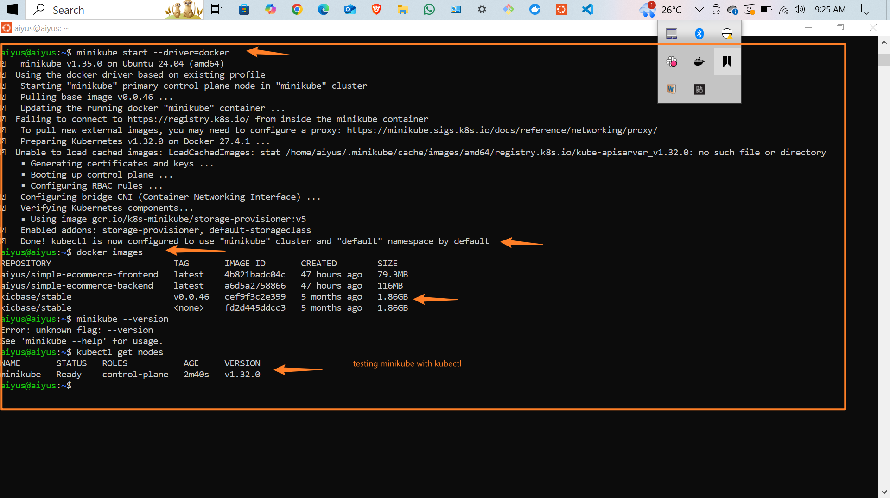

# 🚀 Minikube Setup on Ubuntu 24.04 Using Docker

This project documents the steps I followed to successfully install and run a local Kubernetes cluster using **Minikube** on **Ubuntu 24.04**, with **Docker as the driver**.

---

### 🔧 What I Did

1. **Verified Docker Installation**

   I had already installed Docker, so I just confirmed the version and ensured the Docker service was running:

   ```bash
   docker --version
   sudo systemctl status docker
   ```

2. **Downloaded and Installed Minikube**

   I downloaded the latest Minikube `.deb` package and installed it:

   ```bash
   curl -LO https://storage.googleapis.com/minikube/releases/latest/minikube_latest_amd64.deb
   sudo dpkg -i minikube_latest_amd64.deb
   ```

3. **Started Minikube Using Docker Driver**

   I then started Minikube using the Docker driver:

   ```bash
   minikube start --driver=docker
   ```

   > During startup, I got a warning about pulling images from `registry.k8s.io`, but the setup continued and Kubernetes was initialized successfully.

4. **Checked Docker Images**

   I listed Docker images to see what was available locally:

   ```bash
   docker images
   ```

5. **Verified Kubernetes Cluster Status**

   Finally, I used `kubectl` to check that the Minikube node was up and ready:

   ```bash
   kubectl get nodes
   ```

   Output:

   ```
   NAME       STATUS   ROLES           AGE     VERSION
   minikube   Ready    control-plane   2m40s   v1.32.0
   ```

---

### 📌 Summary

* ✅ Docker was already installed and running.
* ✅ Minikube was installed via `.deb` and started with Docker.
* ✅ Kubernetes node was successfully set up and marked as `Ready`.

---

### 📷 Screenshots

 
---

---

