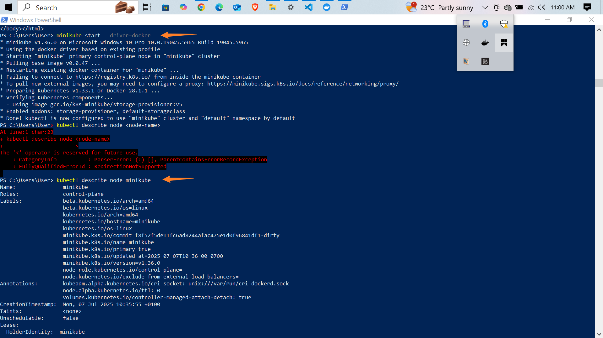
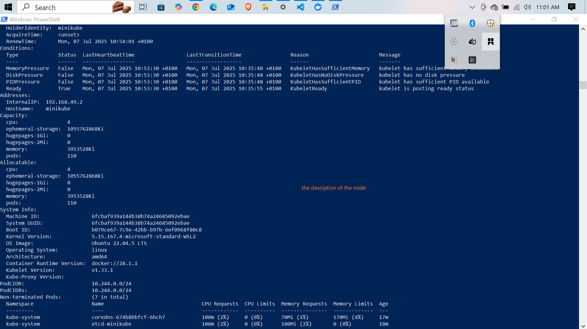
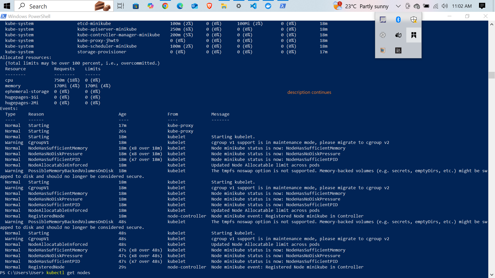
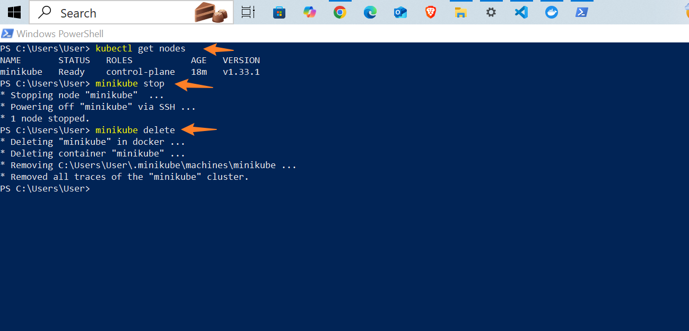

---

# ⚙️ Working with Kubernetes Node using Minikube

## 📌 Project Overview

This project demonstrates how to use **Minikube** to create and manage a single-node **Kubernetes cluster** locally. Minikube is an excellent tool for learning and prototyping with Kubernetes on your personal machine.

In this project, we performed key operations such as starting Minikube, inspecting the Kubernetes node, and stopping or deleting the Minikube cluster.

---

## 🧪 Commands Used

```bash
minikube start                     # Starts the Minikube container and initializes the Kubernetes cluster
kubectl get nodes                  # Displays the current node(s) in the Kubernetes cluster
kubectl describe node minikube     # Provides detailed information about the Minikube node
minikube stop                      # Stops the running Minikube cluster
minikube delete                    # Deletes the Minikube cluster and its associated files
```

> ⚠️ Note: `kubectl` is the Kubernetes CLI tool that interacts with Minikube's internal cluster.

---

## 📸 Screenshots

Below are screenshots showing the project in action:

* **Minikube Start**
  
  *Minikube successfully started and initialized the Kubernetes environment.*

* **Get Nodes**
  
  *`kubectl get nodes` displays the running Minikube node in `Ready` state.*

* **Describe Node**
  
  *Details of the node, including system info, capacity, labels, and conditions.*

* **Stop and Delete**
  
  *Clean shutdown and complete removal of the Minikube cluster.*

---

## ✅ What This Project Demonstrates

* How to **set up a local Kubernetes cluster** using Minikube.
* How to **inspect and interact** with the Kubernetes node.
* How to **clean up resources** using Minikube commands.
* Provides a foundation for deploying containers, services, and exploring Kubernetes concepts locally.

---

## 🚀 Additional Insights and Recommendations

While this project focused on basic node operations, here are further areas you can explore:

* **Scaling Pods/Nodes**: Learn to scale deployments with `kubectl scale` and simulate multi-node clusters using Minikube's `--nodes` flag.
* **Upgrading Kubernetes Version**: Use the `--kubernetes-version` flag when starting Minikube to experiment with different cluster versions.
* **Limitations of Minikube**:

  * Single-node by default (not ideal for true multi-node production testing).
  * Performance may be limited depending on the system.
  * Doesn’t reflect cloud-specific networking and storage challenges.

---

## 💡 Next Steps

* Deploy a sample application using `kubectl apply -f`.
* Explore Minikube’s dashboard UI: `minikube dashboard`.
* Practice setting resource limits and autoscaling.
* Integrate Minikube with a CI/CD pipeline for development workflow automation.

---

