# AWS Account Creation Mini Project

## Overview
This is a guide that will walk you through creating your own Amazon Web Services (AWS) account. I've included screenshots and detailed steps to help you establish your AWS presence with confidence.

## Introduction to Cloud Computing

### What is Cloud?
As I understand it, cloud computing is like a giant digital storage space accessible via the internet. Rather than storing everything on my local device:
- My data is securely stored on powerful remote computers
- I can access my files, photos, and applications from anywhere with internet connectivity
- I think of it as my "magical backpack" that holds all my digital content and follows me everywhere

### What is AWS Cloud?
I've learned that Amazon Web Services (AWS) is one of the market's leading cloud providers, offering:
- A comprehensive suite of cloud computing services
- Computing resources including servers, storage, databases, and networking
- Services delivered over the internet without requiring my investment in physical hardware

### Why AWS Cloud Matters to Me
I value how AWS democratizes access to powerful computing resources:
- It enables me (and businesses of all sizes) to access enterprise-grade technology
- I only pay for resources I actually use with their "pay as you go" model
- I can easily scale up or down based on my needs without significant upfront investment

## Project Goals and Learning Outcomes
By completing this project, I:
1. Understand basic cloud computing concepts
2. Learn the importance and benefits of AWS Cloud for my projects
3. Set up my own functional AWS account
4. Access the AWS Management Console

## Step-by-Step AWS Account Creation Process

### 1. Initial Registration
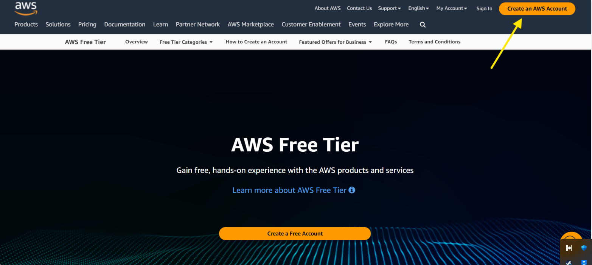
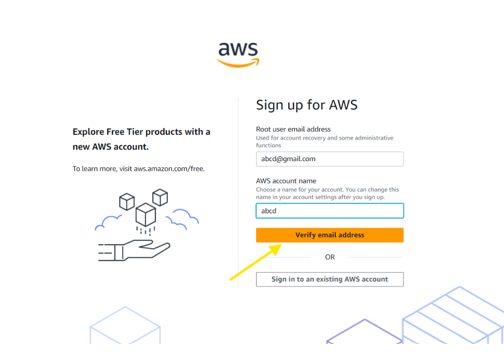
1. I navigated to the AWS website and clicked on "Create an AWS Account"
2. I entered my email address, password, and chose an AWS account name
3. I clicked on "Verify email address"

### 2. Email Verification
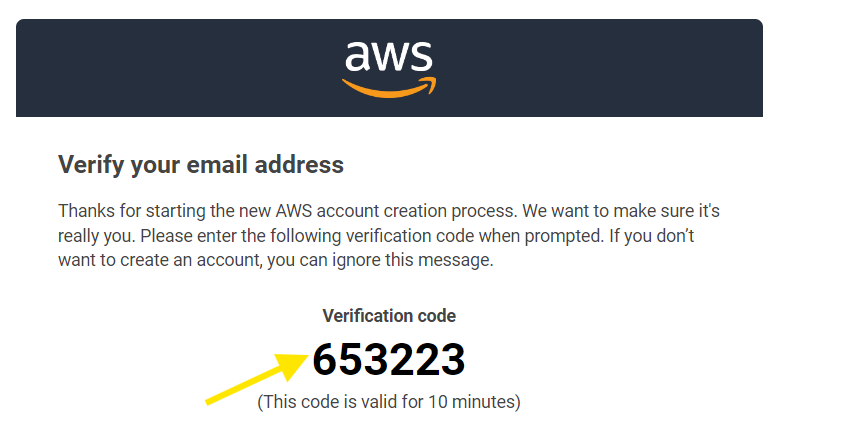
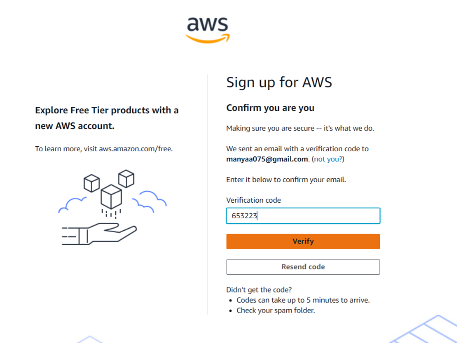
1. I checked my inbox for the verification email from AWS
2. I copied the verification code sent to my email
3. I pasted the code in the verification field
4. I clicked "Verify"

### 3. Set My Root User Password
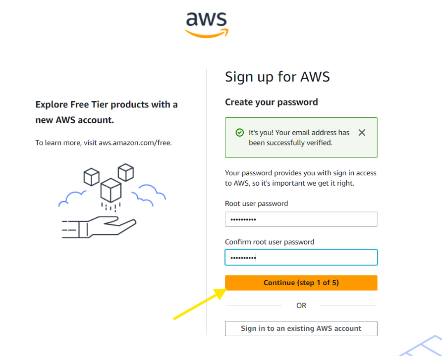
1. I created a strong password for my root user
2. I clicked "Continue"

### 4. My Personal Information
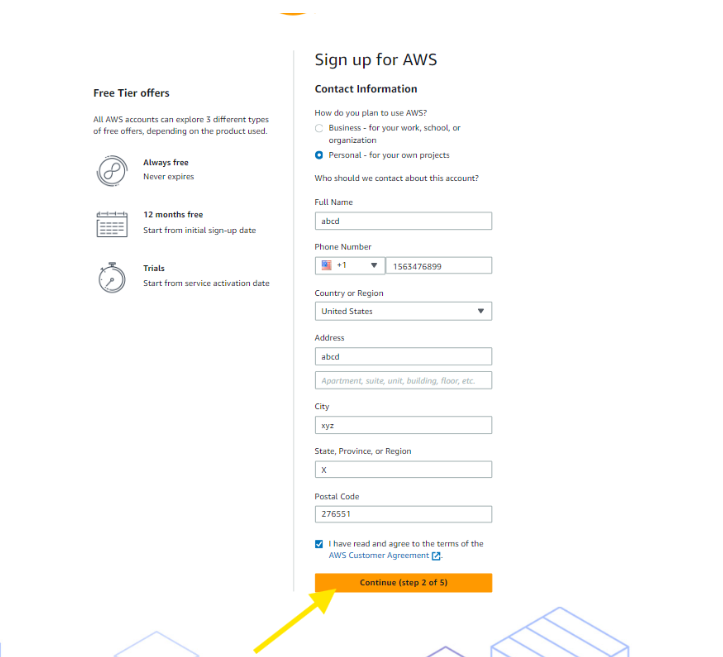
1. I filled in all required personal information fields
2. I clicked "Continue"

### 5. My Payment Information
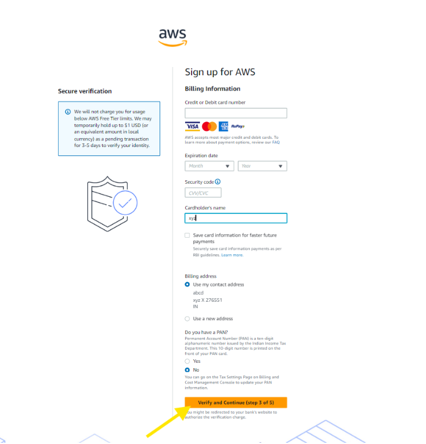
1. I entered my credit/debit card details
   - Note: I was relieved to learn AWS won't charge me unless I exceed Free Tier limits
   - I noticed a small authorization charge (~$1.00) might appear temporarily to verify my card
2. I clicked "Verify and continue"

### 6. Payment Processing
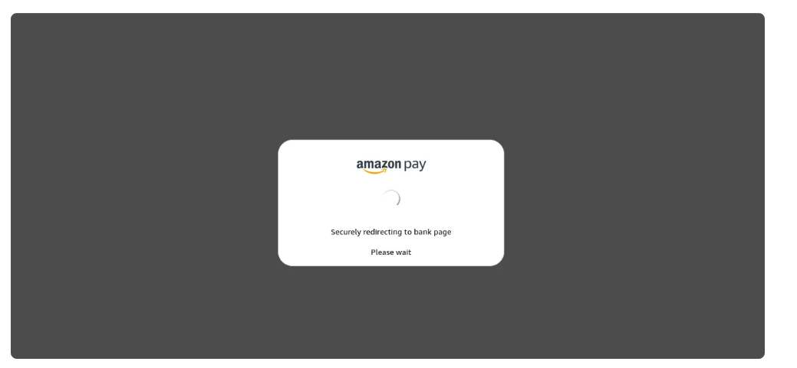
- I waited while my payment information was securely processed

### 7. My Phone Verification
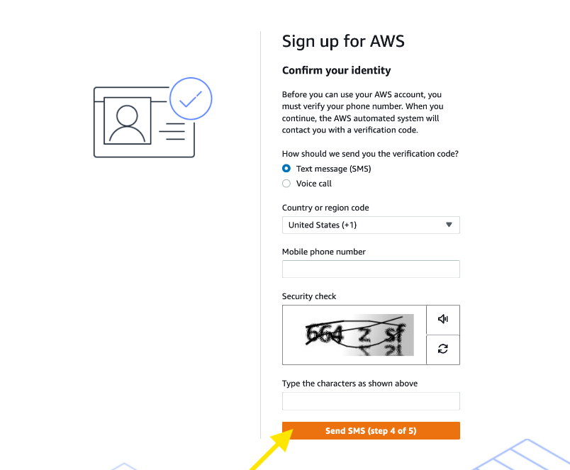
1. I chose my preferred verification method (SMS)
2. I entered my phone number
3. I completed the CAPTCHA when presented
4. I clicked "Send"

### 8. Enter My Verification Code
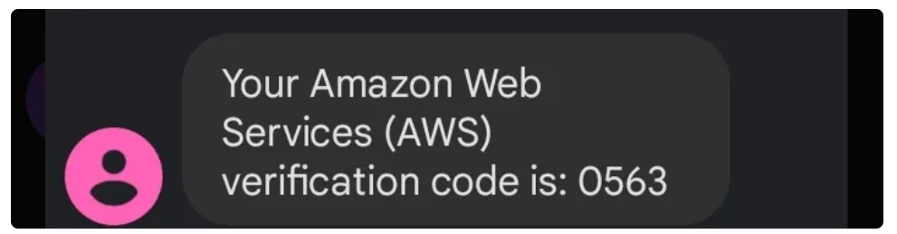
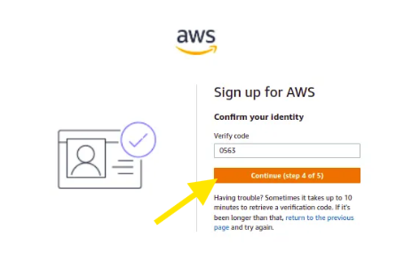
1. I received the verification code on my phone
2. I entered the code in the verification field
3. I clicked "Continue"

### 9. Support Plan Selection
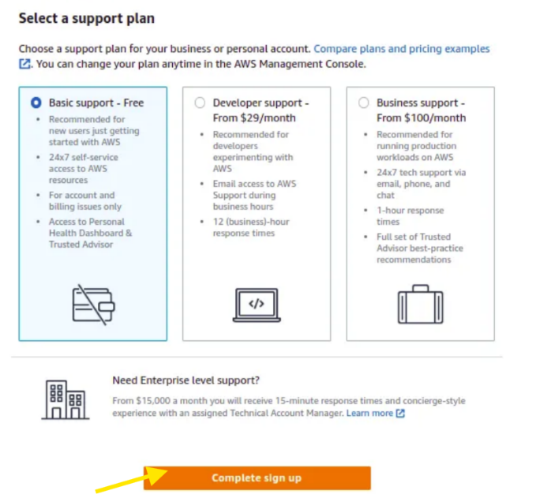
1. I reviewed the available support plans
2. I selected "Basic Support - Free" as recommended for beginners like me
3. I clicked "Complete sign up"

### 10. Account Creation Confirmation
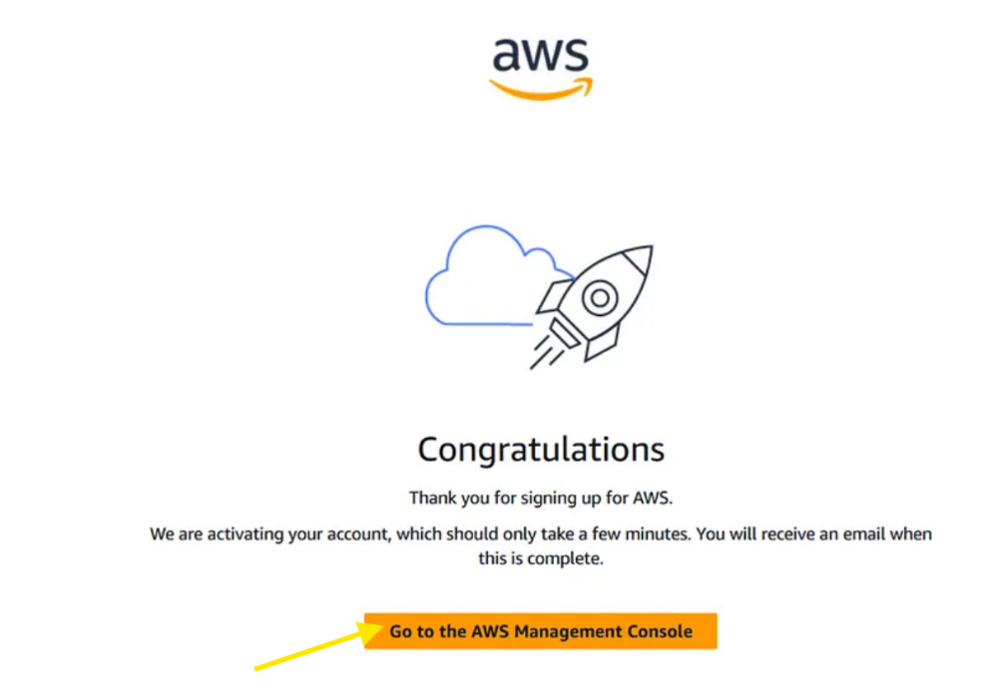
1. I saw the account creation success message
2. I clicked "Go to the AWS Management Console"

### 11. Personalizing My Experience
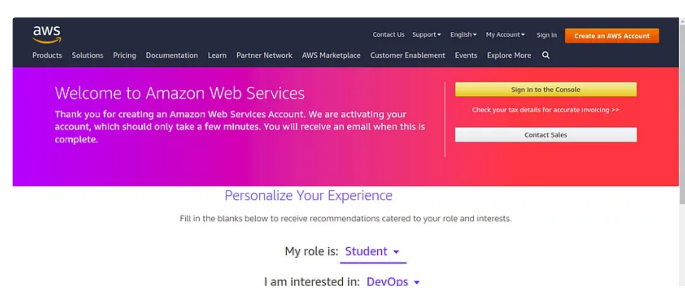
1. I filled in my preferences
2. I clicked "Submit"

### 12. AWS Console Login
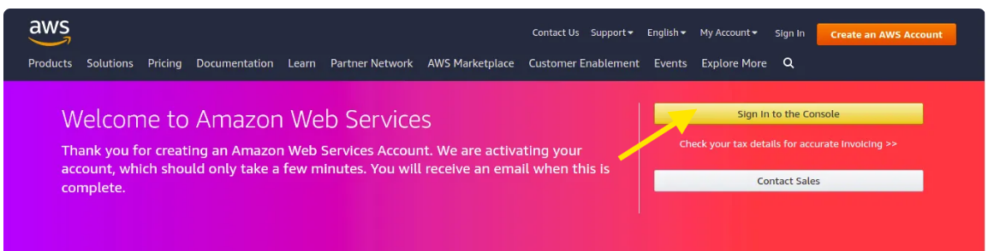
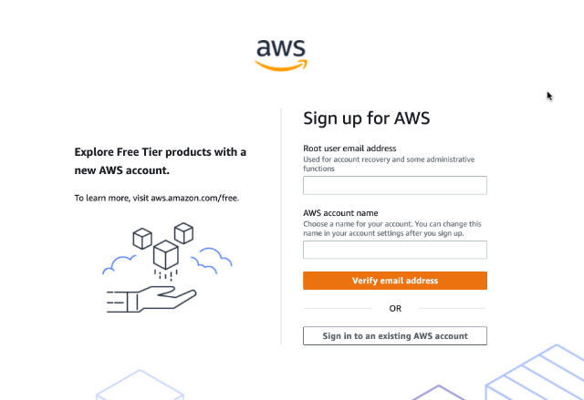
1. I selected "Root user"
2. I entered my registered email address
3. I clicked "Next"
4. I completed the CAPTCHA verification when prompted
5. I entered my root password
6. I clicked "Sign In"

### 14. My AWS Management Console
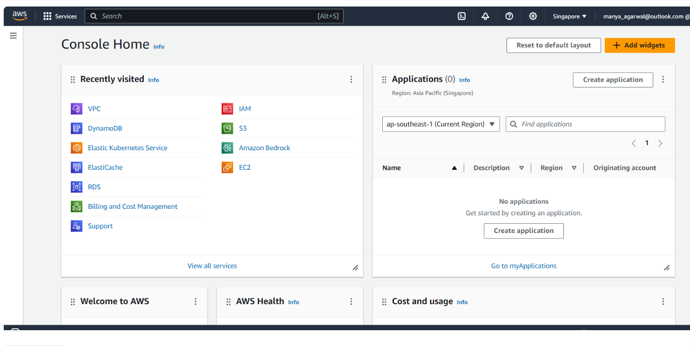
- I successfully logged in to my AWS Management Console
- From here, I can begin exploring and utilizing AWS services for my projects

## Important Notes I've Learned
- **Free Tier Usage**: I need to monitor my usage to stay within free tier limits
- **Root User Security**: I should consider setting up MFA (Multi-Factor Authentication) for my root account
- **IAM Users**: For my day-to-day operations, I should create IAM users instead of using my root account

## My Project Reflection
- **Understanding AWS Cloud**: I now see how AWS provides a virtual infrastructure that eliminates my storage limitations and simplifies my digital content management.
- **Importance of AWS Cloud**: I appreciate how the platform creates an equitable environment where I can access powerful computing tools without significant upfront costs.
- **Account Setup**: I've successfully provided accurate details and selected an appropriate support plan.
- **AWS Management Console**: I now have access to AWS services and resources that I can tailor to my specific needs.

## Additional Resources for My Learning
- [AWS Free Tier Documentation](https://aws.amazon.com/free/)
- [AWS Getting Started Guide](https://aws.amazon.com/getting-started/)
- [AWS Security Best Practices](https://aws.amazon.com/security/security-resources/)