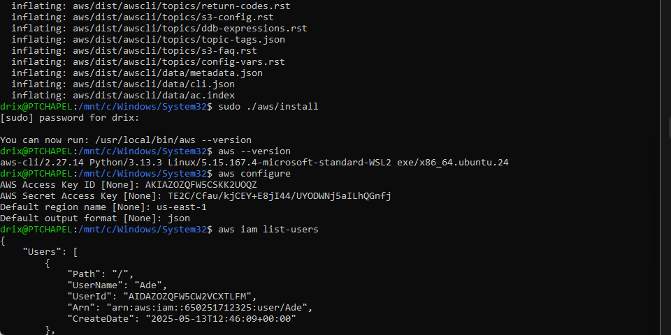
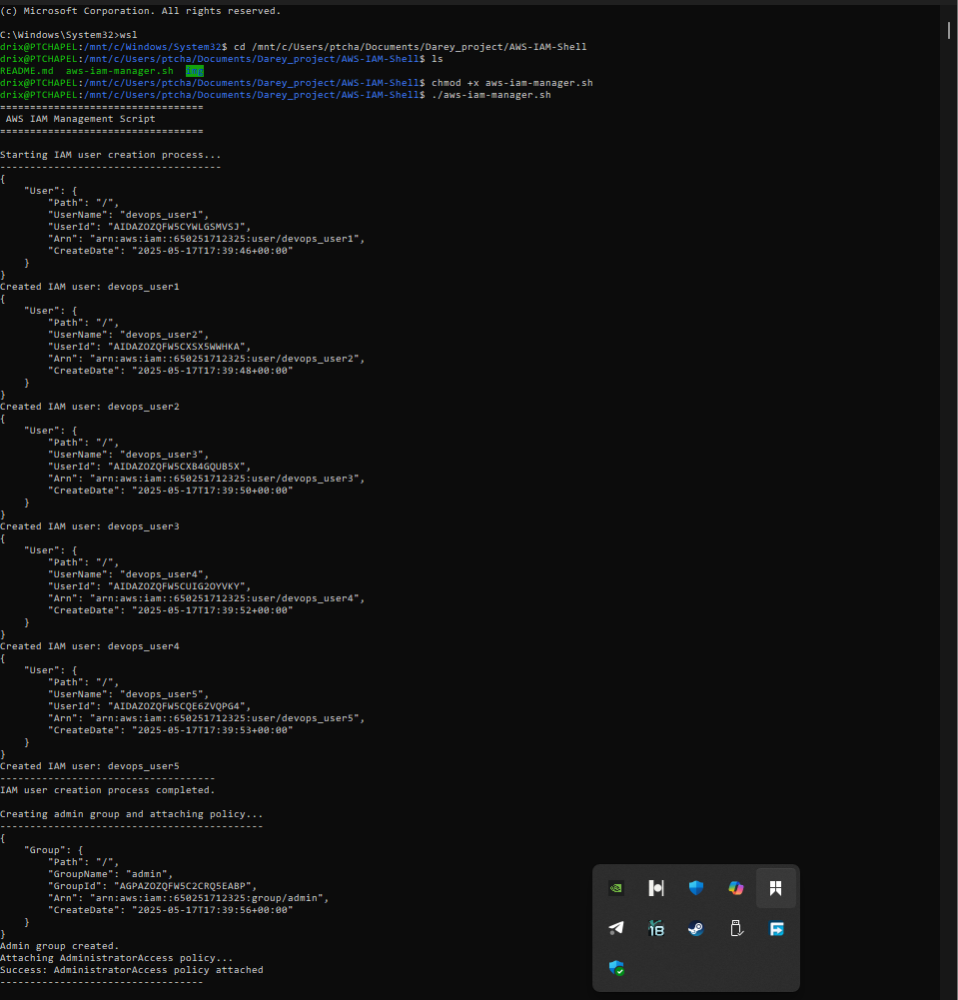

# 🚀 AWS IAM Management Shell Script

This project automates the creation of IAM users, assigns them to a group, and attaches the AdministratorAccess policy using a Bash script and AWS CLI. It was developed as part of a hands-on DevOps learning project for CloudOps Solutions.

---

## 🧩 Project Objective

The goal of this project is to automate the onboarding process for DevOps engineers by:

- Creating multiple IAM users.
- Grouping them under an `admin` group.
- Assigning the `AdministratorAccess` policy to the group.

## User Creation Logic

Used a shell array IAM_USER_NAMES to hold all user names. Iterated over this array using a for loop and used aws iam create-user to create each user.

## Admin Group Management

Used aws iam get-group to check if the group exists. If not, created it using aws iam create-group. Then attached the AdministratorAccess policy using its ARN.

## Assign Users to Group

Iterated over the same user array and used aws iam add-user-to-group to assign each user to the admin group.

## Error Handling

Each command was followed by a check for success ($? -eq 0) to inform the user about success or failure.

---

## ✅ Prerequisites

Before running the script, ensure the following:

- AWS CLI is installed on your system.
- AWS CLI is properly configured using `aws configure`.
- Your IAM credentials have sufficient permissions to create users, groups, and attach policies.



---

## 📜 Script Overview

```bash
#!/bin/bash

# AWS IAM Manager Script for CloudOps Solutions

# Define IAM User Names Array
IAM_USER_NAMES=("devops_user1" "devops_user2" "devops_user3" "devops_user4" "devops_user5")

# Function to create IAM users
create_iam_users() {
    echo "Starting IAM user creation process..."
    for user in "${IAM_USER_NAMES[@]}"; do
        aws iam create-user --user-name "$user"
        if [ $? -eq 0 ]; then
            echo "Created IAM user: $user"
        else
            echo "Error creating user: $user (might already exist)"
        fi
    done
    echo "IAM user creation process completed."
}

# Function to create admin group and attach policy
create_admin_group() {
    echo "Creating admin group and attaching policy..."
    if ! aws iam get-group --group-name "admin" >/dev/null 2>&1; then
        aws iam create-group --group-name "admin"
    fi
    aws iam attach-group-policy \
        --group-name "admin" \
        --policy-arn "arn:aws:iam::aws:policy/AdministratorAccess"
    if [ $? -eq 0 ]; then
        echo "Success: AdministratorAccess policy attached"
    else
        echo "Error: Failed to attach AdministratorAccess policy"
    fi
}

# Function to add users to admin group
add_users_to_admin_group() {
    echo "Adding users to admin group..."
    for user in "${IAM_USER_NAMES[@]}"; do
        aws iam add-user-to-group \
            --user-name "$user" \
            --group-name "admin"
    done
    echo "User group assignment process completed."
}

# Main execution function
main() {
    echo "=================================="
    echo " AWS IAM Management Script"
    echo "=================================="
    
    if ! command -v aws &> /dev/null; then
        echo "Error: AWS CLI is not installed. Please install and configure it first."
        exit 1
    fi

    create_iam_users
    create_admin_group
    add_users_to_admin_group

    echo "=================================="
    echo " AWS IAM Management Completed"
    echo "=================================="
}

# Execute main function
main

exit 0
```

### 🛠️ How to Run the Script

1. Navigate to the directory where the script is located:

   ```bash
   cd path/to/aws-iam-manager
   ```

1. Make the script executable:

   ```bash
   chmod +x aws-iam-manager.sh
   ```

2. Run the script:

   ```bash
   ./aws-iam-manager.sh
   ```

### 🖼️ Screenshots


---

## ✅ Output Summary

- ✅ IAM users created
- ✅ Admin group created
- ✅ Admin policy attached
- ✅ Users assigned to the group

---

## 💡 Key Learnings

- How to write and structure a production-grade shell script.
- Hands-on experience using AWS CLI for IAM operations.
- How to make a script idempotent and safe to rerun.

---

## 🧼 Cleanup (Optional)

To remove the users and group:

```bash
# Detach policy
aws iam detach-group-policy --group-name admin --policy-arn arn:aws:iam::aws:policy/AdministratorAccess

# Remove users from group
for user in "${IAM_USER_NAMES[@]}"; do
  aws iam remove-user-from-group --user-name "$user" --group-name "admin"
done

# Delete users
for user in "${IAM_USER_NAMES[@]}"; do
  aws iam delete-user --user-name "$user"
done

# Delete group
aws iam delete-group --group-name admin
```

---

## 🔒 Disclaimer

This script grants full Administrator access. Only run it in sandbox or training environments—not in production accounts.
