# Network Mastery with AWS VPC - DevOps Learning Project

## Table of Contents
- [Project Overview](#project-overview)
- [Learning Objectives](#learning-objectives)
- [Prerequisites](#prerequisites)
- [Core Concepts](#core-concepts)
- [Project Implementation](#project-implementation)
- [Project Reflection](#project-reflection)
- [Additional Resources](#additional-resources)

## Project Overview

This hands-on project focuses on mastering Amazon Web Services (AWS) Virtual Private Cloud (VPC) fundamentals. Through practical implementation, I explore core networking concepts including subnets, gateways, and routing tables while building a secure, scalable network infrastructure for the fictional company **GatoGrowFast.com**.

## Learning Objectives

- Gain practical experience with AWS VPC service
- Understand VPC, Subnets, Internet Gateway, and NAT Gateway concepts
- Configure secure network architecture in AWS
- Implement proper routing and connectivity
- Establish VPC peering connections
- Apply cloud networking best practices

## Prerequisites

- AWS Account with appropriate permissions
- Basic understanding of networking concepts
- Familiarity with AWS Management Console
- Understanding of IP addressing and CIDR notation

## Core Concepts

### What is a VPC?

A Virtual Private Cloud (VPC) is like creating a private room in the cloud just for your company's use. Think of it as GatoGrowFast.com's virtual office building where different departments can communicate securely while maintaining isolation from other companies.


### Subnets

Subnets are like different departments within GatoGrowFast.com's office building - HR, Finance, and IT. Each department has its own area with specific access rules and security requirements.

### Internet Gateway

An Internet Gateway acts like a router that controls data flow between your VPC and the internet, similar to how a building's main entrance controls access to the outside world.

### NAT Gateway

A NAT (Network Address Translation) Gateway functions as a secret agent between your private resources and the internet. It allows outbound internet access while keeping your resources hidden and secure.

### IP Addresses and CIDR

**IP Address**: A unique identifier for devices on a network, like a phone number for computers.

- **Public IP**: Like your home address - visible to the outside world
- **Private IP**: Like an internal extension number - only used within your network

**CIDR Notation**: A shorthand way to describe groups of IP addresses. For example, `192.168.1.0/24` represents all addresses from 192.168.1.0 to 192.168.1.255.

**Formula for calculating available IPs in a CIDR block:**
```
Number of IPs = 2^(32 - prefix length) - 2
```
The "-2" excludes the network and broadcast addresses.

**Example**: For `192.168.1.0/24`:
- Available IPs = 2^(32-24) - 2 = 2^8 - 2 = 256 - 2 = 254 addresses

## Project Implementation

### Part 1: Setting Up a Virtual Private Cloud (VPC)

#### Step 1: Navigate to VPC Service
1. Log into your AWS Management Console
2. In the search bar, type "VPC" and click on the VPC service

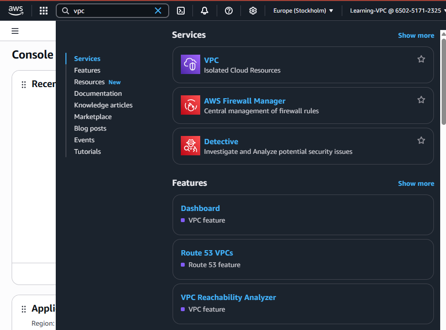

#### Step 2: Create VPC
1. Click on "Create VPC"
2. Choose "VPC only" option
3. Configure the following settings:
   - **Name**: `GatoGrowFast-VPC`
   - **IPv4 CIDR block**: `10.0.0.0/16`
   - **IPv6 CIDR block**: No IPv6 CIDR block
   - **Tenancy**: Default

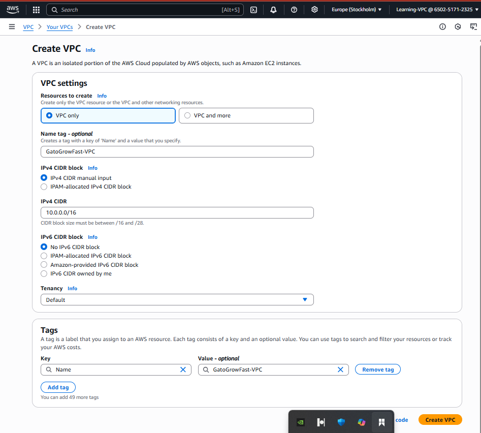

4. Click "Create VPC"

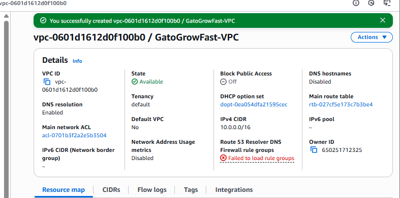

> **Note**: If you encounter an error about CIDR block size, ensure your CIDR block is between /16 and /28.

### Part 2: Configuring Subnets within the VPC

#### Step 1: Navigate to Subnets
1. In the VPC dashboard, click on "Subnets" in the left navigation panel
2. Click "Create subnet"


#### Step 2: Create Public Subnet
1. Select your VPC: `GatoGrowFast-VPC`
2. Configure the first subnet:
   - **Subnet name**: `my-public-subnet-1`
   - **Availability Zone**: Choose an AZ (e.g., `us-east-1a`)
   - **IPv4 CIDR block**: `10.0.1.0/24`

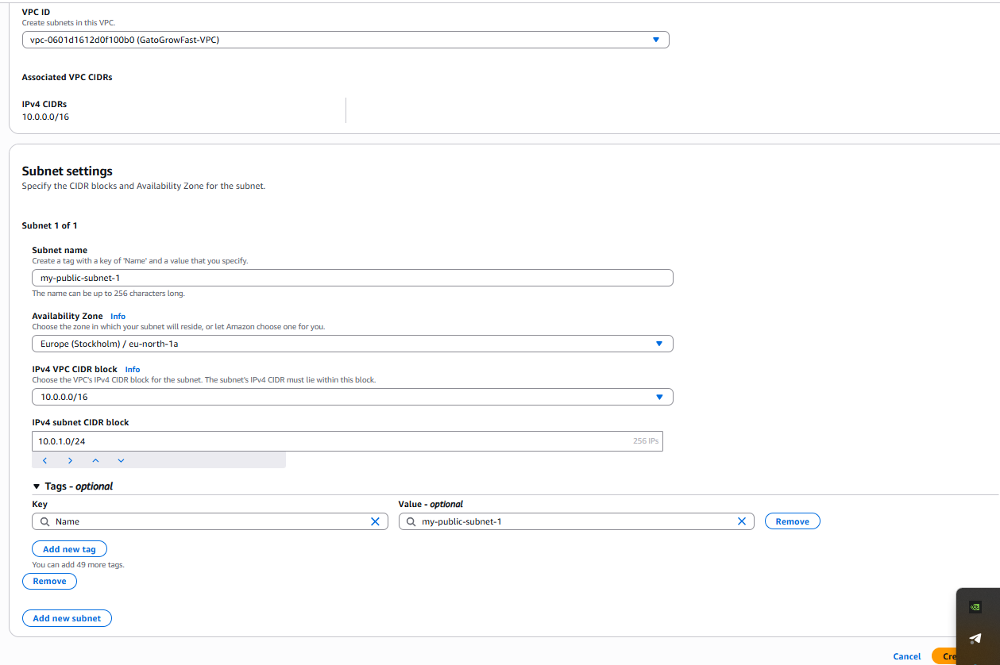

#### Step 3: Add Private Subnet
1. Click "Add subnet"
2. Configure the second subnet:
   - **Subnet name**: `my-private-subnet-1`
   - **Availability Zone**: Choose a different AZ (e.g., `us-east-1b`)
   - **IPv4 CIDR block**: `10.0.2.0/24`

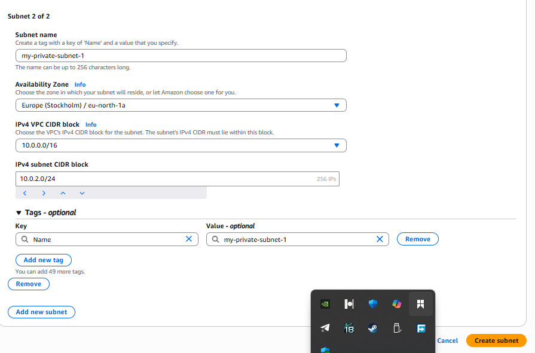

3. Click "Create subnet"

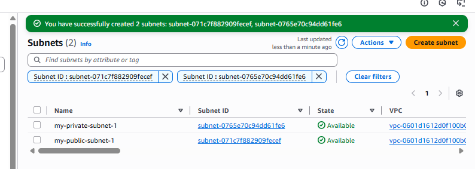

### Part 3: Creating Internet Gateway and Attaching to VPC

#### Step 1: Create Internet Gateway
1. In the VPC dashboard, click on "Internet gateways"
2. Click "Create internet gateway"

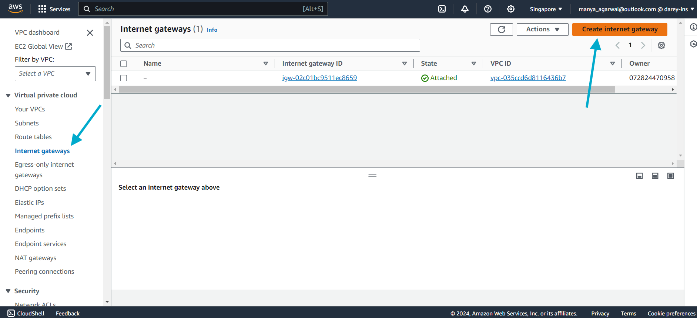

3. Configure:
   - **Name**: `GatoGrowFast-IGW`
4. Click "Create internet gateway"

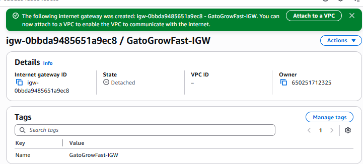

#### Step 2: Attach Internet Gateway to VPC
1. Select your newly created Internet Gateway
2. Click "Actions" → "Attach to VPC"

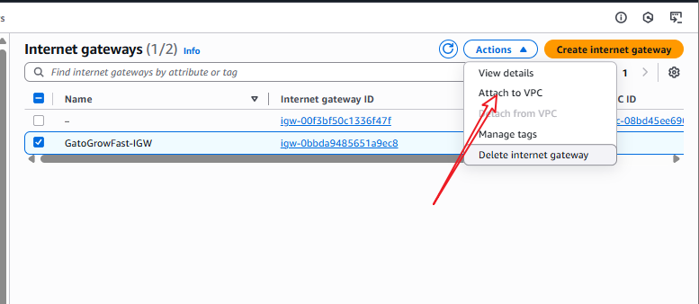

3. Select `GatoGrowFast-VPC`
4. Click "Attach internet gateway"

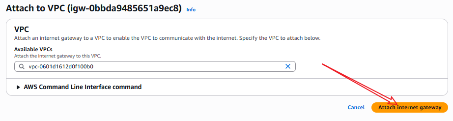

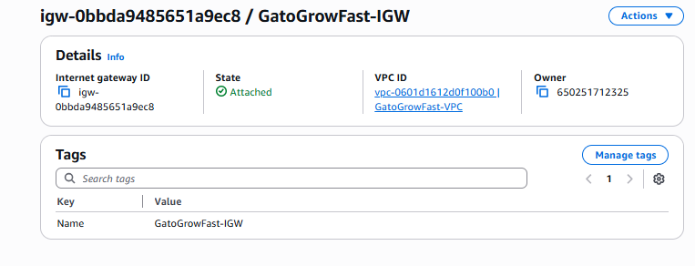

### Part 4: Enabling Internet Connectivity with Route Tables

#### Step 1: Create Route Table for Public Subnet
1. Navigate to "Route tables" in the VPC dashboard
2. Click "Create route table"


3. Configure:
   - **Name**: `public-route-table`
   - **VPC**: Select `GatoGrowFast-VPC`
4. Click "Create route table"

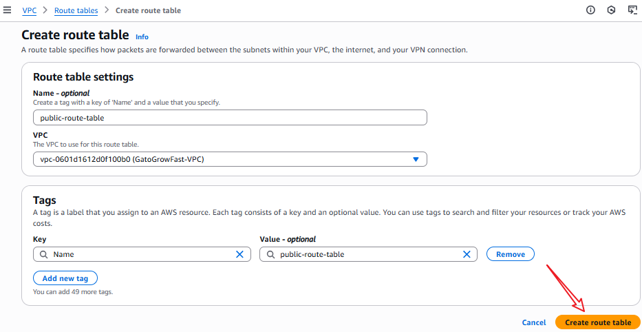

#### Step 2: Configure Routes for Internet Access
1. Select your route table
2. Click on "Routes" tab
3. Click "Edit routes"

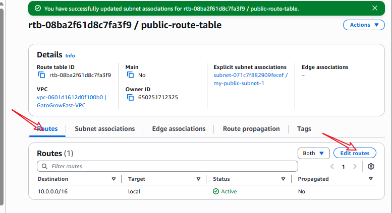

4. Click "Add route"
5. Configure:
   - **Destination**: `0.0.0.0/0` (all IPv4 traffic)
   - **Target**: Internet Gateway → Select `GatoGrowFast-IGW`
6. Click "Save changes"

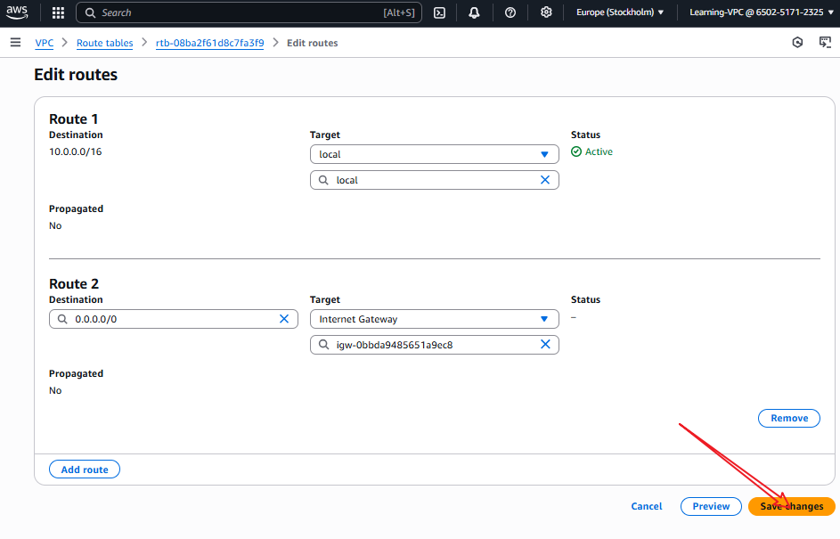

#### Step 3: Associate Public Subnet
1. Click on "Subnet associations" tab
2. Click "Edit subnet associations"

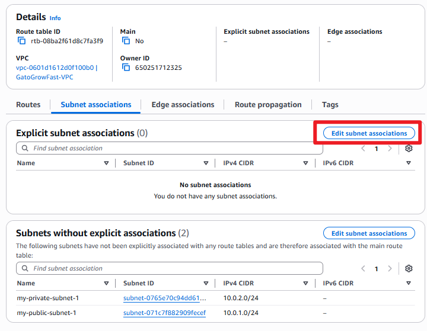

3. Select `my-public-subnet-1`
4. Click "Save associations"

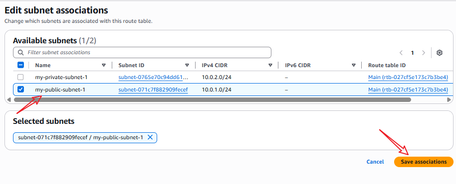

### Part 5: Enabling Outbound Internet Access through NAT Gateway

#### Step 1: Create NAT Gateway
1. Navigate to "NAT gateways" in the VPC dashboard
2. Click "Create NAT gateway"

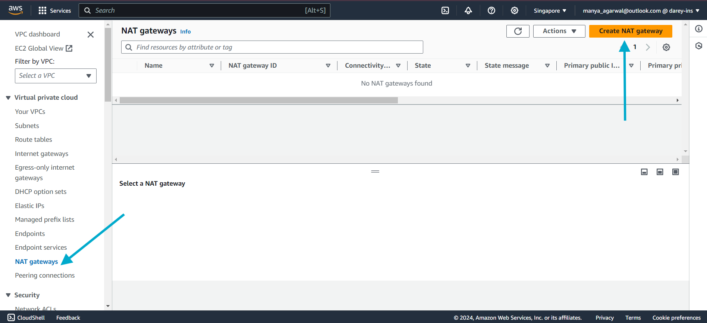

3. Configure:
   - **Name**: `GatoGrowFast-NAT`
   - **Subnet**: Select `my-private-subnet-1` 
   - **Connectivity type**: Private


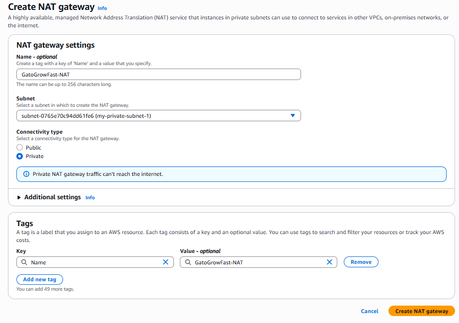

4. Click "Create NAT gateway"

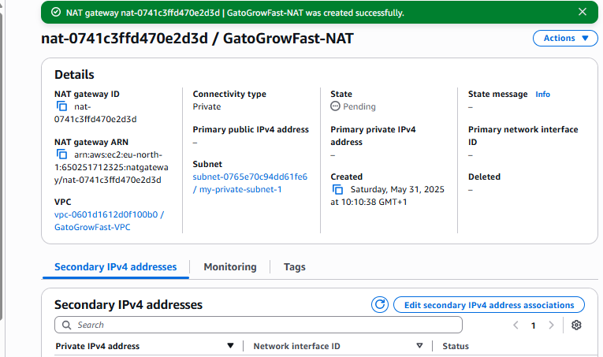

5. Select your NAT Gateway
6. Then navigate to the "Details" tab
7. From there, locate the subnet ID and click on it.

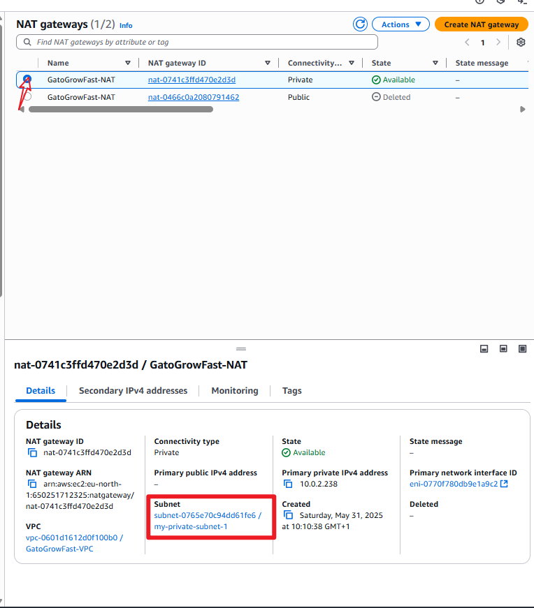

8. In the subnet page, navigate to the "Route Table" tab
9. Click on the route table ID to open it
10. Proceed to the "Routes" tab, then click "Edit routes"
    
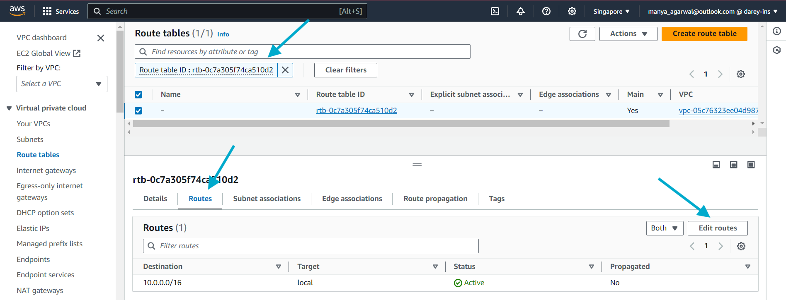

#### Step 2: Add Route for NAT Gateway
1.  Add route:
   - **Destination**: `0.0.0.0/0`
   - **Target**: NAT Gateway → Select `GatoGrowFast-NAT`
2.  Click "Save changes"

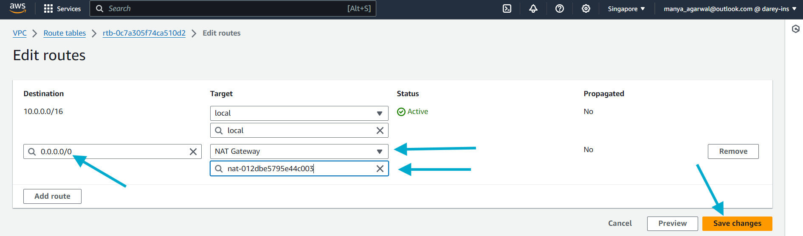

#### Step 3: Verify Subnet Associations
1. Click "Subnet associations" tab
2. Ensure `my-private-subnet-1` is associated
3. If not, click "Edit subnet associations" and associate it

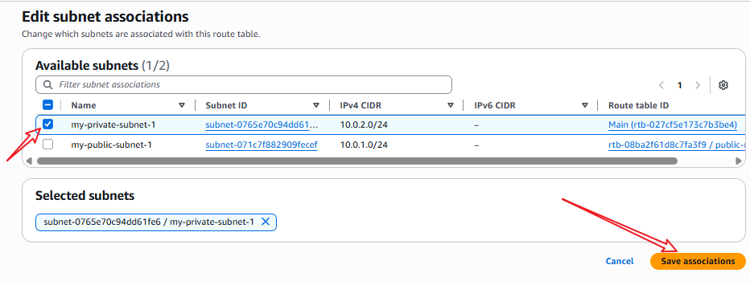

### Part 6: Establishing VPC Peering Connections

#### Step 1: Create Second VPC (for demonstration)
1. Create another VPC with CIDR `192.168.0.0/16`
2. Name it `Requester-VPC` or similar

**: `Requester-VPC`
   - **Account**: My account
   - **Region**: This Region
   - **VPC (Accepter)**: `Accepter-VPC`

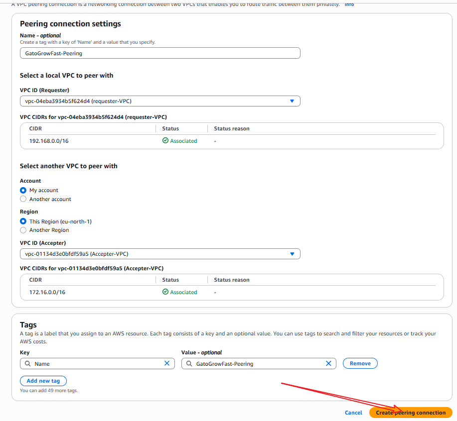

4. Click "Create peering connection"

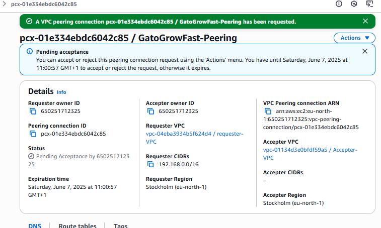

#### Step 3: Accept Peering Connection
1. Select the peering connection
2. Click "Actions" → "Accept request"


3. Click "Accept request"

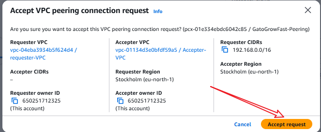

#### Step 4: Update Route Tables for Peering
1. Go to route tables for both VPCs
2. Add routes pointing to each other's CIDR blocks through the peering connection

**For Requester-VPC route table:**
- **Destination**: `192.168.0.0/16`
- **Target**: Peering Connection → `GatoGrowFast-Peering`

**For Accepter-VPC route table:**
- **Destination**: `172.16.0.0/16`
- **Target**: Peering Connection → `GatoGrowFast-Peering`

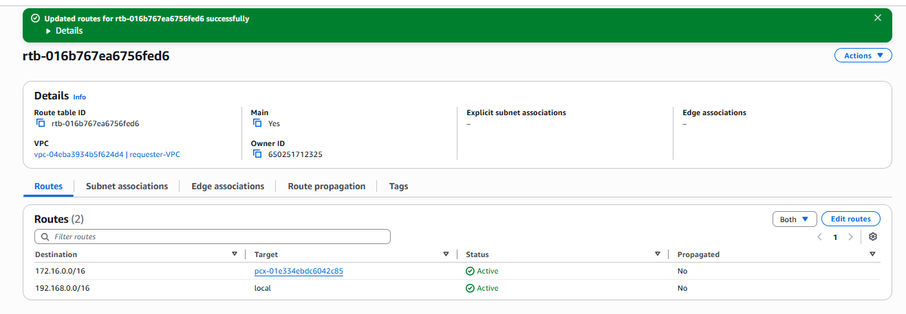


## Key Differences: Internet Gateway vs NAT Gateway

| Feature | Internet Gateway | NAT Gateway |
|---------|------------------|-------------|
| **Direction** | Bidirectional (in/out) | Unidirectional (out only) |
| **Public Access** | Resources get public IPs | Resources remain private |
| **Use Case** | Web servers, public apps | Private servers, databases |
| **Security** | Direct internet exposure | Hidden from internet |

## VPC Peering Best Practices

- **CIDR Blocks**: Must not overlap between peered VPCs
- **Region Compatibility**: Can peer across regions and accounts
- **Security Groups**: Configure to allow traffic between VPCs
- **Routing**: Update route tables in both VPCs
- **Limitations**: No transitive routing through peering connections

## Understanding VPC Endpoints

VPC endpoints provide a secure, private connection between your VPC and AWS services without routing traffic over the internet. This is crucial for sensitive data transfers, such as backing up EC2 data to S3.


## Project Reflection

### Achievements
- ✅ Successfully created and configured VPC infrastructure
- ✅ Implemented secure networking with public and private subnets
- ✅ Configured internet connectivity through Internet Gateway
- ✅ Enabled secure outbound access via NAT Gateway
- ✅ Established VPC peering for inter-VPC communication
- ✅ Gained hands-on experience with AWS networking concepts

### Challenges Overcome
- **CIDR Block Sizing**: Learned about /16 to /28 limitations
- **Route Table Configuration**: Understanding traffic flow and routing
- **Security Considerations**: Balancing accessibility with security

### Key Learnings
- Network architecture design principles
- AWS VPC service capabilities and limitations
- Security best practices for cloud networking
- Importance of proper subnet design and routing

### Skills Developed
- AWS Management Console navigation
- Network troubleshooting and configuration
- Cloud security implementation
- Infrastructure documentation

## Additional Resources

- [AWS VPC Documentation](https://docs.aws.amazon.com/vpc/)
- [AWS VPC Peering Guide](https://docs.aws.amazon.com/vpc/latest/peering/)
- [AWS Networking Best Practices](https://aws.amazon.com/architecture/well-architected/)
- [CIDR Calculator Tools](https://www.subnet-calculator.com/)
``
