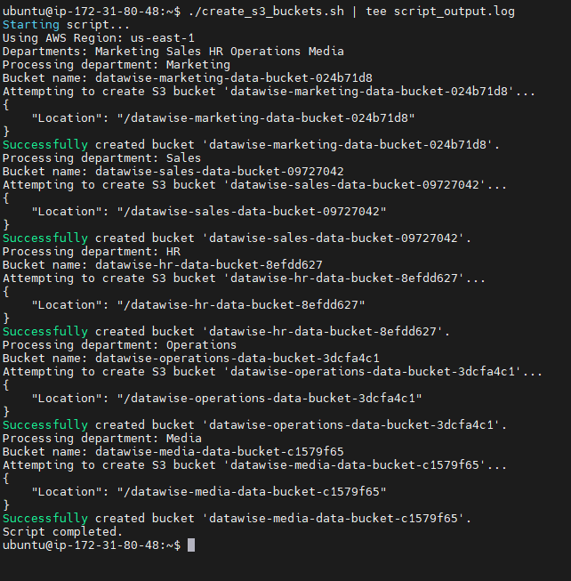
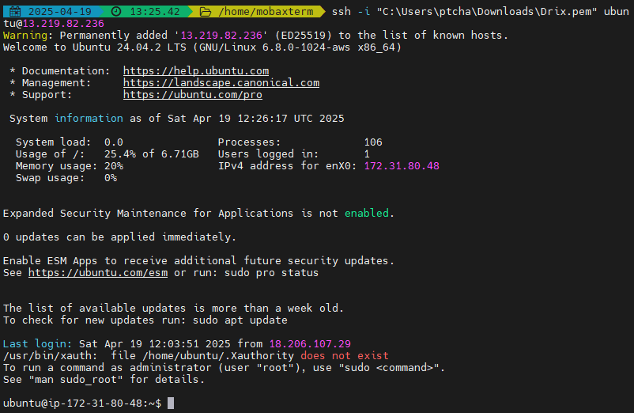
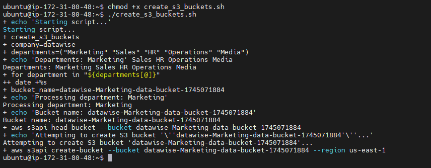
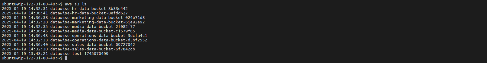
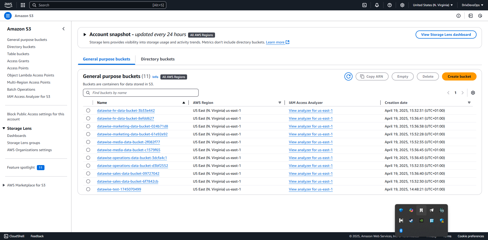

## Summary of Learning

This mini-project emphasized the importance of error handling in shell scripting to enhance script reliability, robustness, and usability. Key takeaways include identifying potential error sources, such as user input validation, command execution, and resource availability, and implementing strategies to handle them effectively. Conditional statements like `if`, `elif`, and `else` were used to check for error conditions and respond appropriately. Informative error messages were incorporated to guide users in resolving issues. A practical example was demonstrated by handling S3 bucket creation errors, where the script checks for the existence of a bucket before attempting to create it, preventing duplication and ensuring smooth execution. This project highlighted the significance of anticipating errors and designing scripts to handle them gracefully, making them more dynamic and user-friendly.

---

## Hands-On Practices

During this mini-project, the following hands-on practices were implemented to reinforce the concepts of error handling in shell scripting:

1. **User Input Validation**  
   - Implemented checks to ensure that user inputs are valid and meet the expected criteria.
   - Used conditional statements to handle invalid inputs and provide meaningful error messages.

2. **Command Execution Error Handling**  
   - Evaluated the exit status (`$?`) of commands to determine their success or failure.
   - Incorporated logic to handle errors gracefully when commands failed.

3. **S3 Bucket Creation with Error Handling**  
   - Used the `aws s3api head-bucket` command to check if an S3 bucket already exists before attempting to create it.
   - Prevented duplication by skipping bucket creation if it already exists.
   - Provided success and failure messages for bucket creation attempts.

4. **Conditional Statements**  
   - Utilized `if`, `elif`, and `else` statements to handle various error scenarios dynamically.
   - Designed scripts to adapt to different conditions and respond appropriately.

5. **Informative Error Messages**  
   - Added descriptive error messages to guide users in resolving issues effectively.
   - Ensured that error messages were clear and actionable.

6. **Script Robustness**  
   - Anticipated potential errors and designed scripts to handle them gracefully.
   - Improved the reliability and usability of the scripts by addressing common error scenarios.

---

## Implementation Example: S3 Bucket Creation with Error Handling

Below is the shell script that demonstrates error handling for creating S3 buckets. It checks if a bucket already exists before attempting to create it, preventing duplication and ensuring smooth execution.

```bash
#!/bin/bash

# Function to create S3 buckets for different departments
create_s3_buckets() {
    company="datawise"
    departments=("Marketing" "Sales" "HR" "Operations" "Media")
    
    for department in "${departments[@]}"; do
        bucket_name="${company}-${department}-Data-Bucket"
        
        # Check if the bucket already exists
        if aws s3api head-bucket --bucket "$bucket_name" &>/dev/null; then
            echo "S3 bucket '$bucket_name' already exists."
        else
            # Create S3 bucket using AWS CLI
            aws s3api create-bucket --bucket "$bucket_name" --region N.Virginia --create-bucket-configuration LocationConstraint=us-east-1 &>/dev/null
            if [ $? -eq 0 ]; then
                echo "S3 bucket '$bucket_name' created successfully."
            else
                echo "Failed to create S3 bucket '$bucket_name'."
            fi
        fi
    done
}

# Call the function
create_s3_buckets
```

----
### Execution and Testing
To test the script:

1. Ensure you have the AWS CLI installed and configured with the appropriate credentials.

   
2. Run the script in a terminal:
   
```bash
./create_s3_buckets.sh
```
**Output:**



3. Verify the output messages and check the AWS S3 console to confirm the buckets were created successfully.

**output**



----


Key Features of the Script:
- **Error Handling for Existing Buckets:** The script uses the aws s3api head-bucket command to check if a bucket exists before attempting to create it.
- **Exit Status Handling:** The script evaluates the exit status ($?) of the aws s3api create-bucket command to determine success or failure.
- **Informative Feedback:** The script provides clear success and failure messages for each bucket creation attempt

-----

