# My AWS Identity and Access Management (IAM) Mini Project

## Overview
I created custom IAM policies, users, and groups to manage secure access to AWS resources like EC2 and S3.

## Introduction to Cloud Computing Security

As I've learned, cloud computing requires proper security controls, and IAM serves as the foundation for access management in AWS:
- It helps me control who is authenticated (signed in)
- It determines who is authorized (has permissions) to use resources
- It allows me to implement the principle of least privilege

## Project Goals and Learning Outcomes
By completing this project, I have:
1. Created custom IAM policies for EC2 and S3 services
2. Set up IAM users (Eric, Jack, and Ade) with appropriate permissions
3. Created and configured the Development-Team group
4. Tested access controls to validate security configurations

## Step-by-Step Implementation Process

### 1. Project Setup
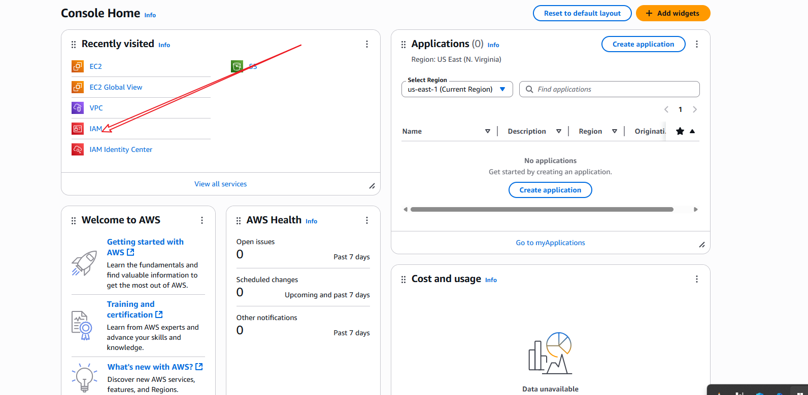
1. I logged into the AWS Management Console using my administrator account
2. I navigated to the IAM Dashboard to manage users, groups, roles, and policies

### 2. Creating Custom IAM Policies

#### EC2 Full Access Policy
[Creating EC2 Policy](img/create-policy.png)
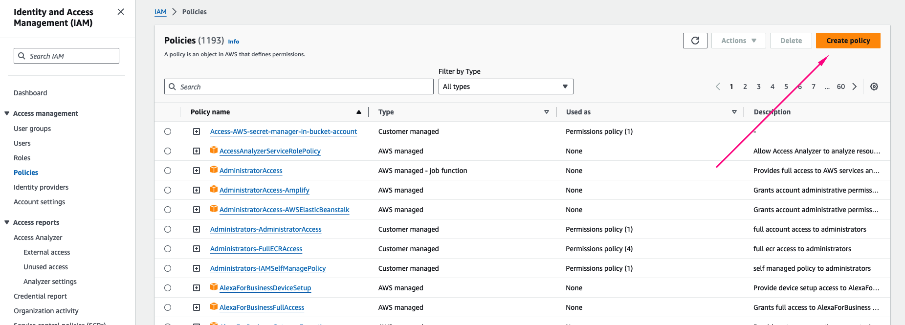
[Creating EC2 Policy](img/create-policy-2.png)
[Creating EC2 Policy](img/create-policy-3.png)
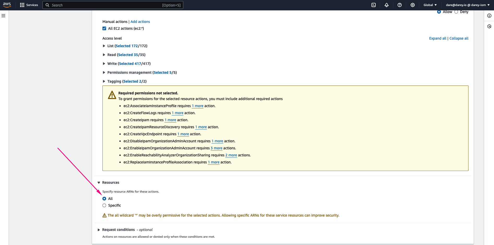
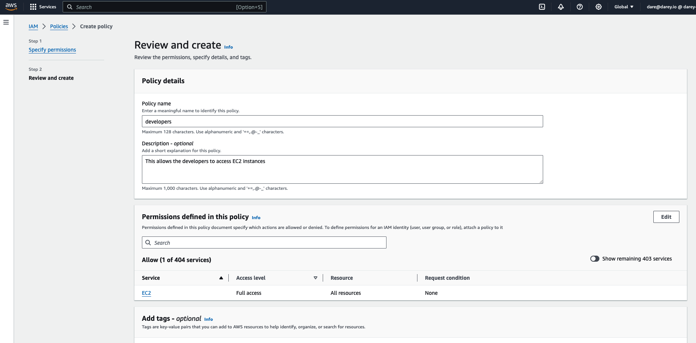
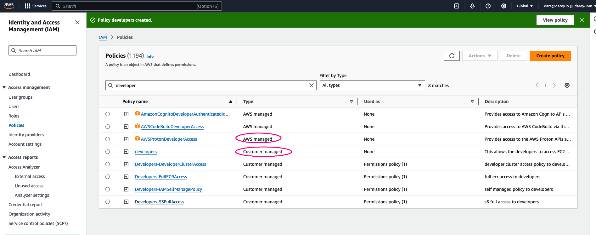

1. I clicked on "Policies" in the IAM console
2. I selected "Create policy"
3. In the service selection, I searched for EC2
4. I selected "All EC2 actions" checkbox
5. I selected "All" in the Resources section
6. I clicked Next and named it "EC2FullAccess-Custom"
7. I added a description explaining the policy purpose
8. I clicked "Create Policy"

#### EC2 and S3 Combined Policy

1. I returned to "Create policy" in the IAM console
2. First, I added EC2 service:
   - I searched for EC2
   - I selected "All EC2 actions" checkbox
   - I selected "All" in the Resources section
3. I clicked "Add more permissions"
4. Next, I added S3 service:
   - I searched for S3
   - I selected "All S3 actions" checkbox
   - I selected "All" in the Resources section
5. I clicked Next and named it "EC2andS3FullAccess-Custom"
6. I added a description explaining the combined policy
7. I clicked "Create Policy"

### 3. Creating the Development-Team Group
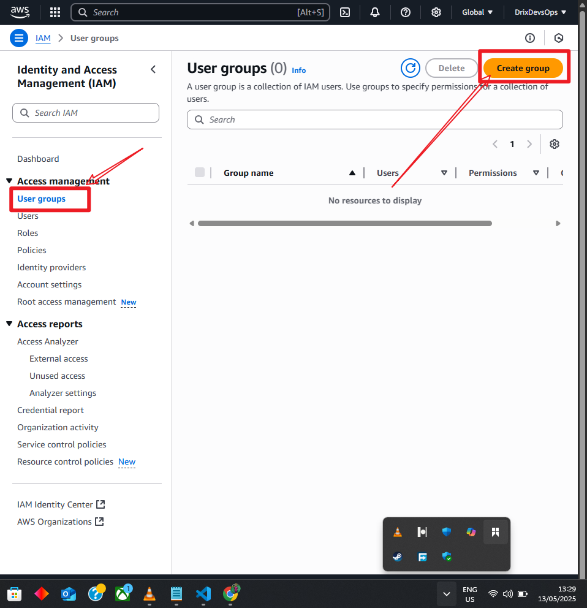
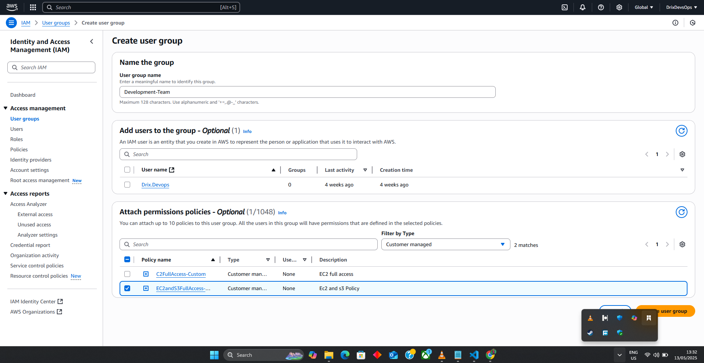
1. I navigated to "User groups" in the IAM console
2. I clicked "Create group"
3. I named the group "Development-Team" exactly as specified
4. I attached the "EC2andS3FullAccess-Custom" policy I created earlier
5. I clicked "Create group"

### 4. Creating IAM Users

#### Creating Eric's User Account
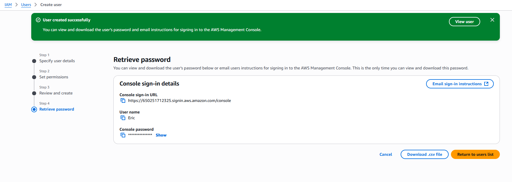
1. I navigated to "Users" in the IAM console
2. I clicked "Create user"
3. I entered "Eric" as the username
4. I enabled AWS Management Console access
5. I selected "Attach policies directly"
6. I attached the "EC2FullAccess-Custom" policy I created earlier
7. I reviewed the details and clicked "Create user"

#### Creating Jack's User Account
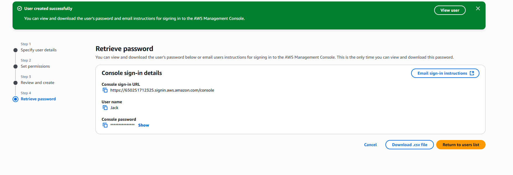
1. I repeated the process for Jack
2. I entered "Jack" as the username
3. I enabled AWS Management Console access
4. I selected "Add user to group"
5. I added Jack to the "Development-Team" group
6. I reviewed the details and clicked "Create user"

#### Creating Ade's User Account
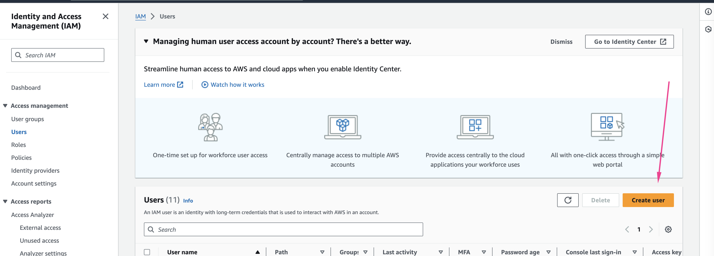
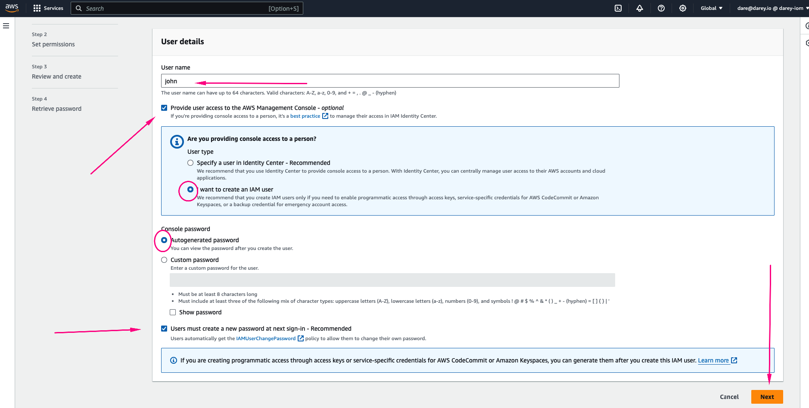
1. I repeated the process for Ade
2. I entered "Ade" as the username
3. I enabled AWS Management Console access
4. I selected "Add user to group"
5. I added Ade to the "Development-Team" group
6. I reviewed the details and clicked "Create user"

### 5. Testing and Validation

#### Testing Eric's Access
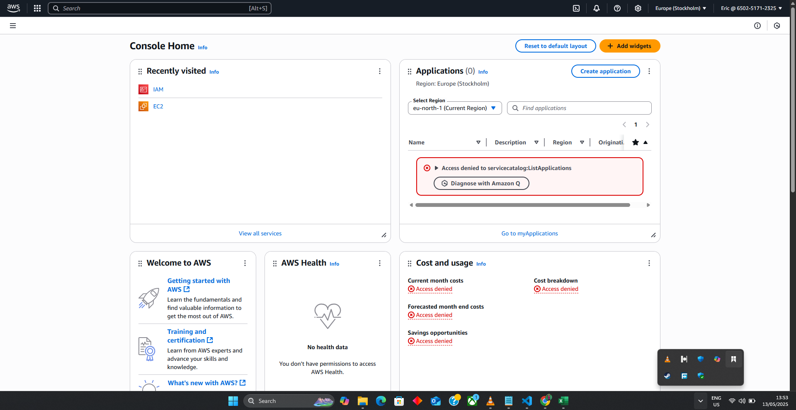
1. I logged in as Eric using his credentials
2. I navigated to the EC2 dashboard
3. I confirmed Eric could view and manage EC2 instances
4. I verified Eric couldn't access S3 services

#### Testing Jack's Access

1. I logged in as Jack using his credentials
2. I navigated to both the EC2 and S3 dashboards
3. I confirmed Jack could view and manage both EC2 instances and S3 buckets
4. I verified Jack's membership in the Development-Team group granted him the combined permissions

#### Testing Ade's Access

1. I logged in as Ade using his credentials
2. I performed the same tests as Jack
3. I confirmed Ade had identical permissions to Jack through the Development-Team group

## My Project Reflection

### The Role of IAM in AWS
Through this project, I've learned that IAM serves as the foundation of security in AWS. It allowed me to control access to AWS services and resources securely. I now understand how IAM provides the tools to implement authentication and authorization, ensuring only the right people have access to the right resources.

### Differences Between IAM Users and Groups
I've learned to distinguish between:
- **IAM Users**: Individual entities like Eric, Jack, and Ade that have specific permissions
- **IAM Groups**: Collections of IAM users (Development-Team) that share common permissions

I created individual IAM users for accountability while using the Development-Team group to efficiently manage permissions for multiple users (Jack and Ade).

### Process of Creating IAM Policies
I found that creating custom IAM policies involves:
1. Identifying the specific AWS services needed (EC2 for Eric, both EC2 and S3 for Development-Team)
2. Determining the level of access required (full access in both cases)
3. Defining the resources these permissions apply to (all resources)
4. Creating and naming the policy documents appropriately
5. Attaching the policies to the appropriate users or groups

### The Principle of Least Privilege
I've implemented the principle of least privilege by:
- Giving Eric access only to EC2 resources as required
- Granting Development-Team members (Jack and Ade) access to both EC2 and S3 resources
- Maintaining clear boundaries of access based on each user's role requirements

This approach minimizes security risks by ensuring each user has only the permissions necessary to perform their job functions.

### Implementation Summary
I successfully created:
- Two custom IAM policies:
  - EC2FullAccess-Custom (for Eric)
  - EC2andS3FullAccess-Custom (for Development-Team)
- One IAM group (Development-Team) with the combined EC2 and S3 policy
- Three IAM users with appropriate permissions:
  - Eric with direct EC2 full access
  - Jack as a Development-Team member with EC2 and S3 access
  - Ade as a Development-Team member with EC2 and S3 access

By completing this implementation, I now understand how to properly configure IAM to ensure secure, role-based access control in AWS.