# MarketPeak E-Commerce Platform Deployment

## Table of Contents
- [MarketPeak E-Commerce Platform Deployment](#marketpeak-e-commerce-platform-deployment)
  - [Table of Contents](#table-of-contents)
  - [Project Overview](#project-overview)
  - [1. Version Control with Git](#1-version-control-with-git)
    - [1.1 Initialize Git Repository](#11-initialize-git-repository)
    - [1.2 Obtain and Prepare Website Template](#12-obtain-and-prepare-website-template)
    - [1.3 Stage and Commit Template to Git](#13-stage-and-commit-template-to-git)
    - [1.4 Push Code to GitHub Repository](#14-push-code-to-github-repository)
  - [2. AWS Deployment](#2-aws-deployment)
    - [2.1 Set Up AWS EC2 Instance](#21-set-up-aws-ec2-instance)
    - [2.2 Clone Repository on Linux Server](#22-clone-repository-on-linux-server)
    - [2.3 Install Web Server on EC2](#23-install-web-server-on-ec2)
    - [2.4 Configure httpd for Website](#24-configure-httpd-for-website)
    - [2.5 Access Website from Browser](#25-access-website-from-browser)
  - [3. Continuous Integration and Deployment Workflow](#3-continuous-integration-and-deployment-workflow)
    - [3.1 Developing New Features](#31-developing-new-features)
    - [3.2 Version Control with Git](#32-version-control-with-git)
    - [3.3 Pull Requests and Merging](#33-pull-requests-and-merging)
    - [3.4 Deploying Updates to Production](#34-deploying-updates-to-production)
    - [3.5 Testing New Changes](#35-testing-new-changes)
  - [4. Challenges and Solutions](#4-challenges-and-solutions)
    - [Challenge 1: Permission Issues with Apache](#challenge-1-permission-issues-with-apache)
    - [Challenge 2: Security Group Configuration](#challenge-2-security-group-configuration)
    - [Challenge 3: Git Authentication on EC2](#challenge-3-git-authentication-on-ec2)
  - [5. Conclusion](#5-conclusion)

## Project Overview

This project documents the deployment of "MarketPeak," an e-commerce platform. The implementation involves setting up version control with Git, preparing the website using a template, and deploying it on an AWS EC2 instance with Apache web server. The documentation also covers the continuous integration and deployment workflow for future updates.

## 1. Version Control with Git

### 1.1 Initialize Git Repository

First, I created a project directory and initialized a Git repository to manage version control:

```bash
mkdir MarketPeak_Ecommerce
cd MarketPeak_Ecommerce
git init
```

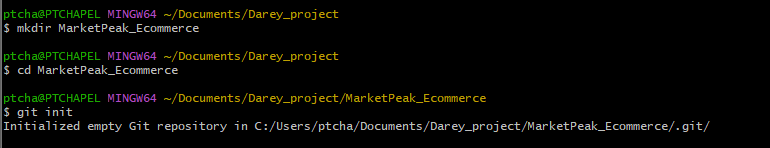

### 1.2 Obtain and Prepare Website Template

Instead of building from scratch, I used a pre-existing e-commerce template:

1. Downloaded the Tooplate 2130 Waso Strategy template from [Tooplate](https://www.tooplate.com/view/2130-waso-strategy)
2. Extracted the template into the project directory
3. Customized the template by updating the branding to "MarketPeak"


### 1.3 Stage and Commit Template to Git

After preparing the template, I staged and committed the files to the local Git repository:

```bash
git add .
git commit -m "Initial commit: Add MarketPeak e-commerce template"
```

 and SSH (port 22) traffic
4. Created and downloaded a key pair for SSH access

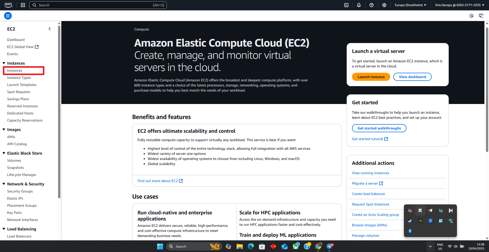
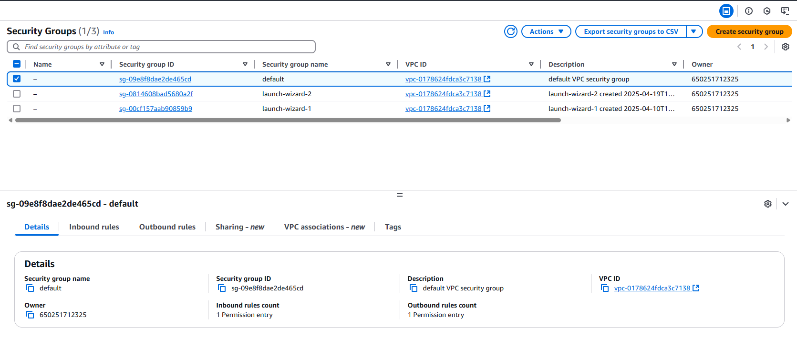
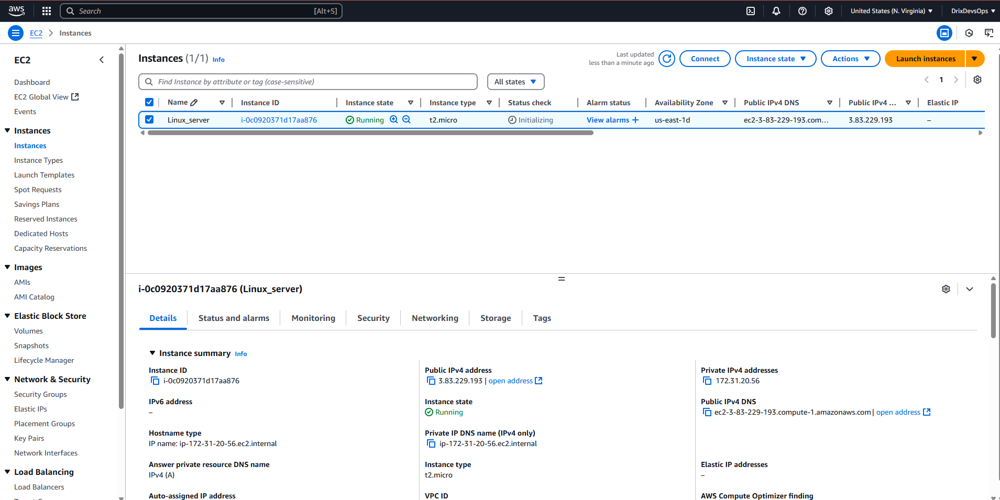

### 2.2 Clone Repository on Linux Server

After connecting to the EC2 instance, I cloned the GitHub repository:

```bash
# SSH into EC2 instance
ssh -i "xxxx.pem" xxxx@ec2-12-345-67-89

# Clone the repository using HTTPS
git clone https://github.com/myusername/MarketPeak_Ecommerce.git
```

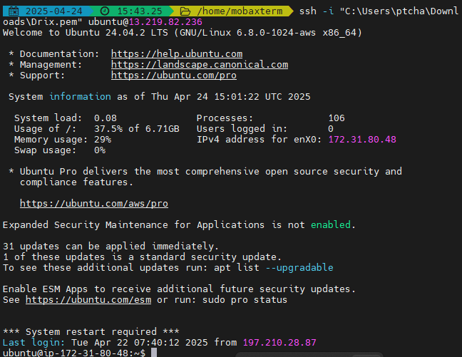
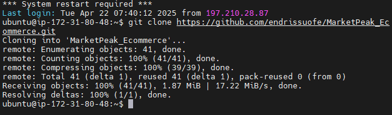

### 2.3 Install Web Server on EC2

I installed and configured Apache HTTP Server (httpd) on the EC2 instance:

```bash
# Update the system
sudo yum update -y

# Install Apache
sudo yum install httpd -y

# Start Apache service
sudo systemctl start httpd

# Enable Apache to start on boot
sudo systemctl enable httpd

# Check status to verify Apache is running
sudo systemctl status httpd
```

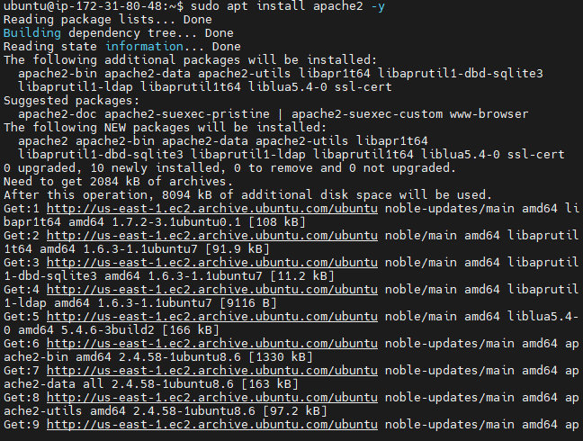

### 2.4 Configure httpd for Website

I configured Apache to serve the MarketPeak website files:

```bash
# Move website files to Apache's document root
sudo cp -r MarketPeak_Ecommerce/* /var/www/html/

# Set appropriate permissions
sudo chown -R apache:apache /var/www/html/
sudo chmod -R 755 /var/www/html/
```

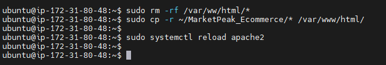

### 2.5 Access Website from Browser

After deployment, I accessed the website using the EC2 instance's public IP address:

```
http://12.345.67.89
```


## 3. Continuous Integration and Deployment Workflow

### 3.1 Developing New Features

For ongoing development, I followed these steps:

1. Created a feature branch from main
2. Implemented new features - specifically customizing the website for MarketPeak

```bash
git checkout -b feature/marketplace-customization
```


The main customizations included:

1. Updated color scheme:
   ```css
   :root {
     --primary-color: #4285f4;  /* Blue */
     --secondary-color: #34a853;  /* Green */
   }
   ```

2. Improved navigation bar for e-commerce:
   ```html
   <nav class="navbar navbar-expand-lg bg-light shadow-lg">
       <div class="container">
           <a class="navbar-brand" href="index.html">
               <strong>Market<span style="color: var(--secondary-color);">Peak</span></strong>
           </a>
           <!-- Navigation items -->
       </div>
   </nav>
   ```

3. Added featured products section:
   ```html
   <section class="featured-products section-padding">
       <div class="container">
           <div class="row">
               <div class="col-12">
                   <h2 class="mb-5">Featured Products</h2>
               </div>
           </div>
           <!-- Product cards -->
       </div>
   </section>
   ```

4. Enhanced the footer with e-commerce specific elements:
   ```html
   <footer class="site-footer">
       <div class="container">
           <!-- Quick links, customer support, contact info, newsletter -->
       </div>
   </footer>
   ```

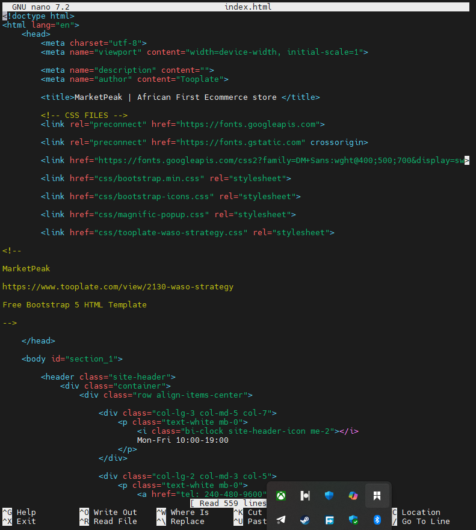

### 3.2 Version Control with Git

After implementing changes, I committed them to the feature branch:

```bash
git add .
git commit -m "Customize template for MarketPeak e-commerce platform"
git push origin feature/marketplace-customization
```


### 3.3 Pull Requests and Merging

To integrate changes into the main branch:

1. Created a pull request on GitHub to merge the feature branch into main
2. Reviewed the changes to ensure they met requirements
3. Merged the pull request

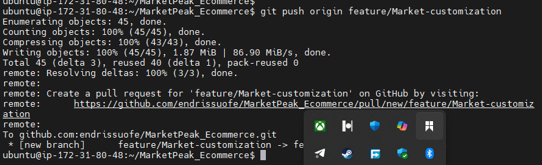
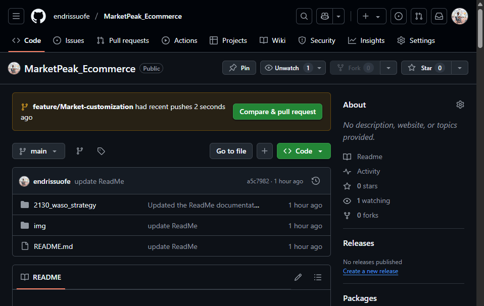

### 3.4 Deploying Updates to Production

To deploy new changes to the live server:

```bash
# SSH into EC2 instance
ssh -i "marketpeak-key.pem" ec2-user@ec2-12-345-67-89.compute-1.amazonaws.com

# Navigate to website directory
cd /var/www/html

# Pull latest changes from main branch
sudo git pull origin main

# Restart Apache if necessary
sudo systemctl restart httpd
```


### 3.5 Testing New Changes

After deployment, I verified the changes on the live site by accessing the public IP and testing the new functionality.


## 4. Challenges and Solutions

During this project, I encountered several challenges and implemented solutions:

### Challenge 1: Permission Issues with Apache

**Problem:** Apache couldn't access some files in the document root directory.

**Solution:** Set appropriate ownership and permissions for the web files:
```bash
sudo chown -R apache:apache /var/www/html/
sudo chmod -R 755 /var/www/html/
```

### Challenge 2: Security Group Configuration

**Problem:** Website wasn't accessible from browsers even though Apache was running.

**Solution:** Verified and updated EC2 security group to properly allow inbound traffic on port 80 (HTTP).


### Challenge 3: Git Authentication on EC2

**Problem:** Initial difficulty in pulling updates from the private GitHub repository.

**Solution:** Set up HTTPS authentication with a personal access token for GitHub on the EC2 instance.


## 5. Conclusion

The MarketPeak E-Commerce platform has been successfully deployed using Git for version control and AWS EC2 for hosting. The implementation follows best practices for continuous integration and deployment, allowing for easy updates and maintenance.

The project demonstrates proficiency in:
- Git version control
- Linux server administration
- AWS cloud deployment
- Web server configuration
- CI/CD workflows
- Web development customization

Future improvements could include:
- Setting up HTTPS with SSL/TLS certificates
- Implementing a CI/CD pipeline with GitHub Actions
- Adding monitoring and logging solutions
- Scaling with load balancing for increased traffic
