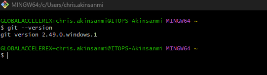
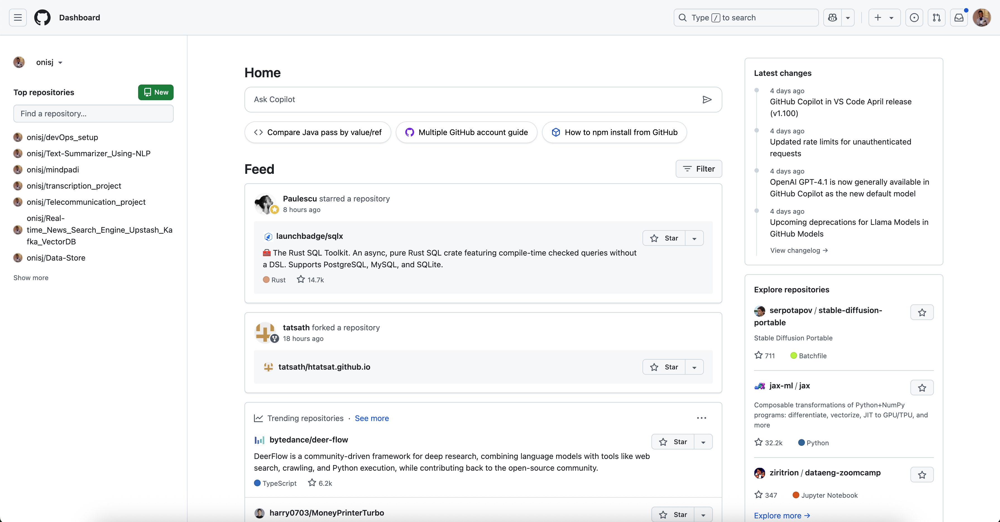
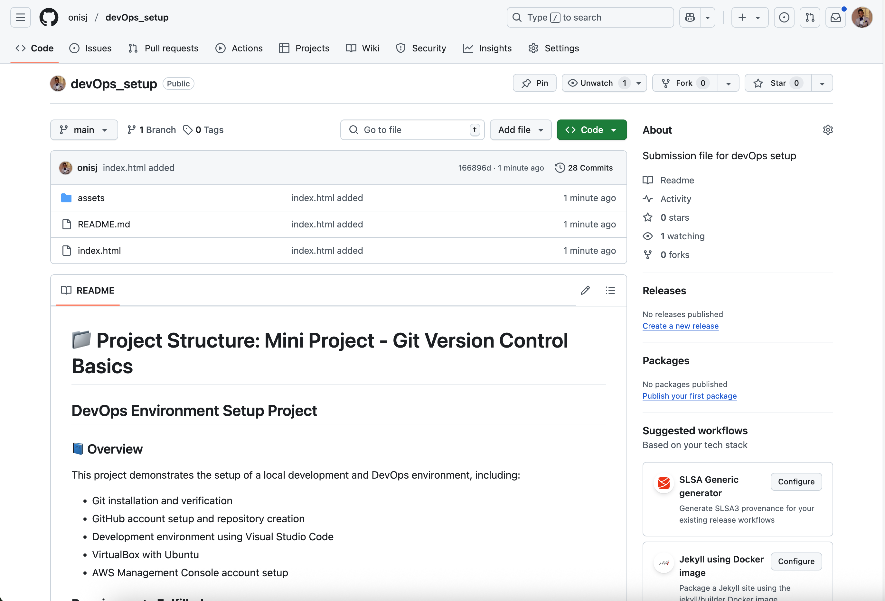

# 📁 Project Structure: Mini Project - Git Version Control Basics  

## DevOps Environment Setup Project

### 📘 Overview

This project demonstrates the setup of a local development and DevOps environment, including:

- Git installation and verification
- GitHub account setup and repository creation
- Development environment using Visual Studio Code
- VirtualBox with Ubuntu
- AWS Management Console account setup

### Requirements Fulfilled

#### 1. Git Installation and Verification

Git was successfully installed. Below is a screenshot of the terminal showing `git --version` command output.

#### 2. GitHub Dashboard Verification

A GitHub account was created and the dashboard accessed. Below is a screenshot confirming this.

#### 3. GitHub Repository

A repository was created containing a valid `index.html` file.

- [GitHub Repository URL](https://github.com/onisj/devOps_setup)
