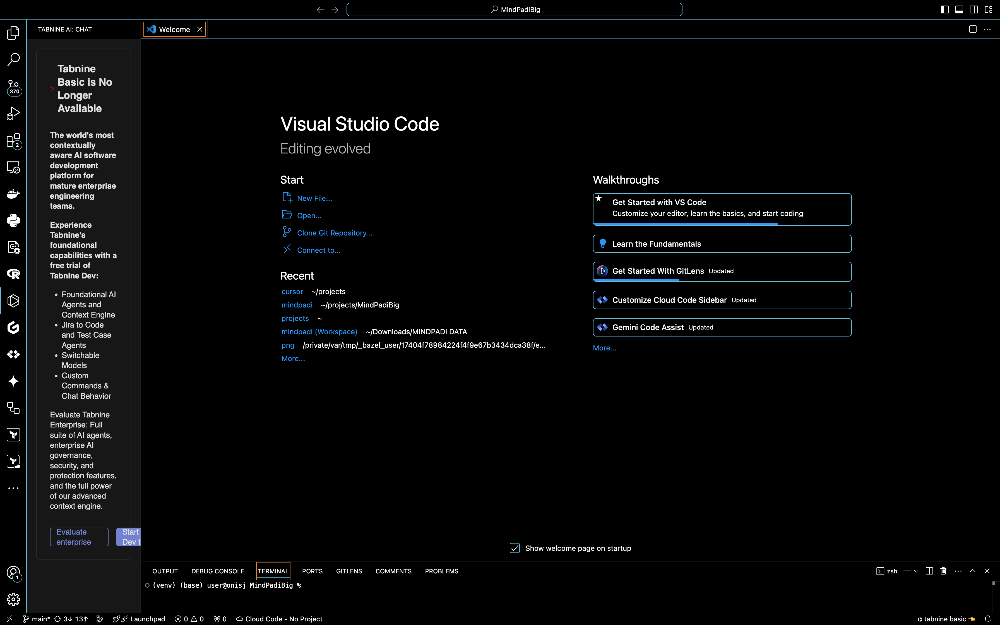
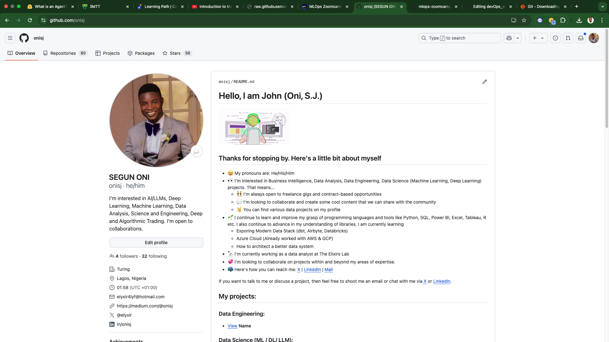
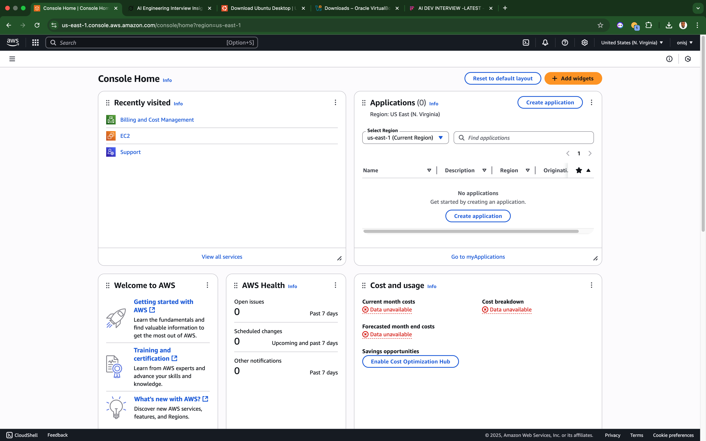

## Step-by-Step Installation & Configuration Guide

This guide details how I installed and configured the essential tools for my development and DevOps environment on a Windows machine.


### 1. Visual Studio Code (VS Code)

**Purpose:** A lightweight, extensible code editor for writing and managing code efficiently.

#### Steps:

1. Go to the [official VS Code website](https://code.visualstudio.com/).
2. Click **Download for Windows**.
3. Run the installer and follow the setup wizard:
   - Accept license agreement.
   - Select destination folder.
   - Add to system PATH (recommended).
4. After installation, launch VS Code.

VS Code Welcome Screen 



### 2. Git

**Purpose:** A version control system used to track changes in code and collaborate with others.

#### Steps:

1. Go to the [Git official website](https://git-scm.com/).
2. Click **Download for Windows**.
3. Run the installer:
   - Use recommended settings during the setup.
4. Once installed, open the Command Prompt or PowerShell.
5. Run:
   ```bash
   git --version
   ```

Git Installation Confirmation


### 3. VirtualBox

**Purpose:** A virtualization platform to run virtual machines like Ubuntu on your host OS.

#### Steps:

1. Visit the [VirtualBox download page](https://www.virtualbox.org/).
2. Download the **Windows hosts** version.
3. Run the installer:
   - Accept default settings.
4. After installation, open VirtualBox to verify it works.

VirtualBox Installation Confirmation
 


### 4. Ubuntu (on VirtualBox)

**Purpose:** A Linux-based OS used for server-side development and DevOps practices.

#### Steps:

1. Download the latest **Ubuntu Desktop ISO** from [ubuntu.com](https://ubuntu.com/download/desktop).
2. Open VirtualBox and click **New** to create a VM:
   - Name: `Ubuntu`
   - Type: `Linux`
   - Version: `Ubuntu (64-bit)`
   - Memory: Allocate at least **2GB (2048MB)** of RAM
   - Create a virtual hard disk (recommended size: 20GB+)
3. Select the created VM and click **Start**.
4. When prompted, browse and attach the downloaded ISO file.
5. Proceed through the Ubuntu installation process inside VirtualBox.
6. After setup, login using the created Ubuntu user.

Ubuntu Installation Confirmation


### 5. GitHub Account

**Purpose:** A cloud-based platform to host repositories and collaborate using Git.

#### Steps:

1. Go to [github.com](https://github.com/).
2. Click **Sign up** and create an account.
3. Complete profile setup and email verification.
4. Once logged in, explore the dashboard and create your first repository.

GitHub User Account Setup
 


### 6. AWS Management Console

**Purpose:** A web interface for managing cloud resources using Amazon Web Services.

#### Steps:

1. Visit [aws.amazon.com](https://aws.amazon.com/).
2. Click **Sign In to the Console** > **Create a new AWS account**.
3. Fill in account and billing information (requires a valid payment method).
4. Once setup is complete, login to the **AWS Management Console**.
5. Explore services like EC2, S3, IAM, etc.

AWS User Account Setup
 

