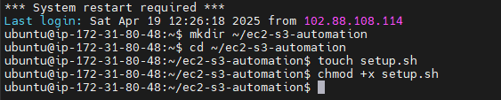
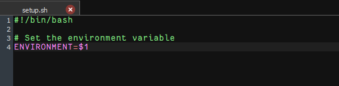
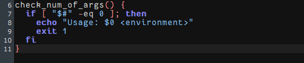
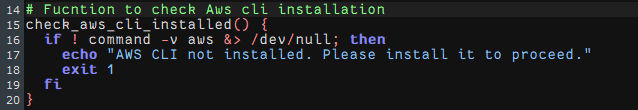
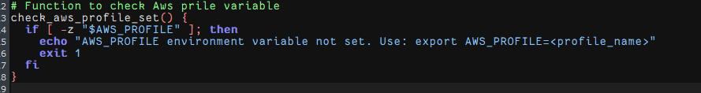
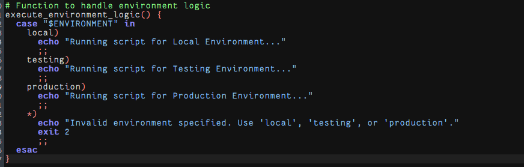
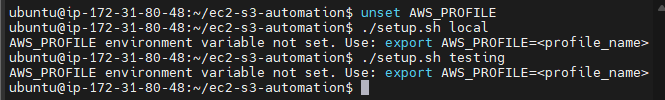
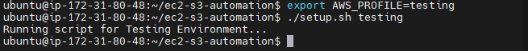

# Mini Project: Working with Functions (Shell Scripting)

This project automates EC2 and S3 setup checks using modular shell functions. The steps involve writing, running, and validating each function in the terminal, with screenshots to verify outputs.

---

## ✅ Prerequisites

- Bash shell installed
- AWS CLI installed
- AWS credentials configured (`~/.aws/credentials` and `~/.aws/config`)
- Basic knowledge of Linux terminal commands

---

## Step 1: Create Project Directory and Script File

```bash
mkdir ec2-s3-automation && cd ec2-s3-automation
touch setup.sh
chmod +x setup.sh
```
**output**


---

## Step 2: Setup Script Header and Environment Variable

```bash
#!/bin/bash

# Set the environment variable
ENVIRONMENT=$1
```

**output**


---

## Step 3: Create Function to Check Script Argument

```bash
check_num_of_args() {
  if [ "$#" -eq 0 ]; then
    echo "Usage: $0 <environment>"
    exit 1
  fi
}
```

**output**


---

## Step 4: Create Function to Check AWS CLI Installation

```bash
check_aws_cli_installed() {
  if ! command -v aws &> /dev/null; then
    echo "AWS CLI not installed. Please install it to proceed."
    exit 1
  fi
}
```

**output**


---

## Step 5: Create Function to Check AWS Profile Variable

```bash
check_aws_profile_set() {
  if [ -z "$AWS_PROFILE" ]; then
    echo "AWS_PROFILE environment variable not set. Use: export AWS_PROFILE=<profile_name>"
    exit 1
  fi
}
```

📸 **output**


---

## Step 6: Create Function to Handle Environment Logic

```bash
execute_environment_logic() {
  case "$ENVIRONMENT" in
    local)
      echo "Running script for Local Environment..."
      ;;
    testing)
      echo "Running script for Testing Environment..."
      ;;
    production)
      echo "Running script for Production Environment..."
      ;;
    *)
      echo "Invalid environment specified. Use 'local', 'testing', or 'production'."
      exit 2
      ;;
  esac
}
```

**output**


---

## Step 7: Call All Functions in Script


```bash
check_num_of_args "$@"
check_aws_cli_installed
check_aws_profile_set
execute_environment_logic
```


---

## Step 8: Run the Script with an Argument

Try running the script with and without an argument:

```bash
./setup.sh
./setup.sh local
```

**output**

---

## Step 9: Test AWS CLI and Profile Logic

Temporarily unset your `AWS_PROFILE` variable and test again:

```bash
unset AWS_PROFILE
./setup.sh testing
```

!**output**


Then:

```bash
export AWS_PROFILE=testing
./setup.sh testing
```

!**output**


---

## ✅ Conclusion
The script run sucessfuly and the functions are working as expected. It checks for the AWS CLI installation, verifies the AWS profile, and executes environment-specific logic.