# AWS Wordpress Capstone Project

As a Solutions Architect, my task is to design and implement a Wordpress solution using various AWS services, such as Networking, Compute, Object Storage and Databases.

### VPC Setup

I set up a VPC with 2 public subnets (for resources accessible from the internet) and 4 private subnets (for resources with no direct internet access), comprising of 2 appsubnets and 2 database subnets in 2 different availability zones

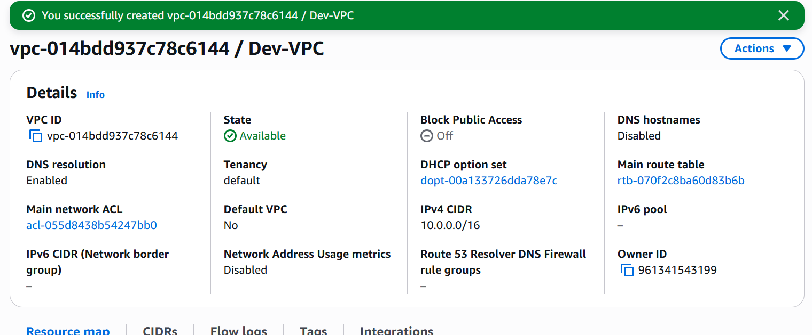

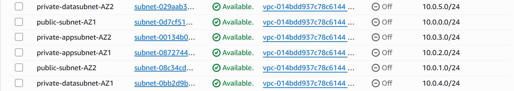

I setup a public route table and 2 private route tables, an Internet gateway and 2 Nat Gateways in 2 different availability zones. I associated the public subnets with the public route table and created a route for internet gateway. I associated the private subnets with the private route table and created a route for the natgateways
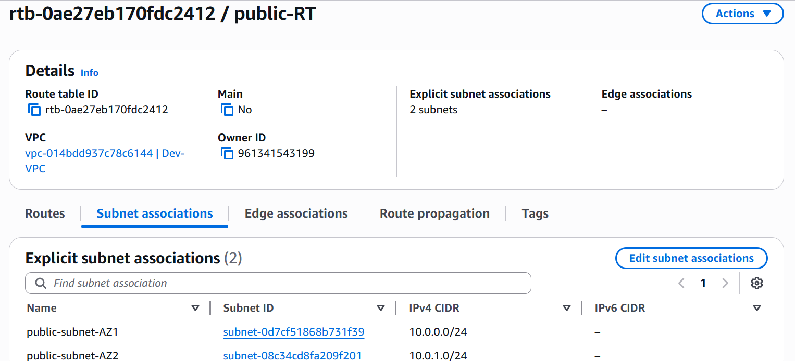

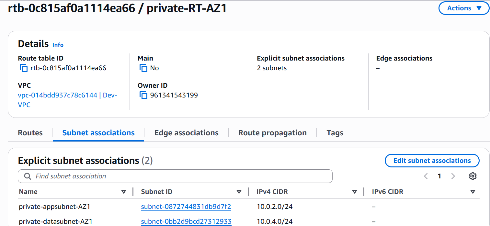

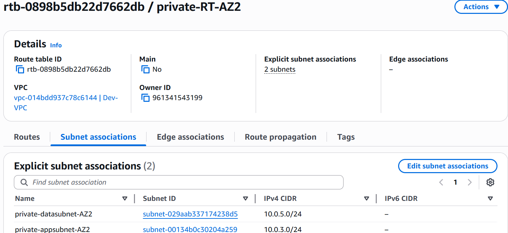

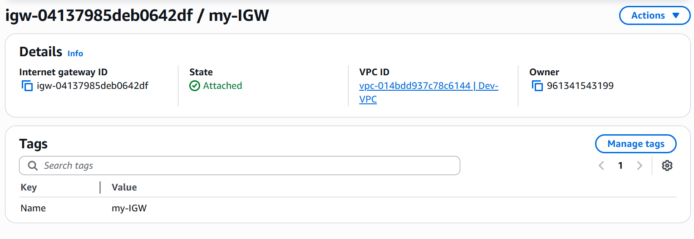

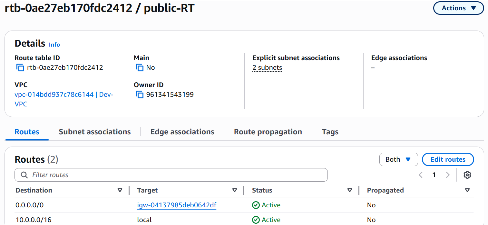


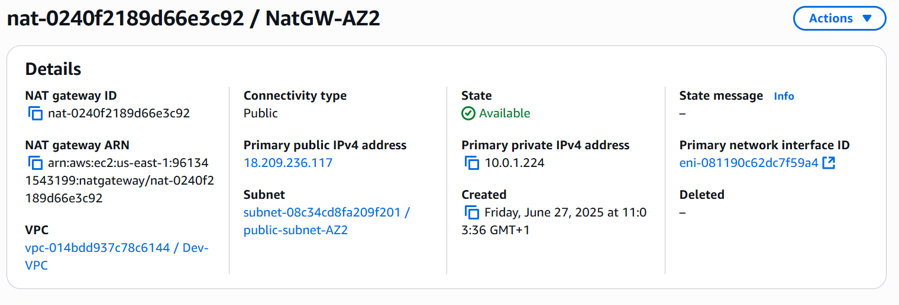

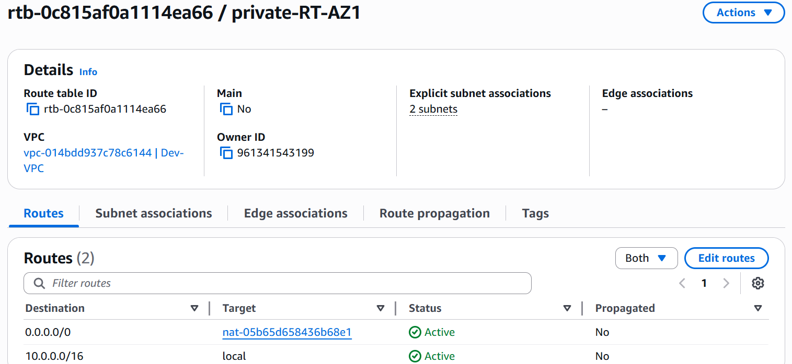

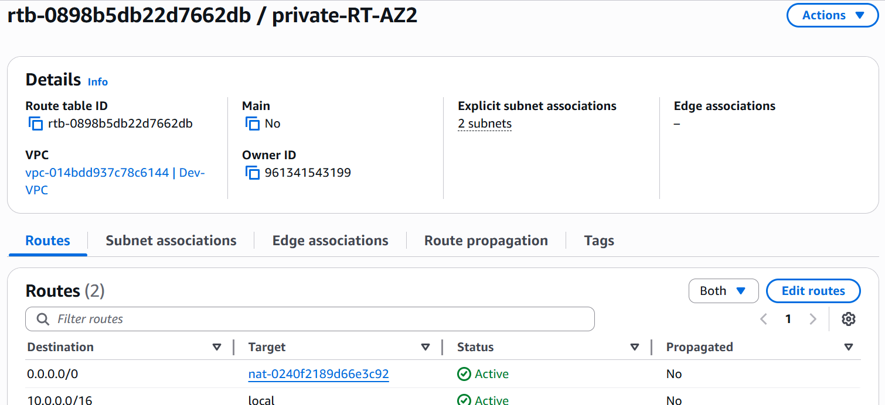

#### Security Group Setup

I created security groups for the load balancer, the web server, the EFS and the database. For the ALB security group, I opened port 80 (http), port 443 (https) and ssh (22) and allowed traffic from anywhere. For the web server security group, I allowed traffic from the ALB security on port 80 and 443. For the EFS and database security groups, port 2049 and 3306 were opened simultaneously, allowing traffic from the Web server security group.

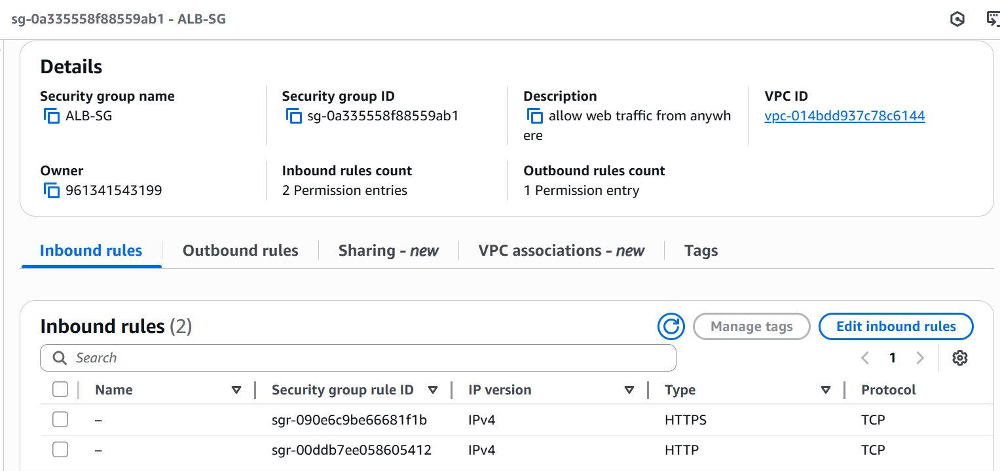

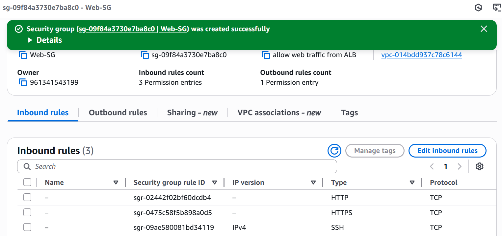

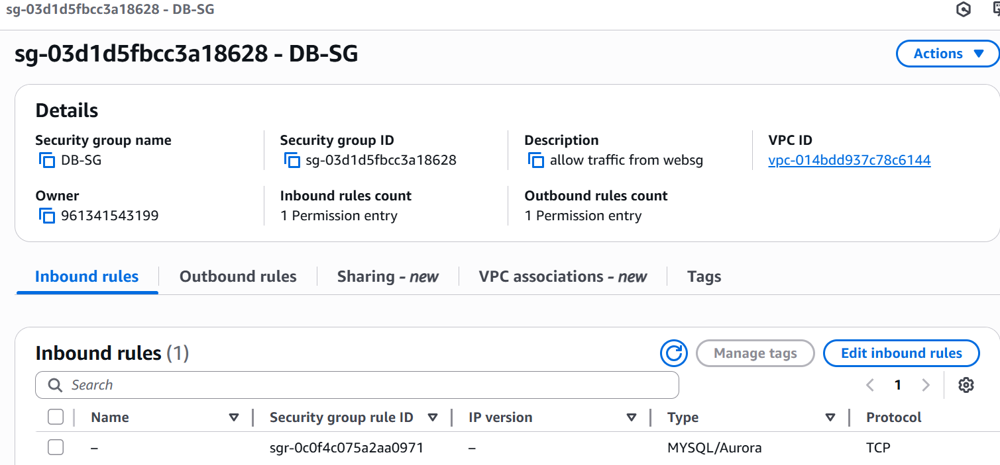

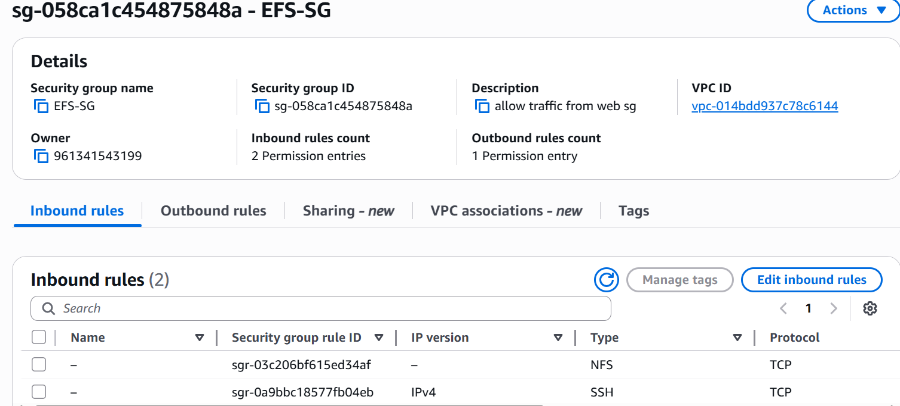

### Amazon RDS Setup

I deployed a managed MySQL database using Amazon RDS for Wordpress data storage. It was deployed in the private subnet with the master database in one availabilty zone and a standby database in a differenr availability zone. Th database security group initially created was attached to the database.

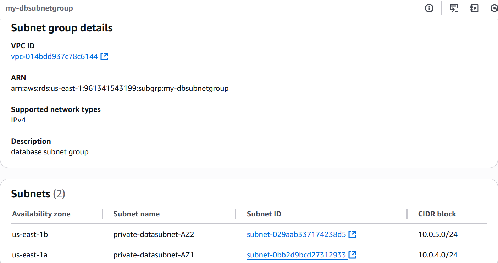

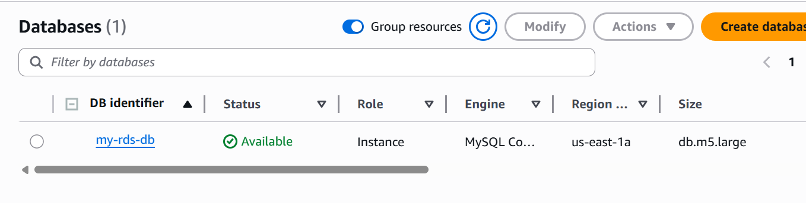

### Autoscaling Group and Webserver Setup

A launch template was setup with the wordpress configuration script. This launch template was used for the creation of an Autoscaling group and the desired capacity was set to 2. This automatically spun up 2 EC2 instances in 2 different availabilty zones in the private subnet. this is the launch template script

```bash
# !/bin/bash

# Update packages and install necessary tools

yum update -y

# Create the web root directory

mkdir -p /var/www/html

# Mount EFS to the web root

mount -t nfs4 -o nfsvers=4.1,rsize=1048576,wsize=1048576,hard,timeo=600,retrans=2,noresvport fs-00485aa0c685458ab.efs.us-east-1.amazonaws.com:/ /var/www/html

# Install Apache

yum install -y httpd httpd-tools mod_ssl
systemctl enable httpd
systemctl start httpd

# Install PHP 7.4 and required extensions

amazon-linux-extras enable php7.4
yum clean metadata
yum install -y php php-common php-pear
yum install -y php-{cgi,curl,mbstring,gd,mysqlnd,gettext,json,xml,fpm,intl,zip}

# Install MySQL client (optional, for testing connection)

yum install -y mysql

# Install MySQL Server locally (optional if using RDS)

rpm -Uvh <https://dev.mysql.com/get/mysql57-community-release-el7-11.noarch.rpm>
rpm --import <https://repo.mysql.com/RPM-GPG-KEY-mysql-2022>
yum install -y mysql-community-server
systemctl enable mysqld
systemctl start mysqld

# Set correct permissions

usermod -a -G apache ec2-user
chown -R ec2-user:apache /var/www
chmod 2775 /var/www
find /var/www -type d -exec chmod 2775 {} \;
find /var/www -type f -exec chmod 0664 {} \;
chown apache:apache -R /var/www/html

# Download and extract WordPress

wget <https://wordpress.org/latest.tar.gz>
tar -xzf latest.tar.gz
cp -r wordpress/* /var/www/html/

# Create wp-config.php

cp /var/www/html/wp-config-sample.php /var/www/html/wp-config.php

# Configure wp-config.php with DB details

DB_NAME='my-rds-db'
DB_USER='grittynazy'
DB_PASSWORD='obumneme'
DB_HOST='my-rds-db.cv4ywuiy24x8.us-east-1.rds.amazonaws.com'

sed -i "s/database_name_here/$DB_NAME/" /var/www/html/wp-config.php
sed -i "s/username_here/$DB_USER/" /var/www/html/wp-config.php
sed -i "s/password_here/$DB_PASSWORD/" /var/www/html/wp-config.php
sed -i "s/localhost/$DB_HOST/" /var/www/html/wp-config.php

# Add health check file

echo "OK" | sudo tee /var/www/html/healthcheck.php

# Restart Apache

systemctl restart httpd
```

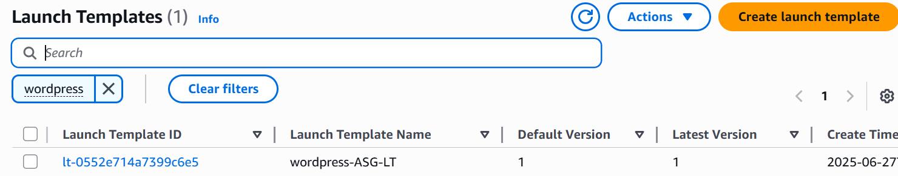

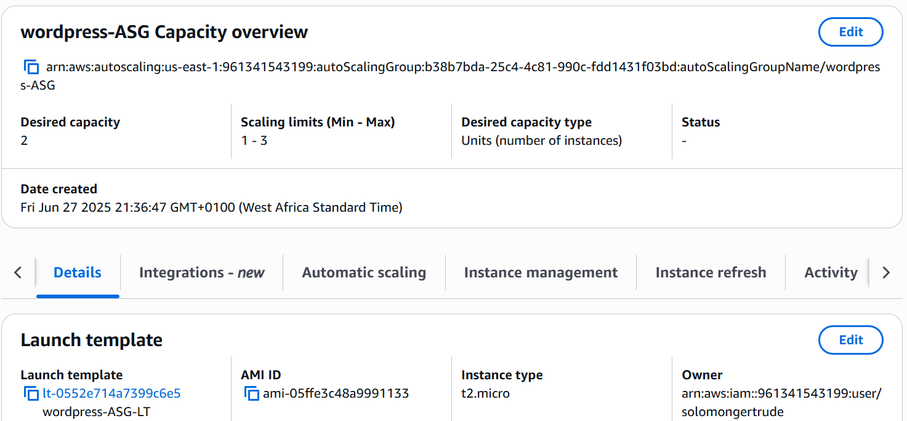

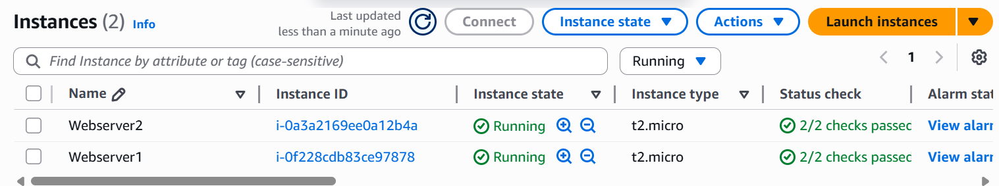

### Loadbalancer Setup

The wordpress servers were placed in a target group and used in the creation of a load balancer. Http and Https listeners were added and forwarded to the target group. A domain was registered in Route 53, hosted zone was created and records added. An SSL certificate was created using AWS Certificate Manager and was added to the https listener. The load balancer was set up to route http traffic to https.


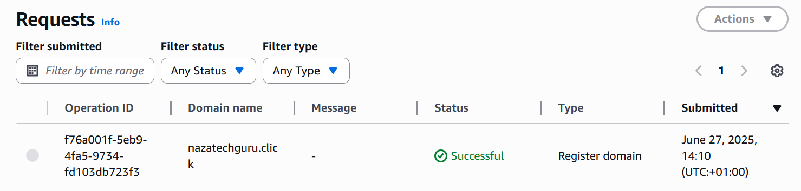

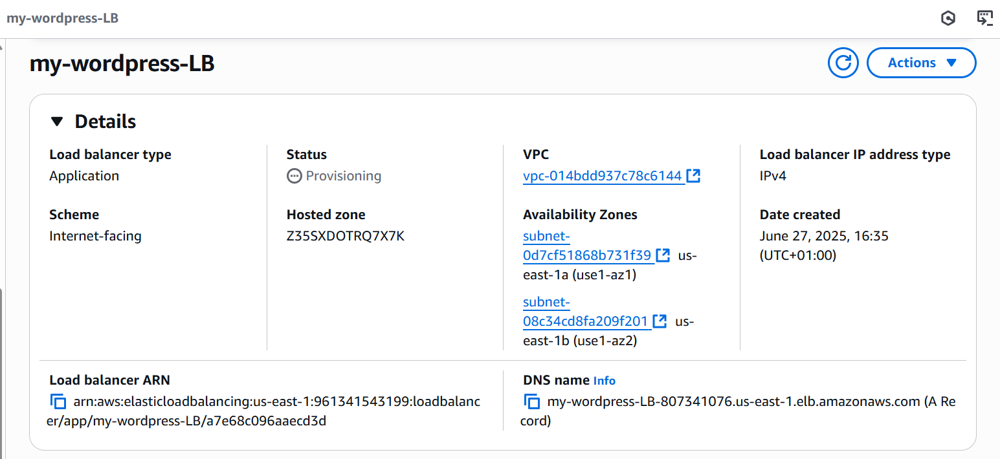

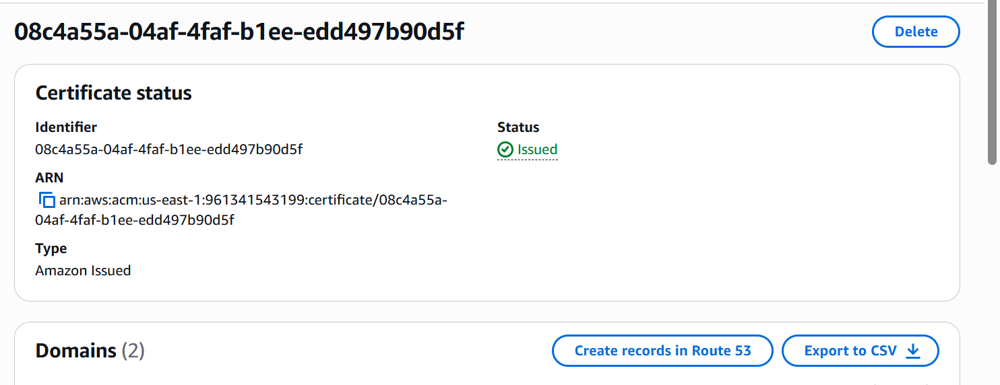

The load balancer DNS was inputted in the browser and the wordpress dashboard showed up

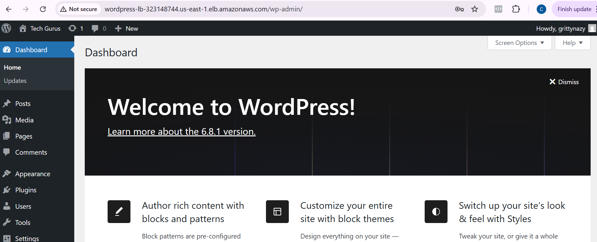

A CNAME record was added routing the domain name to the load balancer DNS.

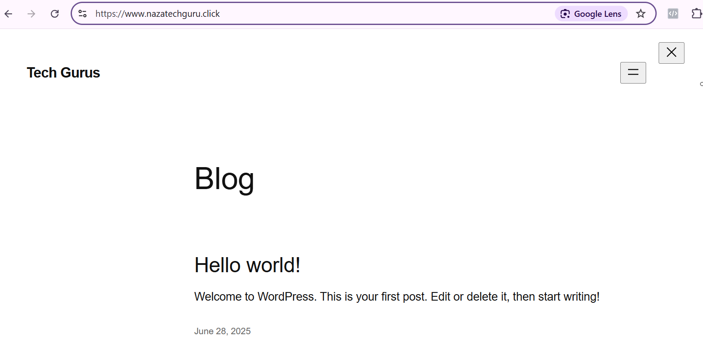
