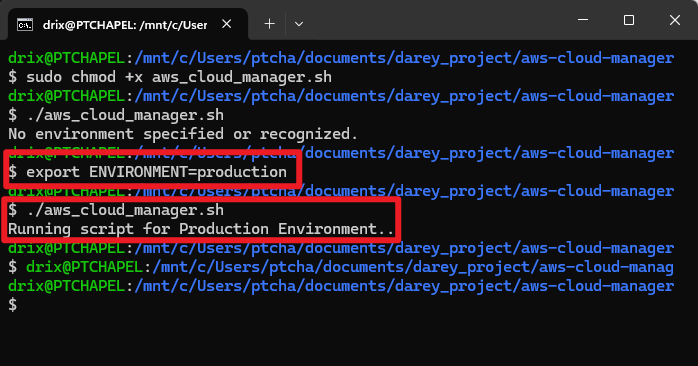
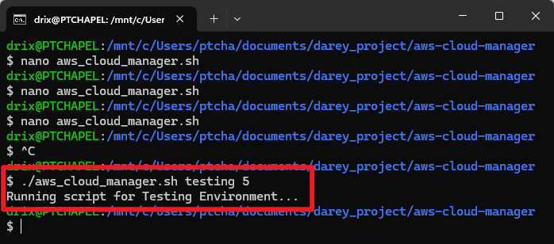
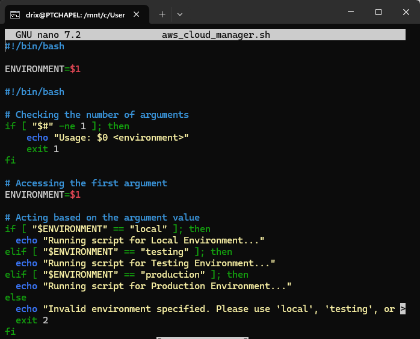
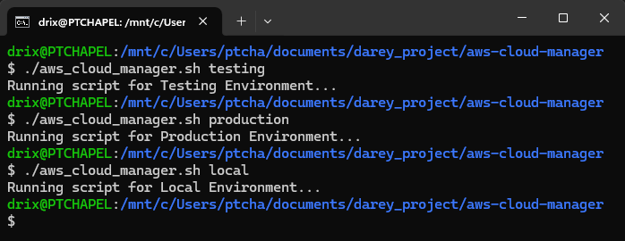

# AWS Cloud Manager Script – Learning Documentation

## 📌 Project Overview

This mini project demonstrates the differences between **Infrastructure Environments** and **Environment Variables**, and how to use them effectively in a shell script.

## 🎯 Learning Objectives

* Understand the distinction between Infrastructure Environments and Environment Variables
* Use environment variables to control script behavior dynamically
* Accept user input through positional parameters
* Apply input validation in shell scripting

---

## 🧠 Concepts Learned

### Infrastructure Environments vs Environment Variables

**Infrastructure Environments** are distinct stages where applications are developed and deployed:

* **Development Environment**: Local (VirtualBox + Ubuntu)
* **Testing Environment**: AWS Account 1
* **Production Environment**: AWS Account 2

**Environment Variables** are key-value pairs that dynamically configure behavior across these environments.

#### 💡 Real-World Example – FinTech Database Connectivity

```bash
# Development
DB_URL=localhost
DB_USER=test_user
DB_PASSWORD=test_pass

# Testing
DB_URL=test-db.aws.com
DB_USER=test_user
DB_PASSWORD=test_pass

# Production
DB_URL=prod-db.aws.com
DB_USER=prod_user
DB_PASSWORD=prod_pass
```

---

## 🛠️ Script Development Process

### ✅ Step 1: Basic Environment Variable Implementation

Create `aws_cloud_manager.sh`:

```bash
#!/bin/bash

# Check the ENVIRONMENT variable
if [ "$ENVIRONMENT" == "local" ]; then
  echo "Running script for Local Environment..."
elif [ "$ENVIRONMENT" == "testing" ]; then
  echo "Running script for Testing Environment..."
elif [ "$ENVIRONMENT" == "production" ]; then
  echo "Running script for Production Environment..."
else
  echo "No environment specified or recognized."
  exit 2
fi
```

**Make it executable:**

```bash
sudo chmod +x aws_cloud_manager.sh
```

**Testing Output:**

```bash
# Without variable
./aws_cloud_manager.sh
# ➜ No environment specified or recognized.

# With variable
export ENVIRONMENT=production
./aws_cloud_manager.sh
# ➜ Running script for Production Environment
```



---

### ✅ Step 2: Implementing Positional Parameters

Update the script to accept arguments:

```bash
#!/bin/bash

ENVIRONMENT=$1

if [ "$ENVIRONMENT" == "local" ]; then
  echo "Running script for Local Environment..."
elif [ "$ENVIRONMENT" == "testing" ]; then
  echo "Running script for Testing Environment..."
elif [ "$ENVIRONMENT" == "production" ]; then
  echo "Running script for Production Environment..."
else
  echo "No environment specified or recognized."
  exit 2
fi
```

**Key Insight:** Positional parameters (`$1`, `$2`, etc.) allow passing values at runtime.



---

### ✅ Step 3: Adding Input Validation

Input validation ensures safe usage:

```bash
#!/bin/bash

# Validate number of arguments
if [ "$#" -ne 1 ]; then
  echo "Usage: $0 <environment>"
  exit 1
fi

ENVIRONMENT=$1

if [ "$ENVIRONMENT" == "local" ]; then
  echo "Running script for Local Environment..."
elif [ "$ENVIRONMENT" == "testing" ]; then
  echo "Running script for Testing Environment..."
elif [ "$ENVIRONMENT" == "production" ]; then
  echo "Running script for Production Environment..."
else
  echo "Invalid environment specified. Please use 'local', 'testing', or 'production'."
  exit 2
fi
```



---

## ☁️ Step 4: AWS CLI Integration

### Enhanced Script with Cloud Infrastructure Management

The final version includes full AWS CLI integration for EC2 instance provisioning:

```bash
#!/bin/bash

# Validate number of arguments
if [ "$#" -ne 1 ]; then
  echo "Usage: $0 <environment>"
  echo "Available environments: local, testing, production"
  exit 1
fi

ENVIRONMENT=$1

# Environment-specific configurations
case $ENVIRONMENT in
  "local")
    echo "Running script for Local Environment..."
    INSTANCE_TYPE="t2.micro"
    AMI_ID="ami-0c02fb55956c7d316"  # Amazon Linux 2
    KEY_NAME="local-key"
    SECURITY_GROUP="local-sg"
    SUBNET_ID="subnet-local123"
    TAG_NAME="Local-Instance"
    ;;
  "testing")
    echo "Running script for Testing Environment..."
    INSTANCE_TYPE="t2.small"
    AMI_ID="ami-0c02fb55956c7d316"  # Amazon Linux 2
    KEY_NAME="testing-key"
    SECURITY_GROUP="testing-sg"
    SUBNET_ID="subnet-testing456"
    TAG_NAME="Testing-Instance"
    ;;
  "production")
    echo "Running script for Production Environment..."
    INSTANCE_TYPE="t3.medium"
    AMI_ID="ami-0c02fb55956c7d316"  # Amazon Linux 2
    KEY_NAME="production-key"
    SECURITY_GROUP="production-sg"
    SUBNET_ID="subnet-production789"
    TAG_NAME="Production-Instance"
    ;;
  *)
    echo "Invalid environment specified: $ENVIRONMENT"
    echo "Available environments: local, testing, production"
    exit 2
    ;;
esac

# Function to provision EC2 instance
provision_ec2_instance() {
    echo "Provisioning EC2 instance for $ENVIRONMENT environment..."
    echo "Instance Type: $INSTANCE_TYPE"
    echo "AMI ID: $AMI_ID"
    echo "Key Name: $KEY_NAME"
    echo "Security Group: $SECURITY_GROUP"
    echo "Subnet ID: $SUBNET_ID"
    
    # Check if AWS CLI is installed
    if ! command -v aws &> /dev/null; then
        echo "Error: AWS CLI is not installed. Please install AWS CLI first."
        exit 1
    fi
    
    # Check if AWS credentials are configured
    if ! aws sts get-caller-identity &> /dev/null; then
        echo "Error: AWS credentials not configured. Please run 'aws configure' first."
        exit 1
    fi
    
    # Launch EC2 instance
    echo "Launching EC2 instance..."
    INSTANCE_ID=$(aws ec2 run-instances \
        --image-id $AMI_ID \
        --count 1 \
        --instance-type $INSTANCE_TYPE \
        --key-name $KEY_NAME \
        --security-group-ids $SECURITY_GROUP \
        --subnet-id $SUBNET_ID \
        --tag-specifications "ResourceType=instance,Tags=[{Key=Name,Value=$TAG_NAME},{Key=Environment,Value=$ENVIRONMENT}]" \
        --query 'Instances[0].InstanceId' \
        --output text)
    
    if [ $? -eq 0 ]; then
        echo "✅ EC2 instance launched successfully!"
        echo "Instance ID: $INSTANCE_ID"
        echo "Environment: $ENVIRONMENT"
        echo "Waiting for instance to be in running state..."
        
        # Wait for instance to be running
        aws ec2 wait instance-running --instance-ids $INSTANCE_ID
        
        # Get instance details
        INSTANCE_INFO=$(aws ec2 describe-instances \
            --instance-ids $INSTANCE_ID \
            --query 'Reservations[0].Instances[0].[PublicIpAddress,PrivateIpAddress,State.Name]' \
            --output text)
        
        echo "Instance Details:"
        echo "Public IP: $(echo $INSTANCE_INFO | cut -d' ' -f1)"
        echo "Private IP: $(echo $INSTANCE_INFO | cut -d' ' -f2)"
        echo "State: $(echo $INSTANCE_INFO | cut -d' ' -f3)"
    else
        echo "❌ Failed to launch EC2 instance"
        exit 1
    fi
}

# Function to list instances for the environment
list_instances() {
    echo "Listing instances for $ENVIRONMENT environment..."
    aws ec2 describe-instances \
        --filters "Name=tag:Environment,Values=$ENVIRONMENT" "Name=instance-state-name,Values=running,stopped,pending" \
        --query 'Reservations[].Instances[].[InstanceId,InstanceType,State.Name,Tags[?Key==`Name`].Value|[0],PublicIpAddress]' \
        --output table
}

# Function to terminate instances for the environment
terminate_instances() {
    echo "Finding instances to terminate for $ENVIRONMENT environment..."
    INSTANCE_IDS=$(aws ec2 describe-instances \
        --filters "Name=tag:Environment,Values=$ENVIRONMENT" "Name=instance-state-name,Values=running,stopped,pending" \
        --query 'Reservations[].Instances[].InstanceId' \
        --output text)
    
    if [ -z "$INSTANCE_IDS" ]; then
        echo "No instances found for $ENVIRONMENT environment"
        return 0
    fi
    
    echo "Found instances: $INSTANCE_IDS"
    read -p "Are you sure you want to terminate these instances? (y/N): " -n 1 -r
    echo
    if [[ $REPLY =~ ^[Yy]$ ]]; then
        aws ec2 terminate-instances --instance-ids $INSTANCE_IDS
        echo "✅ Termination initiated for instances: $INSTANCE_IDS"
    else
        echo "Termination cancelled"
    fi
}

# Main menu
echo "AWS Cloud Manager - $ENVIRONMENT Environment"
echo "============================================"
echo "1. Provision new EC2 instance"
echo "2. List existing instances"
echo "3. Terminate instances"
echo "4. Exit"
echo
read -p "Please select an option (1-4): " choice

case $choice in
    1)
        provision_ec2_instance
        ;;
    2)
        list_instances
        ;;
    3)
        terminate_instances
        ;;
    4)
        echo "Exiting..."
        exit 0
        ;;
    *)
        echo "Invalid option. Please select 1-4."
        exit 1
        ;;
esac
```
#### Enhanced Script with Cloud Infrastructure Management

Includes provisioning, listing, and terminating EC2 instances dynamically.

#### Environment-Specific Configurations

| Environment | Instance Type | AMI ID                | Key Name       | Security Group |
| ----------- | ------------- | --------------------- | -------------- | -------------- |
| Local       | t2.micro      | ami-0c02fb55956c7d316 | local-key      | local-sg       |
| Testing     | t2.small      | ami-0c02fb55956c7d316 | testing-key    | testing-sg     |
| Production  | t3.medium     | ami-0c02fb55956c7d316 | production-key | production-sg  |


#### Usage Example

```bash
./aws_cloud_manager.sh testing
# Choose option:
# 1 - Provision new EC2 instance
# 2 - List existing instances
# 3 - Terminate instances
```

#### Prerequisites

1. **Install AWS CLI**:

```bash
curl "https://awscli.amazonaws.com/awscli-exe-linux-x86_64.zip" -o "awscliv2.zip"
unzip awscliv2.zip
sudo ./aws/install
```

2. **Configure AWS Credentials**:

```bash
aws configure
```

3. **Pre-create** Key Pairs, Subnets, and Security Groups in AWS.

#### Testing AWS CLI Integration

```bash
aws sts get-caller-identity
./aws_cloud_manager.sh production
```

#### Real-World DevOps Scenarios

* Local testing and Dev workloads
* Cloud-based staging environments
* Production-grade deployments
* Easy lifecycle management of EC2 resources


## 🧪 Script Testing Results

### ✅ Run for different environments

```bash
./aws_cloud_manager.sh local
./aws_cloud_manager.sh testing
./aws_cloud_manager.sh production
# ➜ Running script for Local/Testing/Production Environment
```



---

## 📝 Key Takeaways

### Best Practices Learned

1. **Avoid Hard-coding** – Use variables and parameters
2. **Validate Input** – Prevent misuse and unexpected behavior
3. **Clear Errors** – Provide helpful usage instructions
4. **Proper Exit Codes** – `0` = success, `1` = usage error, `2` = invalid input

### Positional Parameters Summary

| Parameter | Meaning             |
| --------- | ------------------- |
| `$0`      | Script name         |
| `$1`      | First argument      |
| `$#`      | Number of arguments |
| `$@`      | All arguments       |

---

## 🧾 Summary

This project clarified how **Infrastructure Environments** define where code runs, while **Environment Variables** define how code behaves. Through progressive improvements—starting with environment checks and ending with full input validation—I built a dynamic, reusable script applicable across real-world scenarios. This forms a solid foundation for writing robust automation scripts in DevOps workflows.

---