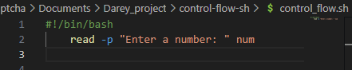
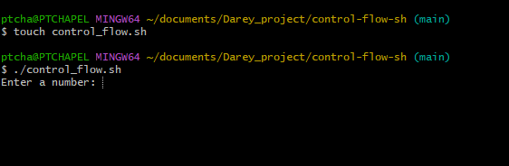
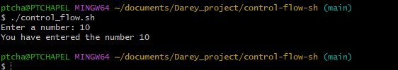
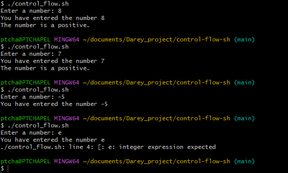
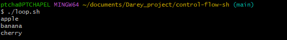
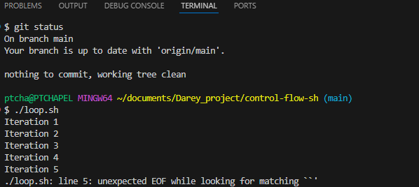
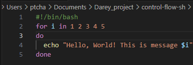
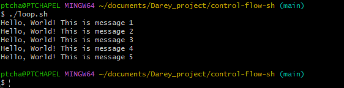
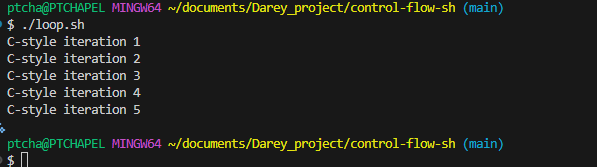

### **CONTROL FLOW STATEMENTS**
Control flow statements let your scripts decide what to do or how to proceed based on certain conditions. They are essential for creating dynamic and responsive scripts. The most common control flow statements in shell scripting are `if`, `case`, `for`, and `while` loops.

### **Examples**
## Task 1:
Our script asks for a number and then tell us if that number is positive, negative or zero.

## Solution:

## Step 1: Create a new file named `control_flow.sh` and open it in your favorite text editor.


## Step 2: Write the following code in the `control_flow.sh` file:

```bash
#!/bin/bash
read -p "Enter a number: " number
```


## Step 3: Execute the above scripts


## Step 4: Update the code to below and exceute the script again

```bash
#!/bin/bash
read -p "Enter a number: " num
echo "You have entered the number $num"
```


## If Statement
The if statements in bash scripts allows you to execute commands based on conditions. The syntax is as follows:

```bash
if [ condition ]; then
    commands
fi
```
## Step 5: Add if statement to the script to check if number is positive and execute. 
```bash
#!/bin/bash
read -p "Enter a number: " num
echo "You have entered the number $num"
if [ $num -gt 0 ]; then
    echo "The number is a positive."
fi
```
**Output:**


## Elif Statement
The elif statement allows you to check multiple conditions in a single if statement. The syntax is as follows:

```bash
if [ condition1 ]; then
    commands1
elif [ condition2 ]; then
    commands2
fi
```
## Step 6: Add elif statement to the script to check if number is negative or zero and execute. 
```bash
#!/bin/bash
read -p "Enter a number: " num
if ! [[ $num =~ ^-?[0-9]+$ ]]; then
    echo "Error: Please enter a valid integer."
    exit 1
fi

if [ $num -gt 0 ]; then
    echo "The number is positive."
elif [ $num -lt 0 ]; then
    echo "The number is negative."
else
    echo "The number is zero."
fi
```
**Output:**


## LOOP STATEMENTS
Loop statements allow you to execute a block of code multiple times. The most common loop statements in bash scripting are `for`, `while`, and `until` loops.

### For Loop
The `for` loop allows you to iterate over a list of items or a range of numbers. Below are examples of both list-based and range-based loops, as well as a C-style loop.

#### List-based for loop
The list-based `for` loop iterates over a predefined list of items. The syntax is as follows:
```bash
for item in item1 item2 item3; do
    echo $item
done
```
**Example:**
```bash
for item in apple banana cherry; do
    echo $item
done
```

**Output:**


---
#### Range-based For Loop
The range-based `for` loop iterates over a sequence of numbers. The syntax is as follows:

```bash
for i in {start..end}; do
    commands
done
```

**Example:**
```bash
#!/bin/bash
for i in {1..5}; do
    echo "Iteration $i"
done
```
**Output:**


####


### Task 2:
1. Create a shell script types of the for loop
2. Insert the code in the file
3. Set the correct permission for the script
4. Excecute the script and evaluate your experience.

## Solution:
1. Create a shell script types of the for loop
```bash
touch for_loop.sh
```


2. Insert the code in the file
```bash
#!/bin/bash
for i in {1..10}; do
    echo "Hello, World! This is message $i"
done
```


3. Set the correct permission for the script
```bash
chmod +x loop.sh
```


4. Excecute the script and evaluate your experience.
```bash
./loop.sh
```


When the script  was executed, it iterated through the number 1 to 10 and printed the message "Hello, World! This is message $i" for each iteration. The output was as expected, with each message displayed on a new line. The script worked correctly and demonstrated the functionality of the for loop in bash scripting.

#### C-style For Loop
The C-style `for` loop uses initialization, condition, and increment expressions. The syntax is as follows:

```bash
for ((initialization; condition; increment)); do
    commands
done
```

**Example:**
```bash
#!/bin/bash
for ((i=1; i<=5; i++)); do
    echo "C-style iteration $i"
done
```
**Output:**
