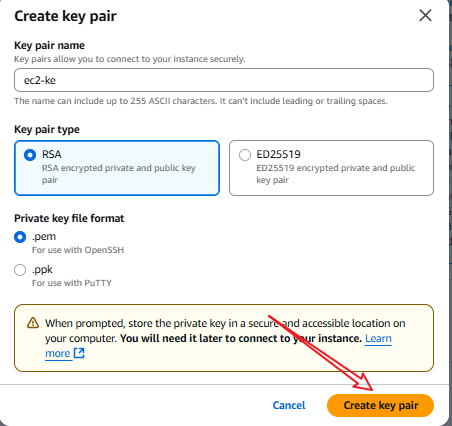
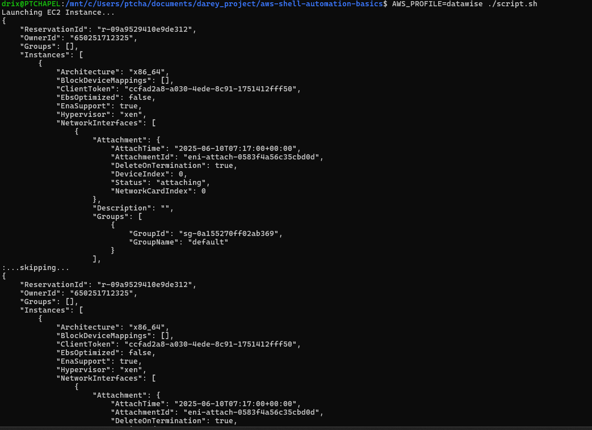
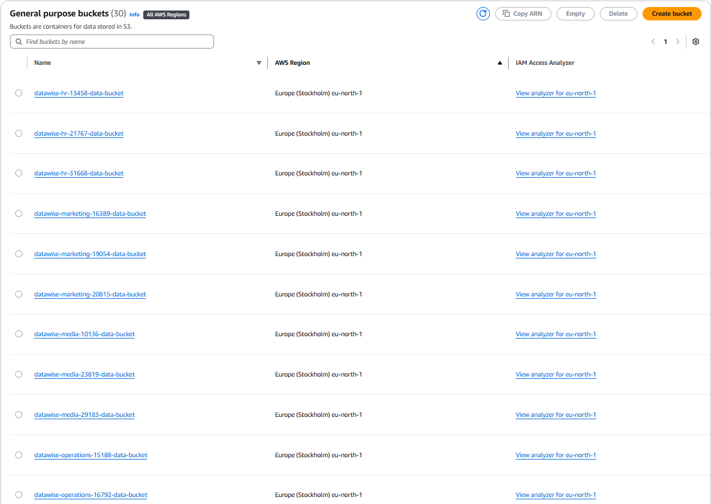

# 🛠️ Mini Project – Creating AWS Resources with Functions & Arrays

## 🎯 Objective

This phase focuses on writing two functions in a shell script to automate the creation of AWS resources:

- One function to provision EC2 instances.
- One function to create multiple S3 buckets using arrays.

We apply core scripting concepts including: **Functions**, **Environment Variables**, **Exit Status `$?`**, and **Arrays**.

---

## 📍 Part 1: Function to Provision EC2 Instances

### ✅ Step 1: Create a Key Pair from the AWS Console

Before running the script, you must manually create a key pair from the EC2 Dashboard.

📸 **Screenshot – Creating a Key Pair:**



---

### ✅ Step 2: Define Function to Create EC2 Instances

We use a shell function to automate EC2 provisioning with environment variables and basic error handling using `$?`.

```bash
create_ec2_instance() {
  echo "Launching EC2 Instance..."

  aws ec2 run-instances \
    --image-id "$ami_id" \
    --count "$count" \
    --instance-type "$instance_type" \
    --key-name "$key_name" \
    --region "$region"

  if [ $? -eq 0 ]; then
    echo "EC2 instance created successfully."
  else
    echo "Failed to create EC2 instance."
  fi
}
````

> Note: Make sure the following environment variables are exported:
> `ami_id`, `count`, `instance_type`, `key_name`, and `region`.

---

## 📍 Part 2: Define Function to Create S3 Buckets & Learn About Arrays

We’ll create five S3 buckets for various departments using a shell array and a loop.

### ✅ Step 1: Understand the Use of Arrays

We use an array to hold department names and loop over them to create uniquely named buckets.

```bash
departments=("Marketing" "Sales" "HR" "Operations" "Media")
```

---

### ✅ Step 2: Define Function to Create S3 Buckets

```bash
create_s3_buckets() {
  departments=("Marketing" "Sales" "HR" "Operations" "Media")

  for dept in "${departments[@]}"; do
    bucket_name="datawise-${dept,,}-data-bucket"

    aws s3api create-bucket \
      --bucket "$bucket_name" \
      --region "$region" \
      --create-bucket-configuration LocationConstraint="$region"

    if [ $? -eq 0 ]; then
      echo "$bucket_name created successfully."
    else
      echo "Failed to create $bucket_name."
    fi
  done
}

```
### ✅ Step 3: Run the Script
To execute the script, ensure you have the AWS CLI configured with the necessary permissions and run:

```bash
./script.sh
```
## 📸 Screenshot – Running the Script & S3 Bucket created from AWS console





---

## 🧠 Summary

In this mini project, we automated the creation of AWS EC2 instances and S3 buckets using shell scripting. We implemented two functions: one to provision EC2 instances using environment variables and another to create five department-specific S3 buckets using arrays and a loop. Error handling was introduced through the `$?` exit status variable to validate command success. These automation tasks not only demonstrate practical shell scripting but also establish foundational skills for real-world DevOps workflows and cloud infrastructure provisioning.

```