# AWS VPC Security Groups vs Network ACLs Project

This project demonstrates how Security Groups and Network ACLs (NACLs) work in an AWS Virtual Private Cloud (VPC) by launching EC2 instances in different subnets and controlling their communication. It shows how Security Groups operate at the instance level while NACLs operate at the subnet level.

## Project Overview

This project involves the following steps:

1. Create a VPC and set up two public subnets.
2. Launch two EC2 instances in different subnets.
3. Configure Security Groups to allow communication.
4. Apply NACL rules to allow/deny specific traffic.
5. Test connectivity (ping and SSH).

---

## Step 1: Create a Custom VPC

* **VPC Name**: `Secure-VPC`
* **IPv4 CIDR**: `10.0.0.0/16`

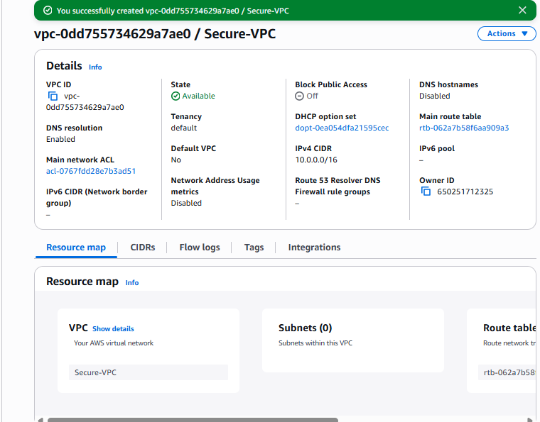

---

## Step 2: Create Two Public Subnets

* **Subnet 1**: `WebSubnet`, AZ: `us-east-1a`, CIDR: `10.0.1.0/24`
* **Subnet 2**: `AppSubnet`, AZ: `us-east-1b`, CIDR: `10.0.2.0/24`

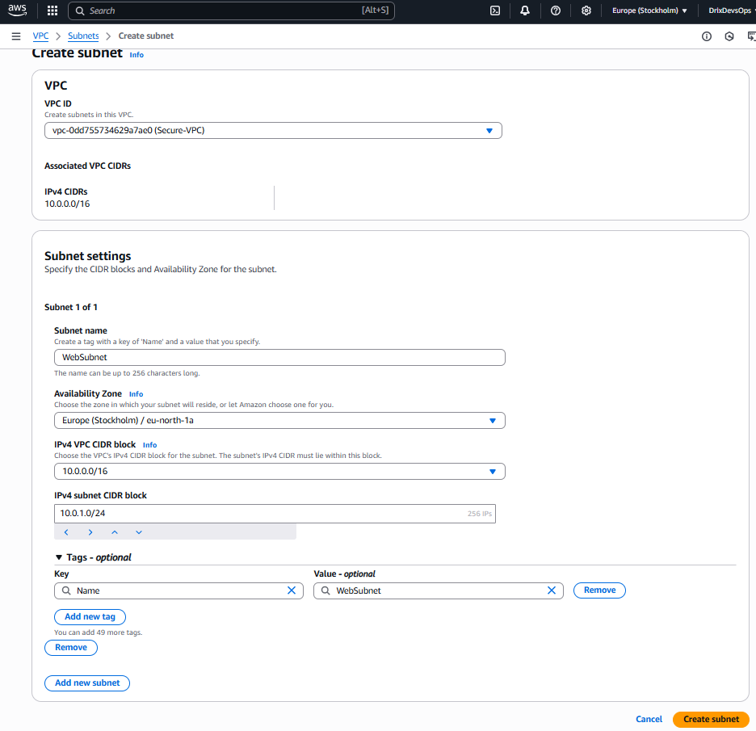

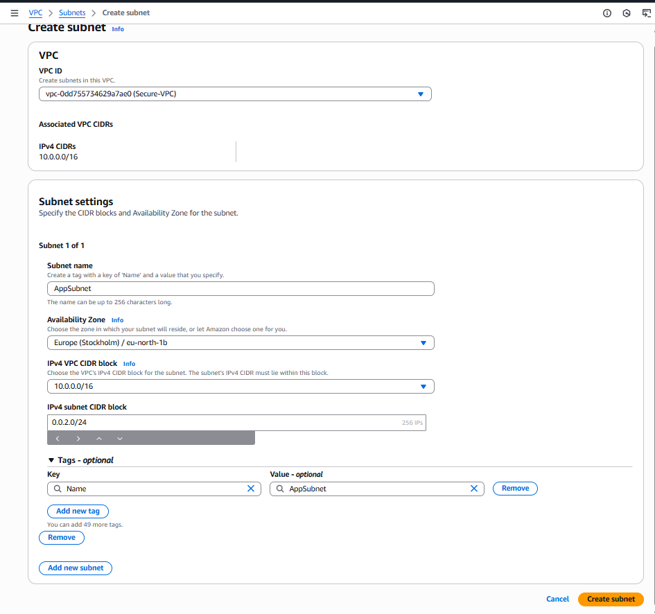

---

## Step 3: Create an Internet Gateway and Attach to VPC

* Name: `Secure-IGW`

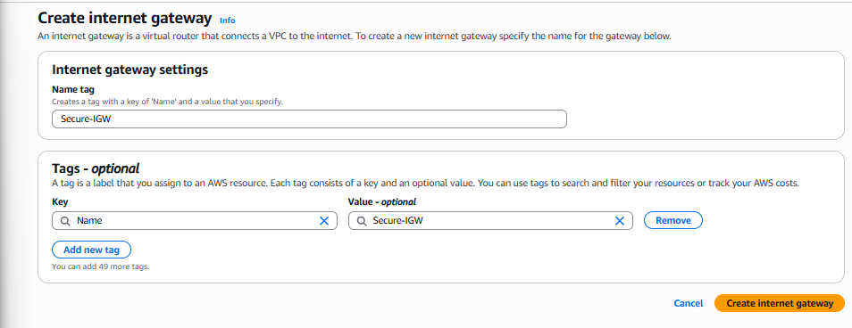

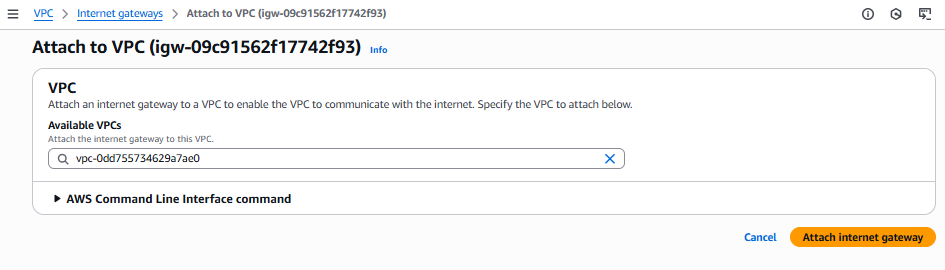

---

## Step 4: Create and Configure a Route Table

* Name: `Public-Route-Table`
* Add a route: `0.0.0.0/0` → IGW
* Associate with WebSubnet and AppSubnet

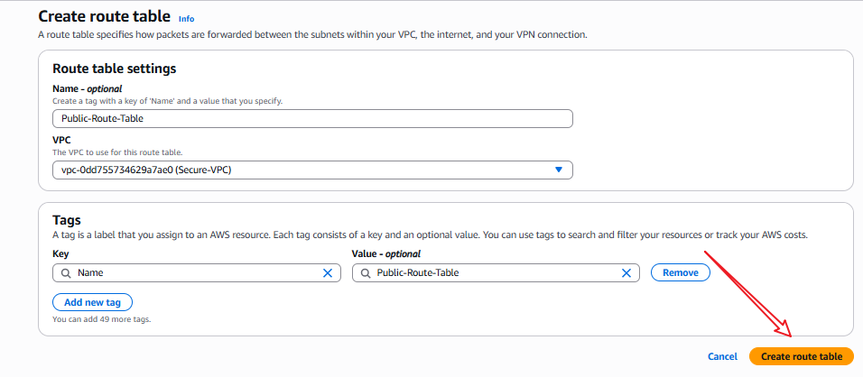

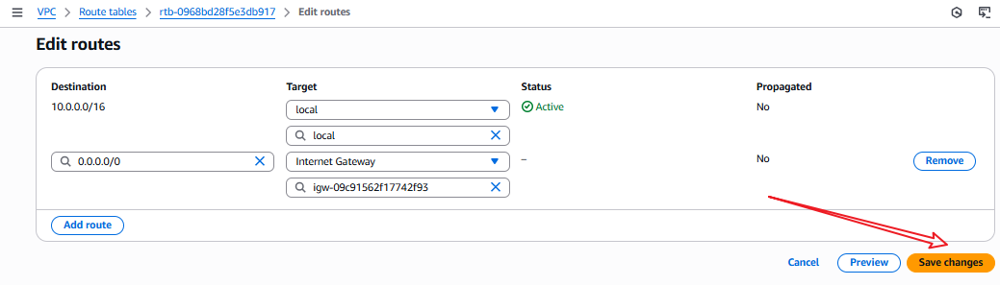

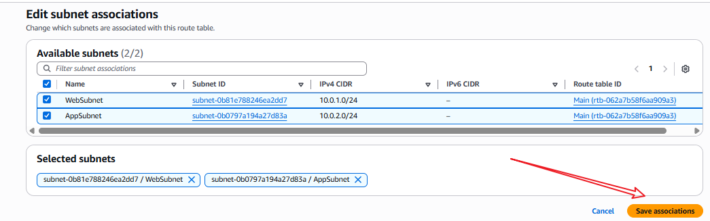

---

## Step 5: Create EC2 Key Pair

* Name: `ec2-key`
* Format: `.pem`

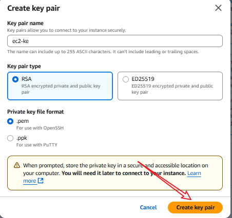

---

## Step 6: Launch Two EC2 Instances

* **Instance 1**:

  * Name: `Web-Server-A`
  * Subnet: `WebSubnet`
  * Security Group: `SG-Webserver`
* **Instance 2**:

  * Name: `Web-Server-B`
  * Subnet: `AppSubnet`
  * Security Group: `SG-App`

---

## Step 7: Configure Security Groups

* **SG-Webserver**:

  * Allow inbound SSH (port 22) from `My IP`
  * Allow ICMP (ping) from `10.0.2.0/24`

* **SG-App**:

  * Allow inbound SSH (port 22) from `My IP`
  * Allow ICMP (ping) from `10.0.1.0/24`

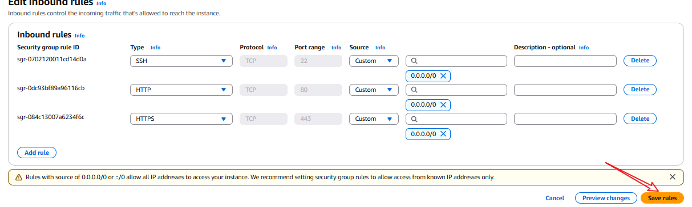

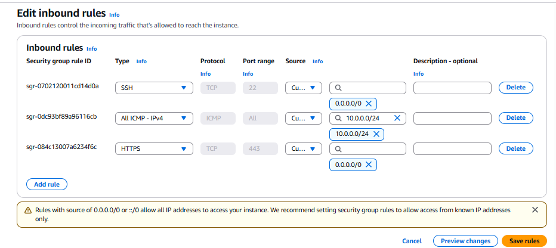

---

## Step 8: Connect to Instances and Test Communication

1. SSH into `Web-Server-A`
2. Try to ping `Web-Server-B`'s private IP
3. Should succeed since SGs allow ICMP traffic

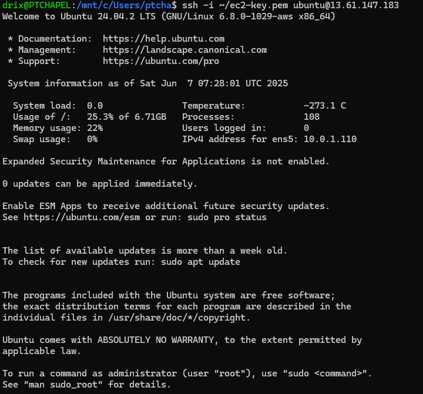

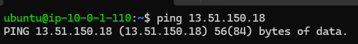

---

## Step 9: Create Custom NACL and Associate with AppSubnet

* Name: `Custom-NACL`
* Associate with AppSubnet

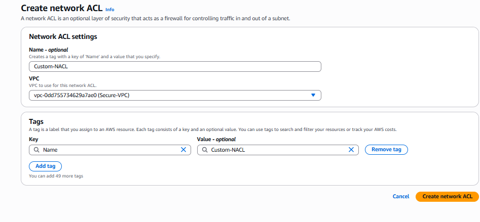

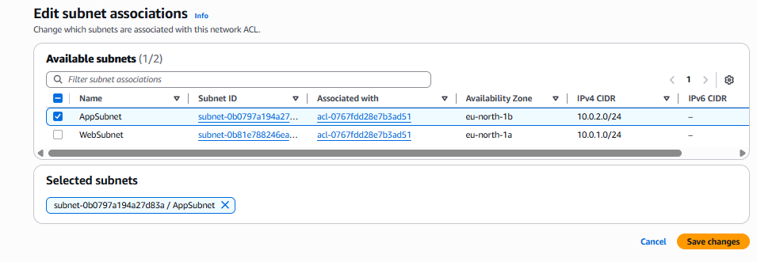

---

## Step 10: Add NACL Rules

Inbound:

* Allow SSH (22) from `0.0.0.0/0`
* Allow ICMP from `10.0.1.0/24`

Outbound:

* Allow all traffic

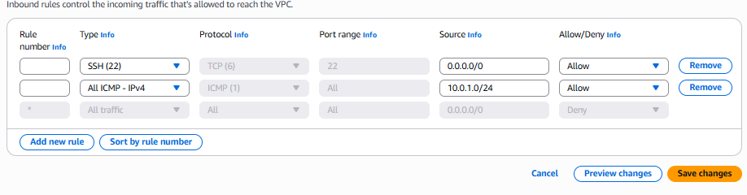

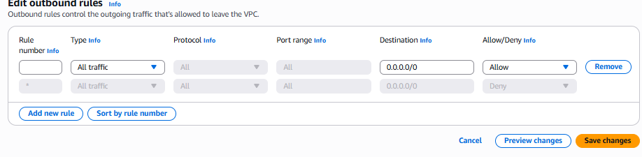

---

## Step 11: Test Again

* SSH into `Web-Server-A`
* Ping `Web-Server-B` again
* If ICMP is denied in NACL, ping will fail

---

## Conclusion

This project illustrates the layered security model in AWS where Security Groups control instance-level traffic and NACLs enforce subnet-level rules. Proper configuration of both is essential for achieving intended connectivity and isolation.
