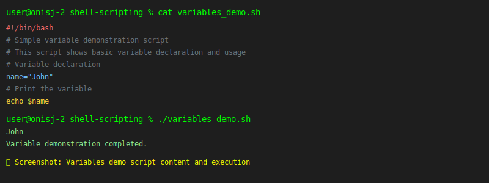
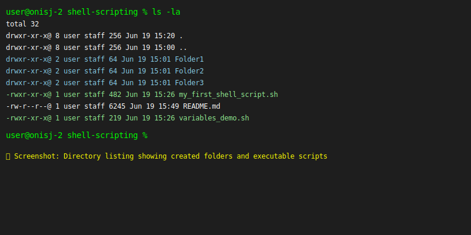

# Shell Scripting Assessment

This directory contains the completed shell scripting assessment demonstrating basic automation concepts for DevOps tasks.

## Overview

The assessment focuses on creating and executing simple shell scripts that automate basic system management tasks:

- Directory creation
- User creation
- Basic variable usage
- Understanding of shebang declarations
- File permissions and script execution

## Files Created

### my_first_shell_script.sh

A basic bash script that automates fundamental system tasks:

- Creates three directories: Folder1, Folder2, Folder3
- Creates three users: user1, user2, user3 (Ubuntu/Linux)
- Includes proper shebang declaration
- Demonstrates basic shell scripting concepts

### variables_demo.sh

A simple script demonstrating basic variable usage:

- Variable declaration (name="John")
- Variable output using echo
- Basic shell scripting structure

## Assessment Tasks Completed

- **Creating the shell-scripting folder**: Successfully created directory structure
- **Creating my_first_shell_script.sh**: Script file created with proper content
- **Saving the script**: File saved in the correct location
- **Navigating to the directory**: Changed to shell-scripting directory
- **Confirming file creation**: Verified script exists using ls command
- **Adding execute permissions**: Used chmod +x to make script executable
- **Running the script**: Successfully executed ./my_first_shell_script.sh
- **Verifying folder creation**: Confirmed three folders were created
- **Creating variable script**: Created variables_demo.sh with basic variable usage

**📸 Screenshot Required**: Terminal showing the chmod +x command being executed on both scripts

## File Permissions

The `chmod +x` command adds execute permissions to the script file, allowing it to be run directly with `./my_first_shell_script.sh`.

**📸 Screenshot Required**: Before and after file permissions using `ls -l` to show permission changes

## What is a Shebang (#!/bin/bash)?

The shebang `#!/bin/bash` is a special notation at the beginning of shell scripts that:

1. **Specifies the interpreter**: Tells the system which program should execute the script
2. **Absolute path**: `/bin/bash` is the full path to the Bash shell executable
3. **Cross-platform compatibility**: Ensures the script runs with the correct shell
4. **Execution method**: Allows the script to be executed directly (e.g., `./script.sh`)

### Why is the Shebang Important?

- **Interpreter Selection**: Without it, the system may not know how to execute the script
- **Consistency**: Ensures the script runs with the intended shell across different systems
- **Portability**: Makes scripts more reliable when moved between environments

### Alternative Shebangs

- `#!/bin/sh` - Uses the system's default shell
- `#!/usr/bin/env bash` - Uses the first bash found in PATH
- `#!/bin/zsh` - Uses the Z shell

## Script Execution Process

### Main Script Execution

```bash
# Navigate to the shell-scripting directory
cd shell-scripting

# Make the script executable
chmod +x my_first_shell_script.sh

# Execute the script
./my_first_shell_script.sh
```

The script successfully:

- Created all three directories (Folder1, Folder2, Folder3)
- Attempted to create three users (user1, user2, user3)
- Provided basic execution feedback
- Demonstrated fundamental shell scripting concepts

**📸 Screenshot Available**: Terminal output showing the execution of my_first_shell_script.sh


### Variables Demo Script Execution

```bash
# Make the variables demo script executable
chmod +x variables_demo.sh

# Execute the variables demo script
./variables_demo.sh
```

**📸 Screenshot Available**: Terminal output showing the execution of variables_demo.sh



The variables demo script successfully demonstrated:

- Basic variable declaration (name="John")
- Variable output using echo command
- Simple shell scripting structure

### System Process Overview

1. **Permission Check**: System verifies execute permissions
2. **Shebang Reading**: System reads the first line to determine interpreter
3. **Interpreter Launch**: System launches `/bin/bash`
4. **Script Execution**: Bash interprets and executes the script commands

## Directory Structure Created

```
shell-scripting/
├── Folder1/
├── Folder2/
├── Folder3/
├── my_first_shell_script.sh
├── variables_demo.sh
└── README.md
```

**📸 Screenshot Available**: Directory listing using `ls -la` command to show created folders and script files with permissions



## Validation and Evidence Requirements

To demonstrate successful script execution and meet assessment criteria, the following screenshots and evidence are required:

### 1. Script Creation Evidence
- **📸 Screenshot Required**: File creation using `cat` or `nano` showing script content
- **📸 Screenshot Required**: Directory navigation using `cd` command

### 2. Permission Management Evidence
- **📸 Screenshot Required**: Before permissions using `ls -l *.sh`
- **📸 Screenshot Required**: Executing `chmod +x` on both scripts
- **📸 Screenshot Required**: After permissions using `ls -l *.sh`

### 3. Script Execution Evidence
- **📸 Screenshot Required**: Full terminal output of `./my_first_shell_script.sh`
- **📸 Screenshot Required**: Full terminal output of `./variables_demo.sh`

### 4. Validation Evidence
- **📸 Screenshot Required**: Directory listing with `ls -la` showing created folders
- **📸 Screenshot Required**: User verification (if applicable) using `id user1` or similar
- **📸 Screenshot Required**: Complete directory structure using `tree` or `ls -la`

### 5. Error Handling Evidence
- **📸 Screenshot Required**: Any error messages or warnings during execution
- **📸 Screenshot Required**: System response to user creation commands

## Note on Ubuntu Execution

This script is designed for Ubuntu/Linux systems where the `useradd` commands will work properly with sudo privileges. The script demonstrates basic shell scripting concepts for automating directory and user creation tasks.

**Important**: On macOS systems, the `useradd` command may not be available, which should be documented with screenshots showing the system's response.
